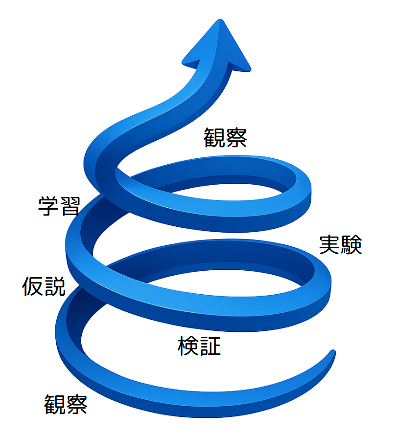

## **プロローグ：2006→2025：なぜ「変革リーダーの実践技術」が必要か**

今、あなたがこの本を手に取ってくださっているのは、きっと、あなたの目の前にある「現場」で、あるいはあなたが関わる「組織」や「プロジェクト」で、何らかの「変化」と向き合っているからではないでしょうか。思うように物事が進まない、新しい技術ややり方についていけない、チームが一つにならない、あるいは、そもそも何をゴールにすれば良いのか定まらない——そんな戸惑いや課題を感じているのかもしれません。

2006年に『現場リーダーの技術』という本を書きました。当時は、主にソフトウェア開発の現場で、メンバーを率いてプロジェクトを成功に導くリーダーたち、つまり「現場リーダー」に向けて、私の経験に基づいた実践的な技術や心構えをお伝えしたいと考えていました。当時は私も永和システムマネジメントという会社の、一人の現場リーダーでした。決められた期間、決められた予算で、要求されたシステムを無事につくりきること。それが現場リーダーに強く求められていた時代だったように思います。いかに効率よく段取りをし、メンバーを動かし、トラブルを乗り越えるか。それがリーダーの腕の見せ所でした。「段取り屋」という言葉がしっくりくるような役割だったかもしれません。

しかし、それから約二十年。私たちの働く環境は想像以上に、そして圧倒的なスピードで変化しました。スマートフォンが登場し、あらゆるものがインターネットに繋がり、仕事の基盤は自分の手元にあるコンピュータからクラウドへと移り、そして今やAIが、私たち人間の思考や創造性のあり方まで問い直そうとしています。この急速な変化は、私たちの働き方、学び方、価値を生み出す方法に根本的な見直しを迫っています。

このような時代において、リーダーに求められる役割は根本から変わりました。もはや、決められた計画を遂行するだけの「段取り屋」では、変化の波に乗り遅れてしまいます。予測不可能な状況下でも、お客様にとっての価値は何かを探し続け、チームや組織を変化に適応させ、自らも学びながら、より良い未来を創り出していく役割。私は、こうした新しい時代のリーダーを、敬意を込めて「**変革リーダー**」と呼びたいと思います。

**では、「変革リーダー」とは具体的にどのような人たちでしょうか？**

それは、必ずしも役職が偉い人や、大きな組織のトップだけを指す言葉ではありません。

* 日々のチーム運営の中で、メンバーの意見に耳を傾け、チームが自律的に問題解決できる土壌を作ろうとしているあなた。  
* 新しい技術（それがITであるか否かに関わらず）の可能性を信じ、自分の「現場」に取り入れることで、仕事のやり方を変えようとしているあなた。  
* 多様なバックグラウンドを持つ人たちの強みを活かし、誰もが安心して意見を言えるチームを作りたいと考えているあなた。  
* お客様や関係部署の声を聞きながら、提供するサービスや製品を継続的にもっと良くしていきたい、という情熱を持っているあなた。  
* 所属する組織や地域の、硬直した古いやり方を変え、新しい流れを生み出そうと奮闘しているあなた。

…そうです、あなたがもし、今いる場所で、何らかの「変化」を生み出し、不確実な状況下でも価値を創造し、周りの人々や組織と共に成長していきたいと願っているなら、あなたこそが「変革リーダー」です。

かつての『現場リーダーの技術』で私が扱った内容は、主にソフトウェア開発という特定の文脈に焦点を当てていました。その中で紹介した「目的／課題／アクション」という思考法や、「見える化」「チームを動かす（演出する）」「トラブルを克服する」といった技術、そして「顧客満足志向」「チームプレイ」「中庸であること」といった心構えは、当時のソフトウェア開発現場に役立つものでした。

しかし、これらの考え方や技術は、時を経て形を変えながらも、より広い領域で価値を発揮するようになってきたと実感しています。私自身、行政のデジタル化（行政DX）支援や自社の新事業立ち上げ、マーケティング活動、教育機関や地域活性化の取り組みなど、様々な分野に関わる中で、これらの「実践技術」が普遍的な重要性を持つことを確認してきました。こうした経験を通じて、これらの技術は今や「変革」の現場で広く求められるものだと確信しています。

【図表 プロローグ-1: 変化の波を乗りこなすリーダーのイメージ】


本書『変革リーダーの実践技術』は、私自身が**長年の現場経験と、組織変革、自治体DX、AI活用といった新たな挑戦を積み重ねる中で、これまでのやり方だけでは通用しない局面や、新しい時代に必要なリーダーシップのあり方を学び、実践してきた知見**を、再構築したものです。旧版の核を大切にしながらも、DX、アジャイル、リーン、AIといった現代の考え方を深く統合し、私の様々な現場での成功も失敗も含めたリアルな経験を交えながらお伝えします。

本書が、今、変化のただ中にいるすべての「変革リーダー」にとって、自身の立つ場所で前に進むための、そして周りを巻き込み、共に未来をひらくための確かな「実践技術」となることを願っています。さあ、私たちと一緒に、この新しい技術を学び、実践する旅を始めましょう。

# 第1章：顧客価値∞ループ：観察／仮説／実験／検証／学習の高速サイクル

## 変化する時代に適応するフレームワークへ

変化の速さが加速する現代において、従来のやり方だけでは、もはや十分ではありません。予測困難な未来に対応するには、時代に合わせた思考と実践のフレームワークが必要です。

2006年版の本書では、この仕事の基本を「目的／課題／アクション」という三段論法として説明しました。この考え方は当時から、単に「計画通りに進める」ことよりも「目的から逆算して考える」ことの重要性を強調したものでした。

【図表 1-1: 2006年版「目的／課題／アクション」のフロー図】


この考え方は、今でも仕事の根幹をなす重要なものです。目的を見失わないこと。課題を明確にすること。アクションに担当者と期限を定めること。これらができなければ、プロジェクトはあっという間に迷走してしまうでしょう。

しかし、あれから約二十年が経ち、私たちの働く環境は劇的に変化しました。テクノロジーの進化は加速し、市場の変化はかつてないほど速くなりました。不確実性が高まる中、目的に向かう道筋を一度決めたら変えない、というのではなく、状況の変化に応じて柔軟に方向転換できる能力がより一層求められるようになったのです。

このような時代においては、「目的／課題／アクション」の基本フレームワークに加えて、お客様に本当に価値を届け、変化に素早く対応するための新たな視点が必要になってきています。

では、現代の**変革リーダー**に求められる、仕事の新しい羅針盤とは一体何でしょうか？ それが、本書でお伝えしたい「顧客価値∞ループ：観察／仮説／実験／検証／学習の高速サイクル」という考え方です。

## 本当に大切なのは「つくったもの」より「起きた変化」

まず、「顧客」という言葉について、少し補足しておきましょう。ここでいう「顧客」とは、単に商品やサービスを購入するお客様だけではありません。あなたが提供する価値を受け取る人すべてを指します。行政の場合は住民であり、社内システムの場合は社員であり、製造現場では次工程の作業者かもしれません。教育現場では生徒や保護者が「顧客」となります。あなたの仕事が誰のためになるのか、その「誰か」が「顧客」です。

さて、かつてのプロジェクトでは、「決められた期日までに、決められた機能を開発する」といった「機能完了」（Output）が成功の大きな基準でした。もちろん、これも重要なのですが、機能がすべて揃っても、顧客がそれを使ってくれなかったり、顧客の課題が解決されなかったりすれば、真の意味で成功したとは言えません。

現代、そしてこれからのリーダーは、「私たちが作ったものによって、顧客の行動がどのように変わったか？」「顧客にどのような『うれしさ』が生まれたか？」といった「顧客の行動変化」（Outcome）にこそ、ゴールを設定する必要があります。

【図表 1-2: Output志向 vs Outcome志向の比較図】

| 観点 | Output志向 | Outcome志向 |
| ----- | ----- | ----- |
| フォーカス | 成果物（何を作るか） | 効果（どんな価値・変化を生むか） |
| 成功の定義 | 作ったかどうか | 目的を達成できたかどうか |
| 指標 | スケジュール、納品物の有無 | ユーザー満足度、業務改善、収益など |
| マネジメント手法 | タスク管理、進捗報告 | OKR、KPI、顧客フィードバック |

このOutcomeに焦点を当てるようになると、仕事の進め方も変わってきます。すべてを事前に計画するのではなく、「もしかしたら、こうすればお客様はもっと喜んでくれるのではないか？」という「仮説」からスタートし、それを小さく「実験」して、そこから「学習」するというサイクルが中心になるのです。

## 変化の波に乗る「観察／仮説／実験／検証／学習」のループ

目的は、引き続き私たちの目指すべき「北極星」です。ただし、その北極星への道のりは常に変化し、予測困難であることを前提とします。

まず、私たちは現在の状況をよく「観察」します。お客様の様子、市場の動き、チームの状態など、様々な情報に耳を澄ませ、目を凝らします。

次に、観察から得られた情報や、目指すべきOutcomeを踏まえて「仮説」を立てます。「この課題を解決するために、このような機能があれば、お客様の〇〇という行動が変わるはずだ」「△△というサービスを提供すれば、お客様は喜んでくれるだろう」といった具合です。仮説は、まだ証明されていないアイデアや見込みであり、時には大胆な推測であっても構いません。重要なのは、それが目的に繋がり、「お客様のうれしさ」を生み出す可能性を秘めていることです。

仮説を立てたら、それを検証するための「実験」を設計し、実行します。ここで大切なのは、小さく、素早く実験することです。完璧なものを作ってから出すのではなく、不完全であっても、仮説が正しいかどうかを確かめられる最小限のもので試してみる。例えば、簡単なプロトタイプを使ったり、一部のお客様にだけ提供してみたり、あるいは調査やインタビューで反応を探ったりします。

実験で得られた結果を「検証」します。お客様は実際にその機能を使ってくれたか？想定した行動変化は起きたか？お客様の反応は？といったデータを客観的に分析します。期待通りの結果が得られなくても、それはそれで貴重なデータです。

検証結果から「学習」します。仮説は正しかったのか？なぜうまくいかなかったのか？実験方法に問題はなかったか？新たな気づきは何か？この学習こそが、私たちを次の行動へと繋げる原動力となります。

そして、この学習から得られた知見を元に、次の「仮説」を立てる、あるいは必要であれば目的そのものを問い直すために立ち戻る。このように、「観察→仮説→実験→データ検証→学習」というサイクルを素早く、何度も回すこと。これが、不確実性の高い現代において、顧客価値を発見し続けるための「顧客価値∞ループ」なのです。

【図表 1-3: 顧客価値∞ループ（観察→仮説→実験→検証→学習のサイクル図）】 



## 「機能完成」と「価値創出」のギャップ：私の失敗体験

私自身、この「観察／仮説／実験／検証／学習」のサイクルを回すことの重要性を、大きな失敗を通じて痛感した経験があります。かつて、社内で新しい自社サービスを開発するプロジェクトで、プロダクトオーナーを務めた時のことです。

当時の私は、長年ソフトウェアを受託開発してきた経験から、「お客様の要求をしっかりと聞き、それを仕様に落とし込み、計画通りに開発し、期日までに納品すれば成功だ」という「受託メンタルモデル」が強く染み付いていました。

新しいサービス開発においても、このモデルを無意識のうちに適用してしまったのです。社内の何人かの声を聞き、「きっと、こういうサービスがあれば喜ばれるだろう」という仮説を立てたつもりになり、すぐに開発チームを組成し、計画を立て、ひたすら「機能」を開発することに注力しました。

毎週のように「議事録」を書いて進捗を確認し、タスク管理ツールで「アクション」の完了を追いかけました。見た目には、プロジェクトは順調に進んでいるように見えました。計画に対する進捗率は高く、多くの機能が完成に近づいていました。チームメンバーも一生懸命開発してくれました。

しかし、ここに決定的な問題がありました。私たちが熱心に開発していた機能やサービスが、実際に市場にいる「お客様」の、どのような「行動変化」（Outcome）に繋がるのか？という、最も重要な「仮説」の検証が、ほとんどできていなかったのです。

お客様になるであろう人たちの生の声を聞いたり、開発中のサービスを実際に使ってもらって反応を見たりといった「実験」が、最小限しか行われていませんでした。「きっとこれで大丈夫だろう」という、自分たちの内側だけで閉じた思い込みで突き進んでしまったのです。

結果として、サービスをリリースしたものの、お客様の反応は期待外れでした。ほとんど使ってもらえず、問い合わせも来ない。ビジネスとしては、全く成り立ちませんでした。プロジェクトは事実上の失敗に終わりました。

この時、私は愕然としました。計画通りに「機能」を開発し、チームも一生懸命やってくれたのに、なぜうまくいかなかったのか？ 必死に考え、あの時のプロジェクトには、お客様の「うれしさ」を生み出すための「仮説」が曖昧で、それを検証する「実験」とそこからの「学習」のサイクルが完全に欠けていたのだと気づいたのです。

旧版で述べていた「目的／課題／アクション」は、計画の実行においては強力なフレームワークです。しかし、不確実な状況で「お客様のうれしさ」というOutcomeを探し当てるためには、観察を行い、仮説を立て、実験し、検証し、学習するという、もう一段階上位の、あるいは常に回し続けるべき「顧客価値∞ループ」が必要だったのです。

この失敗は私にとって、痛みを伴う大きな学びとなりました。同時に、これからの時代に**変革リーダー**が本当に身につけるべき「実践技術」とは何かを、深く考え直すきっかけとなったのです。

## 小さな実験が、行政を変えた

「観察／仮説／実験／検証／学習」の高速サイクルとOutcomeへの意識が、どのように現実の課題解決に繋がるのか、福井県高浜町での空調設備点検アプリ開発の事例をご紹介しましょう。これは、ソフトウェア開発の事例ではありますが、そのアプローチはあらゆる分野の**変革**に応用可能です。

高浜町では、公共施設の空調設備点検業務において、紙での記録や手作業による集計に多くの時間と手間がかかっていました。点検員の方々は、広大な町内の施設を巡回し、紙のリストを見ながら点検し、結果を手書きで記録し、事務所に戻ってからその内容をExcelに転記して集計するという作業を日々行っていたのです。

この業務の「目的」は、もちろん施設の安全性を確保し、住民の皆様に快適な環境を提供することです。そして、その目的達成を妨げている「課題」の一つが、この点検業務の非効率さでした。点検員の方々の負担が大きいだけでなく、集計に時間がかかるため、設備の異常の早期発見や、長期的な修繕計画の立案にも遅れが生じる可能性がありました。

ここで私たちは、「スマートフォンやタブレットで点検結果を直接入力できるようにすれば、紙での記録やExcelへの転記作業がなくなり、業務効率が大幅に改善されるのではないか？」という「仮説」を立てました。

この仮説を検証するために、いきなり高機能なシステム開発を目指すのではなく、まずはローコード開発ツールのkintoneを使って、点検項目をアプリ上で入力できる簡易的なシステムを「実験」として短期間で作ってみました。操作が簡単なタブレットを用意し、実際の点検員の方々にこのアプリを使って点検を行ってもらいました。

【図表 1-4: 高浜町での点検アプリ利用イメージ】


実験の結果、点検現場での記録にかかる時間、事務所での転記・集計作業にかかる時間が大幅に削減されることがデータによって「検証」によって明らかになりました。点検員の方々からも「これは便利だ」「集計が楽になる」という「お客様（業務担当者）の声」というOutcomeが得られました。

この成功的な実験結果を受けて、アプリの本格導入と機能拡張を進めることになりました。最終的には、このアプリ導入を含む業務改善によって、点検業務全体にかかる時間を年間で約45%削減するという具体的な成果（Outcome）に繋がったのです。

この事例は、単にアプリという「機能」（Output）を開発したという話ではありません。業務の「非効率さ」という課題に対し、「アプリで入力できれば効率が上がるだろう」という「仮説」を立て、簡易的なシステムで素早く「実験」し、業務時間削減という「結果」（検証）と点検員の方々の「うれしさ」（Outcome）を確認し、そこから「学習」して本格導入に進んだ。まさに、「観察／仮説／実験／検証／学習」のサイクルを回し、Outcomeに焦点を当てたからこそ生まれた成功だと言えます。

この考え方は、ソフトウェア開発だけでなく、自治体での業務改善、製造ラインの効率化、マーケティング活動、あるいは社内での新しい取り組みなど、あらゆる現場に応用できるのです。

## 顧客価値∞ループで産学官連携をスムーズに

ソフトウェア開発以外の分野でも、「観察／仮説／実験／検証／学習」のループは大きな成果を生み出します。ここでは、私が実際に関わった産学官連携による「ふくいGirls未来のテックリーダー」プロジェクトをご紹介しましょう。

このプロジェクトは、福井県の理工系分野への大学進学におけるジェンダーギャップの課題に取り組むものでした。福井県の理工系学部への進学率は、理学部が全国45位、工学部に至っては47位（最下位）という状況だったのです。

まず私たちは現状を「観察」するところから始めました。高校の情報の授業内容を調べたり、授業で使用される教科書を確認したりしました。同時に、当時爆発的に話題となっていたChatGPTなどの生成AIに対する若者の関心の高さも観察しました。この観察から、「生成AIをテーマにすれば高校生、特に女子高生の理工系への関心を高められるのではないか」という「仮説」が生まれました。

この仮説を検証するための「実験」として、プロジェクト募集の段階から生成AIの魅力を伝える戦略を立てました。教育に関する県のデータを学習させたAIチャットボットを開発し、その様子をYouTubeにアップ。このデモ動画を学校側に提供して募集のきっかけとしてもらったのです。

実験の「検証」は応募者数という明確な指標で行いました。結果は予想以上に良好で、多数の応募がありました。これにより、「生成AIは若者の関心を引くテーマになる」という仮説が支持されました。同時に、「応募者が多数になると準備に課題が生じる」という新たな「学習」も得られました。

この学習を基に、次のサイクルでは「参加者のリテラシーにばらつきがあるのではないか」という新たな「仮説」を立てました。これを検証するために事前アンケートを実施し、参加者の約7割がプログラミング経験ありと回答しましたが、学校によって情報の授業の進み具合が全く異なることも判明しました。この「検証」結果から、「幅広いスキルレベルに対応できる教材が必要」という「学習」を得て、実際のChromebookを取り寄せてテスト環境を用意し、Google Colaboratoryでの動作確認を行うという次の「実験」につなげました。

プロジェクト開始後も顧客価値∞ループを回し続けました。3回目の講座終了時点でのアンケート結果という「観察」から、「難しかった」という声と「単調だった」という相反する声が混在していることを把握。学校や個人の都合による欠席も多く、参加者間のスキル差が広がっているという現実も見えてきました。

この観察から、「数学という共通言語を活用すれば、プログラミングの理解度が上がるのではないか」という新たな「仮説」を立てました。この仮説を検証するための「実験」として、統計やデータ分析の基礎となる数学の概念から教えるアプローチを採用。生成AIを活用して教材を迅速に作成し、数学が好きな女性スタッフに当日の講義を依頼しました。

実験の「検証」結果は非常に良好で、「数学で学んだことをプログラムで書けて楽しかった」などのポジティブな反応が多数得られました。この経験からの「学習」は、「抽象的なプログラミング概念も、身近な数学と結びつけることで理解が深まる」という知見でした。この学習は、その後のカリキュラム設計にも活かされています。

【図表 1-5: ふくいGirls未来のテックリーダーの様子】


このプロジェクトの成功の背景には、顧客価値∞ループを高速で回すことができた組織文化も影響していました。相互信頼や現場の主導性など、様々な要素が顧客価値∞ループの実践を支えていましたが、組織文化についての詳細は第〇章で改めて詳しく掘り下げることにします。

プロジェクトの結果、参加した生徒たちからは次のような声が寄せられました：

「私自身は文系だけど、文系だからといってIT系の仕事を諦めなくてもいいんだなと思った。少し目指してみたいなと思った。」 「とっても楽しくて来てよかったと思いました。プログラミングのことをまた一つ知って将来は絶対医療系に付きたいと思っていたけどエンジニアもとても楽しそうでなによりコードを書くのが楽しいので将来の夢の候補の一つになりました。」 「プログラミングに対する印象がとても良い方向に変わりました。」

この事例で重要なのは、単に「イベントや講座を開催する」というOutputに固執せず、「女子高生の理工系に対する関心向上とキャリア選択の変化」というOutcomeに焦点を当て、小さな実験から学びながら改善を重ねたことです。

また、永和システムマネジメントがこのプロジェクトに取り組んだ理由も興味深いものでした。単なる社会貢献だけでなく、将来の採用や広報的価値という経営戦略も含まれていたのです。社会課題の解決と企業の成長戦略を両立させるという視点は、現代の「変革リーダー」にとって重要な視点だと言えるでしょう。

このプロジェクトは今も続いており、より多くの女子高生が参加できるよう、参加しやすいスケジュールにしたり、大学との連携を強化したりと、さらなる改善を加えながら進行中です。「観察／仮説／実験／検証／学習」のループは、このように教育現場や地域課題の解決にも大きな力を発揮するのです。

## 顧客価値∞ループと既存フレームワーク：比較と独自性

「顧客価値∞（こきゃくかち インフィニティ）ループ」の考え方は、様々な分野で長く活用されてきた実践的フレームワークの系譜に連なるものです。それらとの関係性を理解することで、このループの特徴と使い方がより明確になるでしょう。

**科学的手法との関連**  
 「観察→仮説→実験→検証」という科学的手法は、17世紀から続く問題解決の基本アプローチです。顧客価値∞ループはこれに「学習」のステップを明示的に加え、ビジネス文脈に適用しています。科学的手法が「真理の追究」を目的とするのに対し、顧客価値∞ループは「顧客価値の創出」を目指す点が大きな違いです。

**PDCAサイクルとの違い**  
 マネジメントの世界で広く知られる「Plan（計画）→Do（実行）→Check（評価）→Act（改善）」のPDCAサイクルと比較すると、顧客価値∞ループは「計画」ではなく「観察」から始まります。これは事前の綿密な計画よりも、現状理解と顧客洞察を出発点とする点で、不確実性の高い環境により適応的なアプローチと言えるでしょう。

**OODAループとの共通点**  
 軍事戦略家ジョン・ボイドによって提唱されたOODAループ（Observe/観察→Orient/情勢判断→Decide/意思決定→Act/行動）は、特に複雑で変化の激しい状況での意思決定に効果を発揮します。顧客価値∞ループとOODAループは、どちらも「観察」から始まり、環境変化への適応を重視する点で共通しています。両者を対比すると、観察は共通であり、情勢判断は仮説に、意思決定と行動は実験に、次のサイクルの観察は検証に、次のサイクルの情勢判断は学習に相当します。OODAが「意思決定の速さ」に焦点を当てるのに対し、顧客価値∞ループは「顧客価値の継続的創出」を重視する点が特徴的です。また、OODAループでは熟達した個人やチームの「直観」的判断力が重視される一方、顧客価値∞ループでは明示的な仮説検証と学習のプロセスがより強調されています。どちらも「計画通りに進める」という古い思考モデルから脱却し、「変化に適応しながら学び続ける」という新しいパラダイムへの転換を促している点が重要です。

**リーンスタートアップとの共鳴**  
 エリック・リースが2011年に提唱した「Build（構築）→Measure（計測）→Learn（学習）」のサイクルは、顧客価値∞ループと非常に親和性が高いです。両者とも「学習」を明示的に組み込み、小さな実験を通じて顧客理解を深めていく点で共通しています。顧客価値∞ループは、観察と検証のステップをより明確に分離し、「仮説」の重要性を強調しているのが特徴です。

**アジャイル開発との関連**  
 ソフトウェア開発の世界で広まったアジャイル手法は、短いイテレーションでのフィードバックと改善を重視します。顧客価値∞ループはこの考え方を、技術開発だけでなく顧客価値創造全般に応用し、観察と学習のプロセスをより体系化しています。

---

顧客価値∞ループの独自性は、これら既存フレームワークのエッセンスを取り入れながらも、「顧客の行動変化（Outcome）」に明確な焦点を当て、各ステップを実践的かつ具体的なアクションに落とし込んでいる点にあります。そして何より、私自身の成功と失敗の経験を通じて、このループがなぜ現代のビジネス環境で有効なのかを実例で示せることに価値があると考えています。

フレームワークの名前やステップの数よりも重要なのは、「計画通りに進める」という固定思考から、「変化を観察し、仮説を立て、実験し、学習するサイクル」という適応的思考への転換です。この思考法の転換こそが、現代の**変革リーダー**に求められる**実践技術**の核心なのです。

## 第1章の終わりに：学習するチームの土壌へ

「顧客価値∞ループ」を高速で回し、変化から素早く学び、顧客に価値を届け続ける。これは、現代の**変革リーダー**にとって不可欠な**実践技術**です。そして、この学習サイクルは、リーダー一人の力だけで実現できるものではありません。

チームメンバー一人ひとりが、安心して「仮説」を口にし、たとえ失敗しても責められることなく「実験」に取り組み、そこから得られた気づきをオープンに共有し、「学習」に繋げていく。そんな、チーム全体が安全に学び、進化していける「土壌」があってこそ、この高速なサイクルは真に機能するのです。

では、リーダーはそのためにどのような「土壌」を育て、チームが自律的に変化に対応できるようになるには何が必要なのでしょうか。次の章では、チームの学びと自律を支える「心理的安全性」と「権限移譲」について、さらに深く掘り下げていきましょう。

---

## 第1章 付録：

以下に紹介するツールは、顧客価値∞ループの各ステップ（観察/仮説/実験/検証/学習）を効果的に実践するための補助手段です。これらを適切に活用することで、チームの学習サイクルを加速し、顧客価値の発見と創出をより効率的に進めることができます。

**ツール：

* カンバン（タスクの見える化だけでなく、フローの滞りを検知する視点で）（参考：https://www.agile-studio.jp/post/apm-sprint-backlog - 永和システムマネジメントのAgile Studioが提供するアジャイルプラクティスマップのカンバン解説）【主に実験・検証のステップで活用】  
* AI駆動議事録（決定、リスク、ネクストアクションなど、目的志向・学習促進型の会議記録。生成AIを活用して効率化。本書の別章で詳述）【観察・学習のステップでの情報共有に有効】  
* KPT（Keep, Problem, Try：チームの学習を促進する振り返り）（参考：https://www.agile-studio.jp/post/apm-sprint-retrospective - Agile Studioのスプリントレトロスペクティブでの活用方法）【学習・次の仮説立案のステップに貢献】  
* 簡易プロトタイピングツール（紙芝居、モックアップ作成など非IT含む）（参考：https://www.figma.com/ai/ - Figma AI、https://www.texttodesign.ai/ - Text to Designなど、プロンプトからUIを自動生成）【仮説・実験のステップで特に重要】  
* 顧客インタビュー／観察ガイド（参考：https://pm-ai-insights.com/userinterview-guide/ - 目的・設計・やり方・分析を網羅的に解説）【観察・検証ステップの質を高める】
* 最小実行可能プロダクト（MVP）計画シート（参考：https://monstar-lab.com/dx/solution/howto-mvpcanvas/ - 仮説・目的・方法など10の要素を整理できるMVPキャンバス）【仮説・実験ステップを構造化】  
* 情報共有ツール（Slack, Teams, Mural, Miroなど、学びを共有する視点で）【観察から学習まで全ステップを通じて活用】

**明日から実践できる「小さな一歩」：

1. **5分間観察タイム**: 毎日5分、お客様や現場の様子をただ観察する時間を作ってみましょう。気づいたことをメモするだけでも、新しい発見があるはずです。

2. **仮説ノート**: 「もしかしたら〇〇すれば、××が改善されるのでは？」という小さな仮説を毎日1つノートに書き留めてみましょう。量が質を生み出します。

3. **週1小さな実験**: チームで週に1つ、小さな改善実験を行う習慣をつくりましょう。完璧を目指さず、素早く試すことが大切です。

4. **15分KPT**: 週に一度、15分だけチームで「Keep（続けること）、Problem（課題）、Try（試すこと）」を話し合ってみましょう。短時間でも継続することで、学びの文化が根付きます。

5. **Outcome質問**: 「これによって、誰にどんな変化が起きるだろう？」という問いをプロジェクトで常に問いかけてみましょう。# 第2章：心理的安全性と権限移譲：自律チームを育む土壌づくり

## イントロダクション：2006年から2025年へ、チームの土壌の変化

前章では、変化の激しい現代において「顧客価値∞ループ」を回し続けることの重要性をお伝えしました。観察、仮説、実験、検証、学習というサイクルを高速で回すことで、顧客に本当の価値を届け続けるのです。

しかし、このサイクルを回すのは、リーダー一人の力では不可能です。チームメンバー全員が、自分の観察から仮説を立て、積極的に実験し、失敗からも学び、その気づきを共有していく。そんなチーム全体の知恵と行動力が必要なのです。

では、そのようなチームはどうすれば生まれるのでしょうか？

2006年に『現場リーダーの技術』を書いた当時、私はこの問いに対して「チームプレイ」や「中庸であること」という心構えを提示しました。「チームプレイ」とは、メンバー全員が協力し、同じ目標に向かって進むこと。「中庸であること」とは、極端に走らず、バランスを取りながらチームを導くことでした。

あれから約20年。私たちの働く環境は大きく変わりました。テレワークやハイブリッドワークが普及し、多様なバックグラウンドを持つメンバーがチームを構成するようになりました。そして何より、不確実性が高まり、「計画通りに進める」だけでは対応できない時代になったのです。

このような環境の中で、「チームプレイ」や「中庸であること」という考え方も、より深く、より広い概念へと進化しました。それが「心理的安全性」と「権限移譲」です。

前者は「チームの中で安心して発言し、失敗から学べる環境」であり、後者は「メンバー自身が考え、決め、行動できる自由と責任」を意味します。この2つが交わるところに、真に強い、自律的で学習し続けるチームが生まれるのです。

本章では、まず「心理的安全性」と「権限移譲」という2つの概念について深堀りし、それらをどのように実現していくかについて、私自身の体験も交えながらお伝えしていきます。

## 心理的安全性：チーム内の「酸素濃度」

### チーム内の「酸素濃度」としての心理的安全性

「心理的安全性」という言葉を聞いたことがある方も多いでしょう。2016年にGoogleが「成功するチームの最も重要な要素」として発表して以来、多くの組織で注目されてきました。しかし、この概念が実際にどのようなものなのか、どのように機能するのかについては、まだ理解が浅いケースも少なくありません。

私は「心理的安全性」を、チーム内の「酸素濃度」に例えることがあります。

人間が活動するには酸素が必要です。酸素濃度が21%という地球の大気環境では、私たちは自然に呼吸し、考え、動くことができます。しかし、酸素濃度が16%を下回ると思考力が低下し始め、10%以下になると意識障害が起き、さらに低下すると生命の危機に瀕します。

チームにおける「心理的安全性」も、これと同じです。

心理的安全性が高い環境では、メンバーは自然に意見を言い、質問し、反対意見を述べ、失敗を認め、学びを共有することができます。しかし、心理的安全性が低下すると、メンバーは「この発言は大丈夫だろうか」「失敗を報告したら評価が下がるのでは」といった不安から、徐々に発言や行動を控えるようになります。さらに低下すると、チームは沈黙と同調圧力に支配され、イノベーションや学習、改善といった「生命活動」が停止してしまうのです。

ここで重要なのは、酸素と同様、心理的安全性は「あって当たり前」で「なくなると深刻な事態になる」という点です。酸素が充満していると特別に感じることはありませんが、不足すると即座に危機を感じるのと同じように、心理的安全性も「あること」よりも「ないこと」の方が強く認識されます。

また、酸素が人間の生命活動を支えるように、心理的安全性はチームの「学習活動」と「革新活動」を支えます。特に、第1章で述べた「顧客価値∞ループ」を回すためには、この「酸素」が十分に必要なのです。

### 「チームプレイ」から「心理的安全性」へ

2006年版の『現場リーダーの技術』では、「チームプレイ」を重要な心構えとして挙げました。そこでは、「一人プレイより全員プレイ」「チームの勝利が個人の勝利」といった考え方を中心に据えていました。

これは当時、特にソフトウェア開発の現場で、「決められた期間、決められた予算で、要求されたシステムを無事につくりきること」が最優先課題だったからです。チームが一丸となって計画を遂行することが求められていました。

しかし、現代のビジネス環境では、単なる「協調」だけでは不十分です。むしろ、多様な視点からの「建設的な対立」こそが価値を生み出すことが多いのです。異なる意見をぶつけ合い、そこから新しいアイデアが生まれる。そのためには、「みんなで仲良く」という表面的な協調ではなく、本音で語り合える関係性が必要となります。

同様に、「中庸であること」という心構えも、私の中で意味が広がりました。2006年版では、「極端に走らず、バランスを取る」ことを強調していましたが、その後の経験を通じて「多様な意見を尊重しつつも、必要なときには対立を恐れない」という、より積極的な意味合いも含まれることに気づいたのです。

つまり、私が当時「チームプレイ」や「中庸であること」として直感的に大切だと考えていたものの中に、今日「心理的安全性」と呼ばれる概念の要素が既に含まれていたことに、後になって気づいたのです。

実は、2006年当時のプロジェクトを振り返ると、成功したチームには既に「心理的安全性」の萌芽がありました。例えば、あるプロジェクトでは、毎週の進捗会議で「良かったこと」だけでなく「懸念点」も共有する習慣がありました。最初は遠慮がちだったメンバーも、徐々に率直に問題点を指摘できるようになり、早期に課題を解決できるようになったのです。

当時は「心理的安全性」という言葉こそ知りませんでしたが、振り返ってみれば、それは「チームの中で安心して本音を語れる環境」を直感的に作ろうとしていたのだと言えます。

### 心理的安全性がもたらす変化：プロダクトオーナー失敗体験から

第1章でも触れましたが、私は社内で新しい自社サービスを開発するプロジェクトでプロダクトオーナーを務めた際、大きな失敗を経験しました。

当時の私は「お客様の要求をしっかりと聞き、それを仕様に落とし込み、計画通りに開発し、期日までに納品すれば成功だ」という受託開発のメンタルモデルから抜け出せていませんでした。社内の一部の声だけを聞いて「きっとこういうサービスがあれば喜ばれるだろう」と思い込み、実際のお客様の声を十分に集めないまま開発を進めてしまったのです。

結果として、リリースしたサービスはほとんど使われず、ビジネスとしても失敗に終わりました。

この苦い経験から立ち直る過程で、私は大きな気づきを得ました。そして、単にこの失敗を組織内で共有するだけでなく、あえて社外のコミュニティイベントでも積極的に発信することにしたのです。

当初は「会社の恥をさらすのか」という声もありましたが、私は「失敗から学ぶこと」の大切さを伝えたいと思いました。いくつかの技術コミュニティやアジャイル関連のイベントで、「プロダクトオーナーとしての失敗と学び」というテーマで登壇したのです。

予想以上に、この発表は多くの共感を呼びました。同じような失敗を経験していた他社のエンジニアやプロダクトマネージャーから「自分だけではなかったと知って安心した」「失敗を隠さず共有する勇気をもらった」という声をいただきました。

社内でも少しずつ変化がありました。私が社外で失敗を語ったことで、チーム内でも少しずつ失敗や懸念について話しやすい雰囲気が生まれてきました。徐々に他のメンバーも自分の懸念点や気づきを話してくれるようになりました。

ある若手エンジニアは「実は前からサービスのターゲットユーザーが曖昧だと感じていたけど、言い出せなかった」と打ち明けてくれました。また、別のマーケティング担当者からは「似たようなサービスで失敗した競合他社の事例を知っていたが、プロジェクトの勢いを止めたくなくて黙っていた」という声も上がりました。

これらの声が共有されていれば、プロジェクトの方向性を早い段階で見直すことができたはずです。しかし当時のチームには、そのような「心理的安全性」がなかったのです。

この経験から、私は「振り返り」の重要性を再認識しました。定期的に立ち止まって、うまくいっていることだけでなく、懸念点や改善点も含めて率直に話し合う場の大切さを痛感したのです。日々の小さな懸念や気づきを共有し、全員で学び合う文化が、新たな挑戦を成功させる鍵なのだと気づきました。

この「失敗を語る」経験は、単に心理的安全性の重要性を理解するきっかけになっただけでなく、顧客や社外のパートナーとの関係にも良い影響を与えました。「失敗を認め、そこから学ぶ」姿勢を見せることで、むしろ信頼関係が深まったのです。

### 心理的安全性を高める実践的アプローチ

では、具体的にどうすれば「チーム内の酸素濃度」を高められるのでしょうか。私の経験から、特に日本の組織文化に適した3つのステップをご紹介します。

【図表 2-1: 2006年の「チームプレイ」から2025年の「心理的安全性」への進化】 （*注: 左右二分割の図で、左側に2006年版の「チームプレイ」「中庸であること」の特徴、右側に2025年版の「心理的安全性」の特徴を対比する。矢印で進化の流れを示し、中央には社会変化（テクノロジー進化、働き方の多様化、不確実性の高まり）を時系列で小さく図示する。両者の本質的な連続性と発展を視覚的に表現する*）

**ステップ1：自らモデルになる**

リーダーである自分自身が、最初に「弱さ」や「わからなさ」をさらけ出すことが重要です。完璧を装うのではなく、「実はこれがわからない」「ここで悩んでいる」と正直に伝えることで、他のメンバーも安心して自分の弱みや疑問を共有できるようになります。

前述のプロダクトオーナーとしての失敗体験を共有したのも、このアプローチの一例です。リーダーが失敗を隠さず、そこからの学びを語ることで、「失敗は学びの機会」という文化が生まれていきました。

**ステップ2：「問いかけ」の習慣化**

日本の組織では、特に若手や新しいメンバーが自発的に発言することに躊躇する傾向があります。そこで効果的なのが、リーダーからの積極的な「問いかけ」です。

例えば、「〇〇さんはどう思いますか？」と名前を指定して意見を求めたり、「今の提案に対して、異なる視点はありますか？」と多様な意見を促したりします。初めは緊張するメンバーも、繰り返し問いかけられることで徐々に発言しやすくなっていきます。

ただし、ここで重要なのは「問いかけ方」です。「なぜそんなことをしたの？」というような責める口調ではなく、「どういう考えでその選択をしたのか教えてもらえますか？」というように、相手の思考プロセスを尊重する問いかけを心がけましょう。

**ステップ3：「小さな実験」の奨励**

心理的安全性を高めるには、「小さな成功体験」の積み重ねが効果的です。大きな挑戦よりも、まずは「小さな実験」から始めることで、失敗のリスクを下げつつ、挑戦と学習のサイクルを回し始めることができます。

例えば、「新しい技術を全面的に導入する」のではなく、「小さな機能だけで新技術を試してみる」。「全社的な業務改革を行う」のではなく、「一つのチームで新しい働き方を試してみる」といった具合です。

このような小さな実験を繰り返し、その結果と学びを共有する習慣をつけることで、「挑戦→学習」のサイクルが定着していきます。第1章で紹介した「顧客価値∞ループ」と同様のプロセスが、チーム内の学習文化としても機能し始めるのです。

こうした3つのステップは、「酸素濃度を高めるための換気システム」のような役割を果たします。継続的に実践することで、チーム内の心理的安全性は徐々に、しかし確実に高まっていくでしょう。

【図表 2-2: 心理的安全性を高める3ステップサイクル】 （*注: 上昇するスパイラル（螺旋）状の矢印で3つのステップを表現する。各ステップ（1.自らモデルになる、2.問いかけの習慣化、3.小さな実験の奨励）を円や六角形のノードで表し、それぞれに具体的なアクションの例を短く記載。スパイラルが上昇するにつれて「心理的安全性レベル」が高まっていく様子を色のグラデーションで示す。背景には「酸素濃度計」のメーターを配置し、スパイラルの上昇に合わせてメーターも上昇することを視覚化する*）

### 心理的安全性の「酸素濃度」マトリクス

心理的安全性の「酸素濃度」がチームにもたらす影響を理解するには、レベル別の特徴を把握することが重要です。

【図表 2-3: 心理的安全性の「酸素濃度」マトリクス】 （*注: 縦軸に心理的安全性のレベル（高・中・低）、横軸に時間経過またはチームの発展段階を配置。マトリクスは色分けされ、低酸素濃度域は赤色（下部）、中酸素濃度域は黄色（中部）、高酸素濃度域は緑色（上部）で表現。各領域には代表的な行動特性や症状をアイコンや短文で示す。左下から右上に向かって理想的な発展経路を点線矢印で示し、酸素濃度の低下が起きるリスクポイントも表現。右側には酸素濃度計のメーターを垂直に配置し、各レベルに対応する心理的安全性の状態を視覚化する*）

**低酸素濃度域：**
この領域では、メンバーは防衛的な行動を取ります。「失敗したら責められる」「発言が間違っていたら評価が下がる」といった恐れから、最小限の発言しかせず、リスクある行動を避けます。アイデアは口に出される前に自己検閲され、問題は表面化せず潜在化します。チーム全体が「無難な判断」に終始し、イノベーションは生まれにくくなります。特徴的な行動としては：
- 会議での沈黙や形式的な同意
- 責任の回避と他責思考
- 情報の囲い込み
- 失敗の隠蔽

**中酸素濃度域：**
この領域では、基本的な意見交換は行われますが、対立を避ける傾向があります。「波風立てたくない」という意識から、深い議論や根本的な問題提起は控えられます。表面的には協調的に見えますが、本質的な課題解決や革新的なアイデア創出には至りません。特徴的な行動としては：
- 形式的な振り返りや議論
- 部分的な情報共有
- 小さな改善提案はあるが抜本的な変革提案はない
- 暗黙のルールや「空気」への配慮

**高酸素濃度域：**
この領域では、メンバーが自由に発言し、建設的な対立も恐れません。失敗は学びの機会として捉えられ、皆で共有されます。多様な視点が尊重され、それらが掛け合わさることで創造的なアイデアが生まれます。重要なのは、これは単なる「仲良しクラブ」や「ぬるま湯」とは全く異なるという点です。むしろ、高い目標に向かって互いに率直にフィードバックし合い、時には厳しい指摘も交わす「創造的緊張感」のある状態です。特徴的な行動としては：
- 積極的な問いかけと本音の議論
- 失敗の共有と振り返りによる学習
- 専門性や立場を超えた協力
- 自発的な実験と改善提案

このマトリクスの重要なポイントは、酸素濃度の低下は徐々に起こり気づきにくいが、その影響は甚大であるということです。一方、酸素濃度を高めるには意識的な「換気」（前述の3ステップなど）が必要ですが、その効果は組織全体のパフォーマンスと革新性に大きく表れます。

【図表 2-4: 心理的安全性とパフォーマンスの関係図】 （*注: X軸に「心理的安全性レベル」、Y軸に「チームパフォーマンス」を配置した相関グラフ。曲線は右上がりだが単純な直線ではなく、心理的安全性が特定の閾値を超えると急激にパフォーマンスが向上する様子を表現。グラフ上に実際のプロジェクト事例を点でプロットし、それぞれに簡単な説明を添える。例えば、「失敗を語れないチーム」「形式的な振り返りのみのチーム」「建設的な対立ができるチーム」などの特徴的なポイントを示す。右側には、パフォーマンス指標として「イノベーション創出」「課題解決速度」「メンバー成長」「チーム持続性」などの要素を簡潔に図示する*）

## 権限移譲：自律チームへの進化

前節では「心理的安全性」について掘り下げてきましたが、チームの自律性を高めるためには、もう一つの重要な要素があります。それが「権限移譲」です。

心理的安全性が「発言してもいい」という安心感を提供するとすれば、権限移譲は「行動してもいい」という自由と責任を与えます。この両者が揃ったとき、チームは真に「自律的」となり、「顧客価値∞ループ」を自発的に回し続けることが可能になるのです。

### 2006年から2025年へ：「段取り屋」から「環境設計者」へ

2006年版の『現場リーダーの技術』では、現場リーダーの役割として「段取り」を重視していました。プロジェクトの計画を立て、タスクを割り振り、進捗を管理し、問題が起きたら素早く対処する。いわば「指揮者」としてのリーダー像が中心にありました。

【図表 2-5: 2006年の「段取り屋」リーダーから2025年の「環境設計者」リーダーへの進化】 （*注: 左右に分かれた図で、左側（2006年）には指揮者のようなリーダーが中央にいて矢印でタスクを各メンバーに分配する構図、右側（2025年）にはメンバーが中心に配置され、リーダーは周囲でサポートする構図を示す。両者の特徴をそれぞれ箇条書きで記載し、背景にある社会変化（不確実性の増大、テクノロジーの進化、働き方の多様化など）を上部に時間軸とともに表現する。中央に向かう矢印で、段階的な変化を示す*）

この考え方は、「計画通りに進める」ことが最優先だった時代には効果的でした。しかし前章でも述べたように、現代のビジネス環境は予測困難で変化が激しく、計画を固定して進めることがむしろリスクになることも少なくありません。

では、現代の**変革リーダー**に求められる役割とは何でしょうか？ それは「指揮者」というより「環境設計者」や「触媒」としての役割です。チームメンバー一人ひとりが自律的に考え、決断し、行動できる環境を整え、その能力を最大限に引き出すこと。そのために欠かせないのが「権限移譲」なのです。

権限移譲とは、単に「仕事を任せる」ということではありません。「決断する権限」と「必要な情報・リソース」と「行動の自由度」を適切に与え、さらに「結果に対する責任」も共有することです。つまり、「何をやるか」だけでなく「なぜやるのか」「どうやるか」についても、メンバー自身が考え、決定できるようにすることを意味します。

### 権限移譲の3つの要素

効果的な権限移譲を実現するためには、以下の3つの要素が重要です。

【図表 2-6: 権限移譲の3つの要素とその進化】 （*注: 3つの円が部分的に重なる図（ベン図）で、「情報共有」「判断の範囲と方法」「行動の自由度」の3要素を表現。各円には2006年と2025年の違いを対比的に記載。例えば、情報共有は「一方向的な報告・連絡・相談」から「透明性と対話による双方向性」へ、判断の範囲は「限定的な現場判断の許容」から「意思決定の分散化」へ、行動の自由度は「明確な役割・作業範囲の定義」から「実験と学習の自由度」への変化を示す。中央の重なる部分には「自律的なチーム」と記載し、その特徴をシンプルに列挙する*）

**1. 情報共有**
権限を移譲するには、まずメンバーが適切な決断をするための情報が必要です。「何をすべきか」だけでなく「なぜそれが必要なのか」という背景や目的、さらには「顧客は何を求めているのか」といった本質的な情報までを共有することが重要です。

2006年当時は「報告・連絡・相談」という一方向的な情報共有が中心でした。しかし現代では、チームの全員が同じ情報にアクセスできる「情報の透明性」と、その情報をもとに全員が考えを深める「対話」が重要になっています。

**2. 判断の範囲と方法**
権限移譲の核心部分です。「どこまで自分で決めていいのか」「どのような基準で判断すべきか」が明確になっていなければ、メンバーは不安を感じ、結局は「上に確認」することになってしまいます。

2006年版では「現場判断の許容範囲」として、比較的限定的な権限委譲が想定されていました。しかし現代では、より広範な意思決定を現場に委ね、「意思決定の分散化」を図ることが求められています。

**3. 行動の自由度**
判断したことを実際に行動に移すための自由度も重要です。「自分で決めてもいいが、実行は許可が必要」という状態では、真の権限移譲とは言えません。

2006年版の『現場リーダーの技術』では、リーダーが「メンバーを演出する」という考え方が中心で、メンバーの役割や作業範囲を明確に定義する傾向がありました。しかし現代では「実験と学習の自由度」という考え方が広がり、より柔軟な権限移譲が行われるようになっています。「失敗してもいい領域」を明確にすることで、メンバーは安心して挑戦できるようになるのです。

### 「特命係」制度：権限移譲の実践例

ここで、私たちが永和システムマネジメントで実践している「特命係」制度をご紹介します。これは、特定のミッションに対して明確な権限を委譲し、組織としてのアジリティを高めると同時に、社員の成長を促す仕組みです。

特命係は以下のような構造で定義されます：

- **ミッション**: 特命係が達成すべき目的や役割
- **権限**: 特命係に与えられる決定権と行動の自由度
- **成果指標**: どのような基準で評価されるか
- **任期**: 最長・最短の期間

具体例として、「マーケティングエキスパート」という特命係の定義を見てみましょう。

```
【案】特命係　職制定義書

事業部　アジプラ  
起票者　岡島 幸男

係名称　　マーケティングエキスパート  
任命方法　指名型(永和太郎)  
開始日　　2025年8月～  
任期期間　最長3年間（最短6か月間）とする。  
　　　　　半年ごとに進捗状況・成果の評価を行い、継続登用・解任を判断する。

【職務要件】  
<<ミッション>>

マーケティングのエキスパートとして、Agile Studio のマーケティングに関わる企画・実施・改善を主導する。具体的には、以下の取り組みを主軸とする。

* Agile Studio ウェビナー・見学などの独自イベント  
* 外部イベントへの出展  
* WebページやYouTubeチャンネルなどの分析とその改善

岡島が担当してきた業務を（段階的に）権限移譲していく形となる。もちろん、上記以外の新しい企画の立案や業務の改善に関しても、他メンバー（アジプラメンバーおよび事業部メンバー）を巻き込み、彼らの協力のもと実施していくことを期待する。  
なお、Agile Studio 以外のアジプラの業務に関しては岡島からの指示や相談のもと業務遂行する。

<<付与権限>>

* 人件費以外の全ての予算計画を閲覧可能とし、以下費目に関しては、チームメンバーとも相談の上、目的と合致した執行を可能（岡島に事前確認する必要なし）とする。  
  * 教育研修費、ツールの導入などソフトウェア利用料、消耗品、出張旅費、交際費  
* 他メンバーへの作業移管と権限の委譲　※業務遂行可能な範囲内で  
* 他社・他事業部とのコラボレーションに関わる調整（岡島に事前確認する必要なし）

なお、ミッション遂行に必要な権限の見直しは、岡島と相談のうえ、適宜行うものとする。

【成果指標・目標値】  
以下の成果指標を定める。ただし、個人としての目標値は定めない。半期ごとに、下記指標をもとに岡島が総合的に評価を行う。なお、報告形式は特命係に一任する。

1. ウェビナーや見学等の企画を主体的に周りを巻き込みできるようになったか  
2. 他社とのコラボレーションを主体的に周りを巻き込みながらできるようになったか  
3. マーケティングのエキスパートとして必要な知識を身に着け、それを実務で活用できているか  
4. 「Agile Studio のマーケティングといえば永和さん」として社外認知度が高まっているか。特にSNSなどを通じた発信を期待する。  
5. Agile Studio 以外での活動成果も出せているか
```

この特命係制度の特徴は、以下の点にあります：

1. **明確なミッションと権限**：何をすべきか（ミッション）と、何ができるか（権限）が明確に定義されています。

2. **背景・目的の共有**：「岡島が担当してきた業務を権限移譲していく」というコンテキストも明示されており、なぜこの特命係が必要なのかが理解できます。

3. **評価基準の透明性**：どのような観点で評価されるのかが明確で、自己評価もしやすくなっています。

4. **期間の設定**：「最長3年間（最短6か月間）」と期間が設定されており、特命係自身も組織も見通しを持ちやすくなっています。

5. **レビューと調整の仕組み**：「半年ごとに進捗状況・成果の評価を行う」「権限の見直しは適宜行う」など、柔軟に調整できる仕組みが組み込まれています。

この制度により、組織としての意思決定スピードが上がるだけでなく、特命係自身の成長も促進されます。「自分の裁量で決められること」が明確になることで、安心して挑戦できる環境が生まれるのです。

### 権限移譲の実践例：「ふくいGirls未来のテックリーダー」プロジェクト

第1章でも触れた「ふくいGirls未来のテックリーダー」プロジェクトでも、権限移譲の実践が重要な役割を果たしました。

このプロジェクトでは、「志願してくれた社員にメンターとしてのミッションを任せ、現場の主導性を高めた」と記載しましたが、その背景には明確な権限移譲がありました。

具体的には、講座の内容や進め方について、メンターチームに大幅な裁量を与えました。彼らは講座前に集まり、「女子高生がプログラミングに興味を持ち、理工系への進学を前向きに考えるようになる」というゴールを共有した上で、各自の専門性や経験をもとに講座内容を設計していきました。

私自身は「方向性」と「リソースの確保」に注力し、具体的な内容や進め方はメンターチームに任せる形をとりました。その結果、メンターたちは自分事としてプロジェクトに取り組み、創意工夫を凝らした内容を作り上げてくれたのです。

特に印象的だったのは、あるメンターが「統計やデータ分析の基礎となる数学の概念から教える」というアプローチを提案したときのことです。従来の型にはまらない発想でしたが、「数学好きな女子高生に響くのでは」という彼の仮説に基づく提案だったため、試してみることにしました。結果として、「数学で学んだことをプログラムで書けて楽しかった」という参加者からの高評価につながりました。

これは、明確なゴールを共有した上で判断と行動の権限を移譲したからこそ生まれた成果だと言えるでしょう。

### 高浜町プロジェクト：現場への権限移譲

第1章で紹介した福井県高浜町での空調設備点検アプリ開発プロジェクトも、権限移譲の好例です。

このプロジェクトでは、私たちは技術的な側面でサポートしましたが、アプリの詳細設計や運用方法については、実際に使う町の職員の方々に主導権を持っていただきました。彼らこそが現場のニーズを最もよく知る「専門家」だからです。

具体的には、点検項目やワークフローの設計、UIの使いやすさなどについて、町の職員の方々が主体的に意見を出し、決定していく形をとりました。私たちは技術的な実現可能性やベストプラクティスについてアドバイスする「支援者」という立場に徹したのです。

結果として、職員の方々は「自分たちで作ったアプリ」という当事者意識を持ち、積極的に使いこなそうという意欲が高まりました。また、運用開始後も「ここをこう変えたい」といった改善提案が次々と出てくるようになりました。

これは「技術者が作って、現場に渡す」という従来の開発スタイルとは大きく異なるアプローチです。現場に権限を移譲し、技術者はそれをサポートするという関係性が、結果として高い満足度と効果的な業務改善につながったのです。

### 効果的な権限移譲のためのフレームワーク

権限移譲を効果的に行うには、「どこまで任せるのか」を明確にすることが重要です。そのためのフレームワークとして、「デリゲーションレベル」（権限委譲レベル）という考え方があります。

この概念は、ユルゲン・アペロ（Jurgen Appelo）が2010年に発表した著書「Management 3.0: Leading Agile Developers, Developing Agile Leaders」で提唱されたもので、アジャイル組織におけるリーダーシップのフレームワーク「マネジメント3.0」の一部です。

【図表 2-7: デリゲーションレベル7段階のピラミッド】 （*注: 7段階を下から上へのピラミッド型で表現し、底辺から「レベル1:指示に従って行動」「レベル2:調査して提案」「レベル3:推奨案を提示」「レベル4:実行前に確認」「レベル5:実行後に報告」「レベル6:必要に応じて報告」「レベル7:完全に任せる」と配置。各レベルには簡潔な説明と適切なシンボルを付加。ピラミッドの左側にはリーダーの関与度（高→低）、右側にはメンバーの自律度（低→高）を矢印で示す。図の下部には「案件の重要性」「リスクレベル」「メンバーの経験」など、レベル選択の判断要素を簡潔に記載。また「特命係」制度が該当するレベル5-6あたりに印をつけて例示する*）

デリゲーションレベルは、権限移譲のレベルを7段階に分類したもので、状況やメンバーの経験・能力に応じて適切なレベルを選択することができます。

**レベル1: 指示に従って行動する**
リーダーが詳細な指示を出し、メンバーはその通りに実行します。「何を」「どのように」行うかをリーダーが決定します。

**レベル2: 調査して提案する**
メンバーが調査し、複数の選択肢を提案しますが、最終決定はリーダーが行います。

**レベル3: 推奨案を提示する**
メンバーが調査・分析し、自分の推奨する選択肢を提示します。ただし、最終決定権はリーダーにあります。

**レベル4: 実行前に確認する**
メンバーが決定し、実行前にリーダーに報告します。リーダーは拒否権を持ちますが、特に問題がなければ承認します。

**レベル5: 実行後に報告する**
メンバーが決定・実行し、その結果をリーダーに報告します。リーダーは結果を評価しますが、決定そのものには介入しません。

**レベル6: 必要に応じて報告する**
メンバーが判断して決定・実行し、特に重要な結果や問題が生じた場合のみリーダーに報告します。

**レベル7: 完全に任せる**
特定の領域について、メンバーに完全な決定権と実行権を委譲します。報告義務もなく、メンバーの裁量に任せます。

この7段階を理解しておくと、「この案件については、レベル4で進めましょう」といった具合に、権限移譲のレベルを明示的に共有できます。これにより、メンバーは「どこまで自分で決められるのか」を理解し、安心して行動できるようになります。

前述の「特命係」制度を見ると、基本的にはレベル5〜6の権限移譲となっていることがわかります。「チームメンバーとも相談の上、目的と合致した執行を可能（岡島に事前確認する必要なし）」という記述は、まさにレベル5「実行後に報告する」に相当するでしょう。

重要なのは、すべての案件を同じレベルで扱うのではなく、案件の重要性やリスク、メンバーの経験などに応じて、適切なレベルを選択することです。初めは低いレベルから始め、徐々に高いレベルに移行していくという段階的なアプローチも効果的です。

### 権限移譲を阻む3つの障壁

権限移譲の重要性は理解していても、実践するのは簡単ではありません。特に、従来の「指示・管理型」のリーダーシップに慣れている組織では、以下のような障壁が生じることがあります。

【図表 2-8: 権限移譲を阻む3つの障壁とその突破口】 （*注: 3つの障壁を表現した図。各障壁を壁のブロックとして描き、「リーダー側の不安」「メンバー側の抵抗」「組織・文化的な障壁」と表記。各ブロックには具体的な症状（「自分でやった方が早い」「責任を取りたくない」「前例がない」など）を記載。各障壁に対応する「突破口」を右側に配置し、「段階的な権限移譲と成功体験の共有」「心理的安全性の確保と失敗からの学習文化」「小さな実験からの成功事例づくり」など、具体的な解決策を図示。壁を乗り越えた先には「学習チーム」の姿が見える構図*）

**1. リーダー側の不安**
「任せたら失敗するのでは」「自分がコントロールできなくなるのでは」といった不安です。特に、これまで自分自身が実務をこなしてきたリーダーほど、「自分でやった方が早い」と感じがちです。

私自身も、プロジェクトの成否に責任を感じるあまり、つい細かい指示を出してしまうことがありました。しかし、そうするとメンバーは「言われた通りにやる」という受け身の姿勢になり、創意工夫や主体性が失われてしまいます。

**2. メンバー側の抵抗**
一方、メンバー側にも「責任を取りたくない」「失敗したくない」という心理が働くことがあります。「上司が決めてくれた方が楽」と感じ、権限を渡されても「上に確認します」と返してしまうケースも少なくありません。

これは前節で述べた「心理的安全性」とも密接に関連しています。「失敗しても大丈夫」という環境がなければ、権限を受け取ることへの不安が高まるのです。

**3. 組織・文化的な障壁**
「前例がない」「上司の承認が必要」といった組織的なルールや、「出る杭は打たれる」といった文化的な規範も、権限移譲を阻む要因になります。

特に日本の組織では、責任の所在を明確にする「ハンコ文化」が根強く、現場の判断よりも「お伺いを立てる」ことが重視される傾向があります。

こうした障壁を乗り越えるためには、段階的なアプローチと成功体験の積み重ねが重要です。小さな権限移譲から始め、成功事例を作り、それを組織内で共有していくことで、徐々に「任せる文化」を醸成していくのです。

### 権限移譲と心理的安全性のマトリクス

ここまで、「心理的安全性」と「権限移譲」について別々に見てきましたが、これらは密接に関連しています。実際、この2つの要素の組み合わせによって、チームの状態は大きく変わってきます。

以下の2×2マトリクスは、心理的安全性（縦軸）と権限移譲（横軸）の高低によって、チームが4つの状態に分類されることを示しています。このマトリクスは、Harvard Business Schoolのエイミー・エドモンドソン教授による「心理的安全性と説明責任」のフレームワークを発展させ、「権限移譲」という視点を取り入れた独自のモデルです。

【図表 2-9: 心理的安全性×権限移譲マトリクス】 （*注: 縦軸に「心理的安全性」（低→高）、横軸に「権限移譲」（低→高）を配置した2×2マトリクス。左下象限（心理的安全性低×権限移譲低）を「惰性チーム」、左上象限（心理的安全性高×権限移譲低）を「不満チーム」、右下象限（心理的安全性低×権限移譲高）を「恐怖チーム」、右上象限（心理的安全性高×権限移譲高）を「学習チーム」と分類。各象限にはチームの特徴、メンバーの行動パターン、リーダーの関わり方などを簡潔に記載。右上の「学習チーム」は最も望ましい状態として明るい色調で強調し、そこに至る発展経路を点線矢印で示す。マトリクスの周囲には、各象限の状態を表現するシンプルなイラストやアイコンを配置して視覚的理解を助ける*）

**1. 惰性チーム（心理的安全性低×権限移譲低）**
このチームでは、メンバーは自分の考えを述べることも、自分で判断することも難しい状態です。「言われたことだけをやる」という受け身の姿勢が蔓延し、創意工夫や改善の動きはほとんど見られません。

リーダーは細かく指示を出し、進捗を管理しますが、それでも品質や効率は向上しません。なぜなら、メンバーは「指示通りにやった」という責任回避の思考に陥りがちだからです。

**2. 不満チーム（心理的安全性高×権限移譲低）**
このチームでは、メンバーは安心して発言できますが、決定権や行動の自由がありません。「言いたいことは言えるけど、結局は上が決める」という状態です。

結果として、良いアイデアが出ても実行に移せず、メンバーの不満やフラストレーションが蓄積していきます。「せっかく提案したのに、いつも却下される」という諦めの気持ちが広がりやすいチームです。

**3. 恐怖チーム（心理的安全性低×権限移譲高）**
このチームでは、メンバーに権限は与えられていますが、失敗を恐れる風土があります。「自分で決めていいけど、間違ったら責任を取らされる」という状態です。

結果として、メンバーは無難な判断に終始し、本来の権限移譲の目的である「創意工夫」や「迅速な意思決定」が実現しません。むしろ、責任の重さから萎縮してしまい、パフォーマンスが低下することもあります。

**4. 学習チーム（心理的安全性高×権限移譲高）**
このチームでは、メンバーは安心して発言でき、かつ自分で判断・行動できる環境があります。「自分の考えを述べ、自分で決めて実行できる」という状態です。

失敗しても責められるのではなく、その経験から学ぶ文化があるため、メンバーは積極的に挑戦し、創意工夫を発揮します。その結果、チーム全体の学習と成長が加速し、パフォーマンスも向上していきます。

前述の「特命係」制度は、まさに「学習チーム」を目指した取り組みです。明確なミッションと権限を与え（権限移譲）、半期ごとの振り返りを通じて失敗からも学ぶ姿勢を奨励する（心理的安全性）ことで、メンバーの自律性と成長を促進しているのです。

### 実践ツール：権限移譲テンプレート

ここまでの内容を踏まえて、実際に権限移譲を行う際に活用できるテンプレートをご紹介します。これは前述の「特命係」制度を参考にしたもので、あらゆる組織やプロジェクトで応用可能です。

**権限移譲テンプレート**

```
【権限移譲定義書】

担当者：[名前]
開始日：[日付]
期間：[期間]（例：6ヶ月）
レビュー頻度：[頻度]（例：月1回）

【目的とミッション】
• なぜこの権限移譲が必要なのか？
• 達成すべきゴールは何か？
• どのような価値をもたらすか？

【権限の範囲】
• 自分で決定できること
• 予算執行権限
• リソース活用範囲
• 他メンバーとの協働形態
• 外部連携の裁量

【デリゲーションレベル】
• 各判断領域におけるレベル（1-7）の指定
• 報告・相談のタイミングと方法

【成功の指標】
• どのような観点で評価するか
• 何をもって成功と見なすか
• 期待される成長や学び

【サポート体制】
• 困ったときの相談先
• 利用可能なリソース
• スキル獲得のための支援

【振り返りと調整】
• 定期的な振り返りのタイミング
• 権限範囲の見直し方法
• 次のステップへの移行条件
```

このテンプレートを使うことで、権限移譲の目的、範囲、評価基準が明確になり、移譲する側も受ける側も安心して進められます。特に重要なのは「なぜこの権限移譲が必要なのか」という目的の共有と、「どのような観点で評価するか」という成功基準の明確化です。

また、「サポート体制」を明記することで、「任せっぱなし」ではなく「支援しながら任せる」という姿勢を示すことができます。これにより、権限を受ける側の不安も軽減されるでしょう。

このテンプレートは、プロジェクトや業務の特性に合わせてカスタマイズしてください。例えば、短期的なタスクであれば、より簡略化したバージョンを使うこともできます。

### 権限移譲を成功させる3つのステップ

権限移譲を体系的に進めるための3つのステップをご紹介します。

【図表 2-10: 権限移譲の3ステップ実践サイクル】 （*注: 円形のサイクル図で3つのステップを表現。「ステップ1：「なぜ」を共有する」「ステップ2：小さな権限移譲から始める」「ステップ3：振り返りと調整を繰り返す」の3段階を円環状に配置。各ステップには実践的なヒントや具体例を箇条書きで示す。円の中心には「自律的なチーム」と記載し、サイクルが回るごとに自律性が高まることを螺旋状の矢印で表現。図の外周には「心理的安全性」と「権限移譲」のレベルが同時に高まっていく様子を示すメーターを配置。初心者向けの「明日からできる小さなアクション」を図の下部に簡潔に列挙*）

**ステップ1：「なぜ」を共有する**
権限移譲を始める前に、まず「なぜそれが必要なのか」「どのような価値を生み出すのか」を丁寧に共有しましょう。単に「これからはあなたに任せるから」では、メンバーは戸惑うばかりです。

背景や目的、期待されるOutcomeを明確に伝えることで、メンバーは「自分事」として捉えやすくなります。「この仕事はあなたが一番詳しいから」「もっと迅速に意思決定するために」など、相手に合わせた理由付けも効果的です。

**ステップ2：小さな権限移譲から始める**
いきなり大きな権限を移譲するのはリスクが高いため、小さな範囲から始めましょう。例えば、「今週のミーティングの進行役を担当してほしい」「この機能の設計について判断してほしい」といった具合です。

成功体験を積み重ねることで、移譲する側も受ける側も自信がつき、徐々に範囲を広げていけます。前述のデリゲーションレベルでいえば、レベル3から始めて、徐々にレベル5、6へと上げていく形です。

**ステップ3：振り返りと調整を繰り返す**
権限移譲は一度決めたら終わりではなく、継続的な振り返りと調整が必要です。定期的に「うまくいっていること」「課題になっていること」を話し合い、必要に応じて権限の範囲やサポート方法を見直しましょう。

特に初期段階では、「もっとこうしてほしい」「ここがわからない」といった率直なフィードバックを交換することが重要です。このプロセス自体が、チームの心理的安全性を高めることにもつながります。

これらのステップを実践することで、チーム内の権限移譲は徐々に進み、メンバーの自律性と責任感が高まっていきます。その結果、リーダー一人が頑張るのではなく、チーム全員が主体的に考え、行動する「自律的なチーム」が実現するのです。

### 明日から実践できる「小さな一歩」

上記の3ステップは中長期的な取り組みですが、今日からすぐに始められる小さなアクションもあります。以下から1つでも選んで、まず試してみましょう。

1. **今日のミーティングで1つだけ判断を委ねる（15分）**
   次のミーティングで、いつもあなたが決めていることを1つ、メンバーに「どう思う？」と投げかけてみましょう。会議の進行順序や次回の日程など、小さなことから始めて構いません。

2. **心理的安全性セルフチェック（10分）**
   以下の質問に正直に答えてみてください：
   - チームメンバーは失敗を報告しやすい環境にいるか？
   - 異なる意見が出たとき、どのような雰囲気になるか？
   - 「わからない」と言いやすい空気があるか？

3. **小さな権限移譲を1つ決める（20分）**
   今週中に、デリゲーションレベル3〜4で任せられる小さなタスクを1つ特定し、メンバーに「これ、あなたに判断してもらいたいんだけど、どうだろう？」と声をかけてみましょう。

4. **感謝の言葉を具体的に伝える（5分）**
   今日、メンバーの小さな判断や提案を見つけたら、「ありがとう、そのアイデア助かる」と具体的に伝えてみましょう。心理的安全性は小さな承認の積み重ねから生まれます。

5. **自分の失敗を先に共有する（10分）**
   次の振り返りや1on1で、まず自分から「今週うまくいかなかったこと」を1つ共有してみましょう。リーダーが先に弱さを見せることで、メンバーも安心して話せるようになります。

### 第2章のまとめ：心理的安全性と権限移譲が生み出す好循環

本章では、自律的なチームを育む土壌として「心理的安全性」と「権限移譲」の2つの要素について掘り下げてきました。

「心理的安全性」は、メンバーが安心して発言し、失敗からも学べる環境を提供します。それは「チーム内の酸素濃度」のようなものであり、イノベーションや学習、改善といった活動の基盤となります。

一方、「権限移譲」は、メンバーが自ら考え、決断し、行動できる自由と責任を与えます。2006年の「段取り屋」型リーダーから、2025年の「環境設計者」型リーダーへの変化を象徴するものであり、組織のアジリティと個人の成長を促進します。

そして、これら2つの要素が揃ったとき、チームは「学習チーム」という状態に進化します。メンバーが安心して発言でき、かつ自分で判断・行動できる。この状態こそが、変化の激しい現代において、「顧客価値∞ループ」を高速で回し続けるために必要な環境なのです。

権限移譲を進める際には、「特命係」制度のような明確な枠組みや、権限移譲テンプレートのようなツールが役立ちます。また、デリゲーションレベルを理解し、状況に応じて適切なレベルを選択することも重要です。

何より大切なのは、段階的に進めること。小さな成功体験を積み重ね、振り返りと調整を繰り返しながら、徐々に「任せる文化」を醸成していくのです。

次章では、この「自律的なチーム」をさらに強くする「多様性・学習・レジリエンス」というテーマに焦点を当て、変化を乗り越える組織筋力について探っていきます。# 第3章：多様性がもたらすレジリエンス：変化を跳ね返す組織筋力

## はじめに：組織の「筋力」という新たな視座

第1章では「顧客価値∞ループ」を、第2章では「心理的安全性」と「権限移譲」をお伝えしました。これらは組織の「呼吸」と「血流」のようなものです。しかし、激変する環境で生き残るにはもう一つ必要なものがあります。それが「組織筋力」です。

筋肉は使わなければ衰え、鍛え続ければ強くなります。組織も同じです。変化という「負荷」を受け止め、吸収し、跳ね返して前進する力。それが本章でお伝えしたい「組織筋力」なのです。

2020年8月、私たちは「FDO（Future Design Office）」という実験を始めました。新しい技術を素早くキャッチアップし、それを組織に還元する人材を育成する。この野心的な目標を掲げてスタートしたプロジェクトは、3年後、当初思い描いていた姿とは異なる形で終了しました。しかし、この予想外の展開こそが、私たちに組織筋力の本質を教えてくれたのです。

## レジリエンスの本質：FDOから学んだこと

組織のレジリエンスとは、困難や変化から素早く回復し、さらに強くなる能力です。FDOの3年間は、まさにこの能力を実践的に身につけた過程でした。

当初の目標とは違う結果になりましたが、その試行錯誤の中で、私たちは組織が「失敗から学び、より強くなる」ための具体的な方法を発見しました。週次の振り返りで失敗を共有し、多様な背景のメンバーが集まることで新しい視点が生まれ、現場主導で素早く方向転換できる。これらの実践が、FDOをレジリエントな組織へと変えていきました。

## FDO：3年間の試行錯誤

### 第一期（2020年）：多様性からの出発

FDO第41期は3名でスタート。業務系SE、組込み系SE、Rubyエンジニア。多様な背景ゆえに共通言語がなく、まるでバベルの塔のようでした。しかし、この混沌から「帽子提案ARアプリ」「非接触型体温計」という成果が生まれました。

ただし、3名という少人数で、AI、Unity、ARという多様な技術に手を広げすぎた結果、深い専門性の獲得には至りませんでした。期末の振り返りで、より焦点を絞る必要性を認識し、41期後半から「機械学習」に軸足を置く決定をしました。これが多様性を失う第一歩となりました。

### 第二期（2021年）：チームワークのジレンマ

42期は4名。アジャイル運営を本格導入し、チームワークは向上しました。非接触型体温計Ver2や書籍推薦アプリ「Bee」を開発し、実用的な成果を上げました。

しかし、新たな問題が浮上しました。「スキル先行者がフォロワーに回り、個々の技術獲得ペースがダウンする」。チームワークを重視するあまり、できる人ができない人に合わせる。全員で同じペースで進もうとする。結果として、個人の成長速度が落ちてしまったのです。

### 第三期（2022年）：多様性の喪失

43期はわずか2名、しかもWeb系のみ。多様性は完全に失われました。しかし皮肉にも、技術的には最も深化した期となりました。

強化学習に挑戦し2ヶ月で断念したものの、素早く自然言語処理へ転換。「就業規則Bot」「対話型ロボット」を開発し、ブルーカーボン・ダイナミクスコンペで357チーム中12位という成績を収めました。

技術的な成功の陰で、部門横断というFDOの理念は完全に失われていました。多様性を保とうとすれば個人の成長が遅れ、個人の成長を優先すれば多様性が失われる。この逆説こそが、FDO3年間の最大の学びでした。

【図表 3-1: FDO3年間の変遷】
（*注: 縦軸に多様性、横軸に専門性を配置。41期（多様性高・専門性低）から43期（多様性低・専門性高）への変化を図示*）

## 挑戦・学習・転換の実践

### 失敗を学びに変える振り返り文化

FDOでは、週次の振り返りミーティングで、技術的な挑戦や失敗を積極的に共有する文化が根付いていきました。「失敗を隠すのではなく、みんなで共有して学ぼう」という姿勢です。

例えば、「3日かけたモデルが実は1行のライブラリで実装できた」という経験は、「まず既存ライブラリを調査する」という重要な知恵として、次の期へと継承されていきました。この振り返りの実践は、思わぬ効果を生みました：

- 失敗を恐れず、新しい技術に挑戦する姿勢が生まれた
- 失敗から学ぶスピードが上がった
- 心理的安全性が向上した

「失敗しても振り返りで共有すれば学びになる」という安心感が、メンバーの創造性と挑戦意欲を支えたのです。

組織レジリエンス研究で重要とされる「マインドフルな組織状態」－小さな異常にも注意を払い、現場の状況に敏感に反応する状態－を、FDOは図らずも実現していたのです。

### 強化学習から自然言語処理への転換

43期の最も印象的な経験は、強化学習への挑戦とその後の方向転換でした。「AlphaGoのような、自己対戦で学習するAIを作りたい」という高い目標を掲げましたが、現実は想定以上に困難でした。

強化学習の理論は複雑で、実装はさらに困難でした。2ヶ月間、メンバーは必死に取り組みましたが、まともに動くモデルすら作れませんでした。報酬関数の設計、環境のモデリング、学習の安定化など、すべてが想像以上に難しかったのです。

「このままでは1年かけても成果が出ない」

2Qの終わりに、私たちは重要な決断を下しました。強化学習から自然言語処理へと方向転換する。一見「失敗」に見えますが、これは戦略的な判断でした。

うまくいかないと判断したら、素早く方向を変える。これは「諦め」ではなく「戦略的な判断」です。限られたリソースを最大限活かすための柔軟性こそが、組織のレジリエンスなのだと学びました。実際、自然言語処理への転換は大成功でした。ChatGPTという時流に乗り、就業規則Botや対話型ロボットといった実用的な成果物を生み出すことができました。

### 外部発信という未完の課題

FDOの3年間で最も達成できなかったのは、「外部発信」でした。当初の計画では、学んだことを積極的に外部に発信し、会社の技術力をアピールする予定でした。しかし、実際には「質・量ともに不足感」があったと言わざるを得ません。

なぜ外部発信ができなかったのか。一つは、「まだ学習中だから」という言い訳です。完璧になってから発信しようと思っているうちに、時間だけが過ぎていきました。もう一つは、「失敗を外に見せたくない」というプライドです。

この経験から学んだのは、「完璧を待つより、進行形で共有する価値」です。学習過程そのものを発信することで、同じ道を歩む他者の参考になり、フィードバックも得られる。この相互作用の価値を、私たちは当初見落としていました。

## 試行錯誤から生まれた発見

### 予想外の発見：「人を育てて返す」モデル

2023年春、FDOの3年間を振り返る中で、予想外の事実に気づきました。

卒業生たちが、それぞれの部署で驚くほど活躍していたのです。43期の卒業生は実務でAIを活用した開発を推進し、作業効率を約30%改善。42期の金融エンジニアはモダンな開発スタイルをチームに浸透させ、リリースサイクルを月次から週次へと短縮。41期の卒業生は新技術の探索を続け、3つの新規プロジェクトを立ち上げていました。

私たちは「機械学習のエース集団」を作ろうとして、その点では期待通りの成果を上げられませんでした。しかし、気づけば「人を育てて、組織に返す」という、より価値のあるモデルを生み出していたのです。

### なぜ気づけたのか：前提を問い直す力

この発見ができたのは、「目標そのもの」を問い直したからでした。

通常、目標が達成できないとき、私たちは「どうすればうまくいくか」を考えます。しかしFDOでは「そもそも、なぜ機械学習のエースが必要なのか？」「本当に専門部署が正しいアプローチなのか？」と、前提自体を問い直しました。

これはクリス・アージリスが「ダブルループ学習」と呼んだものです。方法を改善するのではなく、目的を問い直す。FDOの存在意義を根本から考え直した結果、「人を育てて返す」という新たな価値を発見できたのです。

### 知識が組織に浸透する仕組み

従来の専門部署では、知識がその部署内に閉じてしまいます。しかし「人を育てて返す」モデルでは、知識が自然に組織全体に浸透します。

FDOで学んだメンバーが元の部署に戻ると、その知識は各部署の文脈に合わせて「翻訳」されます。業務系では業務改善の文脈で、サービス系では顧客体験向上の文脈で。同じ技術が、それぞれの部署に最適な形で伝わるのです。

興味深いことに、FDOは知識創造の理想的なサイクルを回していました。

ペアプログラミングで暗黙的な「コツ」を共有し（共同化）、振り返りで経験を言語化し（表出化）、GitHubで知識を蓄積・改良し（結合化）、卒業生が各部署で実践する（内面化）。このサイクルが3年間続いたことで、FDOの知識は組織全体に浸透していったのです。

これは野中郁次郎教授の「SECIモデル」そのものでした。意図せずに、私たちは組織学習の理想形を実現していたのです。

【図表 3-2: 知識が組織に浸透する仕組み】
（*注: FDOから各部署への知識の流れと、部署内での知識の変換・拡散を図示*）

## 組織を変革する新しいモデルの誕生

### Learning-as-a-Serviceの発見

FDOの真の価値は、期間限定の「Learning-as-a-Service」モデルにありました。

従来の研修は「教えて終わり」。専門部署は「知識を囲い込む」。しかしFDOは違いました。1年間という期間限定で各部門から人材を受け入れ、最新技術を習得させ、元の部署に返す。卒業生は各部署で技術伝道師となり、知識を実務に応用する。

興味深いことに、このモデルは後に知ることになったマシュー・スケルトンとマニュエル・パイスの『チームトポロジー』で提唱される「イネーブリングチーム」の概念と合致していました。期間限定で他チームを支援し、自律性を育てるという考え方は、まさに私たちが実践していたことだったのです。

このモデルの革新性は3つあります：
1. 知識が部署を越えて循環する
2. 各部署の文脈に合わせて技術が「翻訳」される
3. 組織全体の技術レベルが底上げされる

FDOは単なる教育機関ではなく、組織の知識循環を促進する「サービス」だったのです。

### アジプラの実践

この成功体験は、2023年7月の「アジプラ（アジリティプラットフォーム）」設立につながりました。マーケティング、広報、人材育成、採用といった機能を「サービス」として全社に提供する組織です。

例えば、新規事業を立ち上げたいがマーケティングノウハウがない事業部に対し、「Marketing-as-a-Service」として3ヶ月間の伴走支援を実施。アジプラ担当者が週2日その事業部で活動し、市場調査からプロモーション戦略まで共に実行。3ヶ月後には事業部内にマーケティングの基礎知識が根付いていました。


【図表 3-3: 従来型組織とX-as-a-Service型組織】
（*注: 左に階層的・固定的組織、右にネットワーク的・流動的組織を配置。知識の流れを矢印で表現*）

### なぜX-as-a-Serviceが必要なのか

従来の組織では、専門部署を作ると以下の問題が起きます：
- 知識が部署内に閉じ込められる
- 他部署との連携が難しくなる
- 固定費が増大し、柔軟性が失われる

X-as-a-Serviceモデルはこれらを解決します：

**期間限定**：3ヶ月〜1年の期限付きで機能を提供。必要な時だけリソースを投入できる

**伴走型支援**：教えるだけでなく、一緒に実践。現場で共に課題を解決する

**知識の定着**：サービス終了後も、獲得した知識は組織に残る

FDOの経験から生まれたこのモデルは、固定的な組織構造から、必要に応じて形を変える流動的な組織への転換を可能にしました。現代の組織が直面する「認知負荷の問題」－一つのチームがあらゆる専門知識を持つことは不可能という現実－に対する、実践的な解答だったのです。

## レジリエンスの本質

### 試行錯誤を新たな価値に転換する力

正直に言いましょう。FDOは設定した目標の多くを達成できませんでした。新技術のキャッチアップは部分的、機械学習の専門性は中級レベル止まり、外部発信は質・量ともに不足。しかし、FDOは予想外の価値を生み出しました。

第一の価値：人材の流動化による知識の組織全体への浸透
第二の価値：失敗を共有し学びに変える文化の醸成  
第三の価値：X-as-a-Serviceモデルという新しい組織形態の発見
第四の価値：失敗を価値に変えるレジリエンスの体現

レジリエンスとは、単に「困難から立ち直る力」ではありません。「試行錯誤を新たな価値に転換する力」です。FDOは新技術の深い専門性獲得という点では期待に応えられませんでした。しかしその経験を、X-as-a-Serviceモデルという新しい価値に転換しました。これこそが組織筋力の真髄です。

挑戦を受け止める柔軟性、経験から学ぶ吸収力、試行錯誤を価値に変える創造力。これらが組み合わさることで、組織は変化に対して強靭になるのです。これらは、高信頼性組織（HRO）研究でワイクとサトクリフが提唱した「マインドフルな組織」の特徴でもあります。私たちは高信頼性組織を目指したわけではありませんが、変化への適応力を高める過程で、結果的にマインドフルな組織状態を育んでいたのです。

### FDOからの3つの提言

3年間の総括として、FDOは以下の提言を残しました：

**1. 多様性のあるメンバー構成を維持すること**
「年々多様性が下がっていった」という反省から。意図的に多様性を保つ仕組みが必要です。部門横断的なメンバー構成は維持コストが高いですが、それ以上の価値を生み出します。

**2. メンバーの複数年固定とリーダーの選任**
組織的な知識の蓄積には、ある程度の継続性が必要。毎年総入れ替えでは、知識が希薄化してしまいます。コアメンバーを残しつつ、新しい血を入れるバランスが重要です。

**3. ニーズドリブンで事業開発とワンセット**
技術のための技術ではなく、明確なニーズに基づいた活動を。事業価値と直結させることで、学習の方向性が定まり、成果も見えやすくなります。

これらの提言は、「失敗から学んだ教訓」そのものです。成功体験からは得られなかった、貴重な知見です。

## 実践フレームワーク

### レジリエンス診断チェックリスト（簡易版）

以下の10項目を5段階評価（1：全くない～5：十分にある）してください。

□ 失敗を共有する場がある
□ 失敗から学んだことを文書化している
□ 異なる部門からメンバーが集まる機会がある
□ 意見の対立を建設的に扱える
□ 環境変化を素早く察知できる
□ 方向転換を躊躇なく行える
□ 部門間で知識共有が活発
□ 人材の流動性が確保されている
□ 新しい試みを奨励している
□ 失敗しても再挑戦できる環境がある

合計40点以上：レジリエントな組織
合計30-39点：改善の余地あり
合計30点未満：脆弱性が高い

### X-as-a-Service導入テンプレート

組織能力をサービス化するためのテンプレートです。FDOとアジプラの経験を基に作成しました。

```
【X-as-a-Service定義書】

サービス名：[例：Learning-as-a-Service]
提供期間：[例：1年間]
対象者：[例：各部門から推薦された人材]

【サービスの目的】
• なぜこのサービスが必要か？
• どのような組織課題を解決するか？
• 期待される効果は何か？

【サービスの内容】
• 提供する機能・能力
• 提供方法（常駐型/伴走型/オンデマンド型）
• 成果物・アウトプット

【運営モデル】
• 人材の調達方法（固定/ローテーション）
• 費用負担の仕組み
• ガバナンス体制

【成功指標】
• 定量的指標（例：スキル習得率、プロジェクト成功率）
• 定性的指標（例：満足度、知識の波及効果）

【知識継承の仕組み】
• ドキュメント化の方法
• 卒業生のフォローアップ
• コミュニティの形成

【リスクと対策】
• 想定されるリスク
• 予防策・対応策
```

### 多様性維持のための仕組みガイド

FDOの経験から学んだ、組織の多様性を維持するための具体的な仕組みです。

**中小企業での適用例**
10名〜50名規模の組織でも、以下のような形で適用可能です：
- 月1回の「技術共有会」で各部門の知見を共有（FDOの週次振り返りの簡易版）
- 3ヶ月のローテーション制度で部門間の人材交流を実施
- 外部の専門家を期間限定で招聘し、内部人材とペアで活動
- 小規模でも「学習係」を輪番制にすることで、組織全体の学習意欲を維持

**1. メンバー選定の工夫**
- 部門ごとの推薦枠を設ける：各部門から必ず1名以上参加させることで、視点の多様性を確保
- スキルレベルを意図的に混在させる：初心者から上級者まで、あえて混在させることで相互学習を促進
- 異なる世代を組み合わせる：ベテランの経験と若手の柔軟性を融合

**2. 運営上の工夫**
- ペアプログラミング/モブプログラミングで知識共有：技術的なスキル差を埋めながら、暗黙知を伝達
- 役割を定期的にローテーション：リーダー、書記、発表者などの役割を交代することで、多様な経験を積む
- 個人学習時間とチーム学習時間のバランス：週の半分は個人のペースで、半分はチームで学習

**3. 評価の工夫**
- 個人の成長とチームの成果を両方評価：どちらか一方に偏らない評価制度
- 多様な視点の提供を評価項目に含める：「異なる視点からの提案」を積極的に評価
- 失敗からの学びを積極的に評価：失敗を隠さず共有したことを評価

**4. 継続性の工夫**
- コアメンバーと流動メンバーの組み合わせ：30%は継続、70%は新規という比率を維持
- 卒業生によるメンタリング制度：過去の参加者が新規参加者をサポート
- 知識ベースの継続的な更新：GitHubやWikiで知識を蓄積・共有

## 明日から実践できる「小さな一歩」

1. **今週の失敗を価値に変える（30分）**
   今週の失敗を一つ選び、以下の問いに答えてみてください：
   - この失敗から得られた新しい知見は何か？
   - もし同じ状況になったら、次はどうアプローチするか？
   - この経験を他のメンバーと共有したら、どんな価値があるか？

2. **失敗共有の場を作る（今週中）**
   週次ミーティングの最後5分間、「今週の学び」として失敗談を共有する時間を設けてみてください。
   最初は自分から「うまくいかなかったこと」を話し、そこから得た学びを1つ共有することから始めましょう。

3. **固定組織をサービスモデルで考える（1時間）**
   現在検討中の新組織や専門部署があれば、以下の観点で再考してみてください：
   - 本当に恒久的な組織が必要か？
   - 3ヶ月〜1年の期間限定で目的を達成できないか？
   - 知識を組織全体に広げる仕組みを組み込めないか？

## 第3章のまとめ：組織レジリエンスを高める3つの要素

本章では、変化を跳ね返す「組織筋力」について、FDO（Future Design Office）の3年間の実践を通じて得られた知見を共有してきました。

当初、新技術の専門家集団を作ることを目指したFDOは、期待していた形では成功しませんでした。しかし、その試行錯誤の過程で、より価値のある組織モデルを発見することができました。それが「人を育てて返す」Learning-as-a-Serviceモデルであり、後のX-as-a-Service型組織へとつながっていきました。

### 組織レジリエンスの3つの鍵

FDOの経験から明らかになった、組織レジリエンスを高める3つの要素を整理します。

**1. 多様性がもたらす創発**
41期のバラバラなメンバー構成は、当初「バベルの塔」のような混乱を生みました。しかし、その多様性があったからこそ、ARアプリや非接触型体温計といった予想外の成果が生まれました。多様性は確かに管理コストを増大させますが、それ以上の創造的価値を生み出す源泉となります。

**2. 失敗を学びに変える文化**
43期の強化学習への挑戦は、技術的には失敗に終わりました。しかし、「もう無理です」と正直に言える心理的安全性があったため、素早く自然言語処理へと方向転換でき、ChatGPTという時流に乗った成果を生み出すことができました。失敗を隠すのではなく、共有し、学びに変える文化こそが、組織の適応力を高めます。

**3. 知識の循環による組織学習**
FDOで学んだメンバーが各部署に戻ることで、知識が組織全体に自然に拡散していきました。これは意図せずに野中郁次郎教授のSECIモデルを実践していたことになります。ペアプログラミングでの暗黙知の共有（共同化）、振り返りでの言語化（表出化）、GitHubでの知識の蓄積（結合化）、各部署での実践（内面化）というサイクルが、組織全体の学習を促進しました。

### 実践への示唆

FDOの3年間から得られた実践的な示唆として、以下の3点が特に重要です。

**意図的な多様性の維持**：部門横断的なメンバー構成は維持コストが高くなりますが、創発的な価値創造のためには不可欠です。

**段階的な権限移譲と失敗の許容**：小さな実験から始め、失敗を学びの機会として活用する仕組みを作ることが重要です。

**期間限定のサービスモデル**：固定的な専門部署ではなく、X-as-a-Serviceモデルのような柔軟な組織形態が、変化の激しい時代には有効です。

組織のレジリエンスは、単に「失敗から立ち直る力」ではありません。試行錯誤を新たな価値に転換し、変化をむしろ成長の機会とする力です。FDOは当初の目標とは異なる着地点に至りましたが、その過程で得られた知見は、組織変革の新しいスタンダードとなりつつあります。

これまでの3章を通じて、「顧客価値∞ループ」「心理的安全性と権限移譲」「組織レジリエンス」という、変革リーダーに必要な3つの基盤について探究してきました。次章では、これらの基盤の上に立ち、より実践的なリーダーシップのあり方について考察していきます。# 第4章：AIを組織能力に変える－部門横断で実践知を創造する

AIの登場は、個人の生産性を劇的に向上させました。しかし、真の変革は個人レベルではなく、組織レベルで起きます。本章では、故野中郁次郎教授のSECIモデルを基盤に、AIを単なるツールとしてではなく、組織全体の能力として内在化させる方法を探ります。第1章で述べた「顧客価値∞ループ」を加速させ、第2章の心理的安全性を土台に、第3章の多様性を活かしながら、部門の壁を越えた学習ネットワークを構築する。そして、AIに関する暗黙知を形式知へ、さらには組織の実践知（フロネシス）へと昇華させる仕組みづくりを実践的に解説します。

## 個人から組織へ：AI活用の変革ストーリー

### 先駆者たちの挑戦（2021-2023）：FDOが切り拓いた道

2020年にOpenAIがGPT-3を発表し、2021年にはGitHub Copilotの技術プレビューが始まりました。しかし、この時期のAIはまだ一部の技術者が実験的に触れる程度で、ビジネス活用は限定的でした。永和システムマネジメントでは、Future Design Office（FDO）の少数精鋭が果敢に挑戦を行っていた時期です。

そして2022年11月30日、OpenAIがChatGPTを公開。わずか2ヶ月で1億ユーザーを突破し、史上最速で普及したアプリケーションとなりました。世界中が生成AIの可能性に熱狂する中、FDO43期（2023年）は素早く方向転換。当初取り組んでいた強化学習から、ChatGPTという「現在最もホットな領域」に焦点を移しました。GPT-3.5-turboを使って仮想人格を持つ対話型ロボットを実装し、「AIは単なる検索エンジンではない。対話のパートナーになりうる」という洞察を得ました。

2023年3月にはGPT-4もリリースされ、AIの能力は飛躍的に向上していく中、永和システムマネジメントも2023年4月、全社でのChatGPT利用補助を開始し、同時にAIサービス利用ガイドラインを策定しました。FDOの先駆的な実験と並行して、組織活用の準備も着実に進めていたのです。しかし、この時点では、まだまだ「エンジニアの個人レベルでの研究事例」に過ぎませんでした。

### 種が芽吹く時期（2024-2025年前半）：個人レベルでの業務活用

2024年は「エンタープライズAI元年」と呼ぶべき年でした。Claude 3、Gemini Pro、そして各種の専門化されたAIツールが次々と登場。Microsoft 365 Copilot、Google Workspace向けDuet AIなど、業務システムへのAI統合も加速しました。GitHub Copilotは開発者の標準ツールとなり、「AIペアプログラミング」が当たり前の時代に突入していました。

世界的なAIツールの普及と、社内の先駆者たちの活動が相まって、2024年から2025年前半にかけて個人レベルでのAI活用が急速に広がりました。開発系の部門では開発者たちがGitHub Copilotを日常的に使い始め、管理部門では文書作成にChatGPTを活用する人が増えました。Agile Studioの2000人の見学者アンケートをChatGPTで分析し、従来1週間かかっていた作業を3時間で完了させるという実績も生まれました。

しかし、この広がりは自然発生的で、組織的な戦略に基づくものではありませんでした。部門によって温度差があり、個人の興味や能力に依存した「点」の活用に留まっていました。

### 全社調査で見えた現実（2025年6月）：期待と課題の明確化

2025年半ば、世界ではAIエージェントやAutonomous AI（自律型AI）が次の大きなトレンドとして注目されていました。Devin、AutoGPT、BabyAGIなどの自律的にタスクを遂行するAIが登場し、「AIと協働する」から「AIに委託する」時代への移行が議論され始めていました。

このような潮流の中、2025年6月に実施した永和システムマネジメント全社215名対象の生成AI利用実態調査は、我々がどこまで来て、どこに課題があるかを明確に映し出しました。同月、急激なAIの普及に対応すべく、AIサービス利用ガイドラインもメジャーバージョンアップ。利用促進とガバナンスの両立を図る新たな段階に入りました。全社平均では56.3%が「ほぼ毎日」AIを活用していましたが、部門間の格差は衝撃的でした。アジャイル部門では92.0%が毎日利用している一方、医療システム部門では28.1%にとどまり、実に3倍以上の開きがありました。

最も利用されているツールはChatGPT（73名）でしたが、Gemini（16名）、GitHub Copilot（12名以上）など、ツールも分散していました。利用用途では「情報検索・リサーチ」（122件）、「文章の要約・校正・翻訳」（103件）、「専門知識に関する質問・壁打ち」（96件）、「コード生成・提案」（95件）が上位を占める一方、41名が「業務では利用していない」と回答しました。

期待と不安も明確になりました。192名が「業務効率の向上・時間短縮」を期待する一方、164名が「情報の正確性・信頼性」を懸念し、148名が「機密情報や個人情報の漏洩リスク」を不安視していました。特に89名が「生成AIに対する過度な依存」を懸念していたことは、組織として健全な警戒心を持っていることを示しています。

アンケートの自由記述には、成功体験と将来への期待が混在していました。「Clineを使用したリファクタリングの対応完了までの時間の速さ」「バグ発生時のログ解析が時間短縮になってよかった」という成功体験がある一方、「具体的な実装タスクはコーディングエージェントに任せるようにしていきたい」「DevinのようなAIエージェントをチームに入れたい」という、まだ実現していない期待も多く寄せられました。

### 組織能力化への転換点：個人の総和を超えて

2025年6月の調査結果は、重要な気づきをもたらしました。FDOの取り組みから4年、個人レベルでのAI活用は確実に広がっていました。しかし、それは「個人の生産性向上の総和」であって、「組織能力」にはなっていなかったのです。

部門間の3倍の格差、41名の未利用者、分散したツール選択、統一されていない活用方法。これらは、自然発生的な広がりの限界を示していました。個人が点として輝いても、それが線となり面となって組織全体を照らすには、別のアプローチが必要でした。

この認識が、2025年7月の「フロネシス・プログラム」立ち上げにつながります。同月、ChatGPT利用補助も縮小されました。これは後退ではなく、AIを利用することが「研究」から「業務」へと転換し、各事業部が自ら費用負担する段階に到達した証でした。AIを「賢く・正しく、個別の具体的な状況で使いこなせる知恵」として組織に内在化させる。個人の集合ではなく、組織としての実践知を創造する。FDOの実験精神と、調査で明らかになった現実を踏まえた、新たな挑戦の始まりでした。

## 実践知を育む組織設計：SECIモデルとフロネシス

### 組織的AI活用の3層構造モデル

多くの組織でAI導入が進む中、成功と失敗を分けるのは何でしょうか。様々な事例を分析すると、持続的な成果を上げている組織には共通するパターンがあることがわかりました。それが「3層構造モデル」です。

**第1層：知識共有層**
部門横断のAIチャンピオンやエバンジェリストのネットワークです。彼らは各部門でAI活用の「火付け役」となり、小さな成功事例を作り出します。重要なのは、彼らが「専任」ではなく「兼任」であること。通常業務を持ちながらAI活用を推進することで、実践的な知見が蓄積されます。

**第2層：深い実践層**
専門チームが先端技術を探求し、概念実証（PoC）から本番実装まで担います。ここでは「失敗を恐れない」文化が不可欠です。多くの実験を行い、そこから学習することで、組織としての技術力が向上します。

**第3層：外部対話層**
コミュニティや顧客との対話を通じて、内部の実践を検証し、新たな気づきを得ます。外部発信することで、思わぬフィードバックや協業の機会が生まれることもあります。既存のマーケティング・広報機能をX-as-a-Serviceモデルで活用することで、専門性を持った支援が可能になります。

この3層が相互に作用することで、組織全体にAI活用の好循環が生まれます。

### 実装例：永和システムマネジメント「フロネシス・プログラム」

2025年7月、永和システムマネジメントは全社AI変革戦略「フロネシス・プログラム」を立ち上げました。

このプログラムの命名には、深い想いが込められています。フロネシス（実践知）とは、スクラムの思想的基盤を築いた故野中郁次郎教授が提唱した概念です。野中先生は亡くなる前、AI時代における知識創造について深い洞察を残されました。特に、AIが得意とする形式知の処理と、人間にしかできない暗黙知の領域を明確に区別することの重要性を説かれていたのです。

永和システムマネジメントはもともと顧客への共感、信頼関係の構築、チーム開発といった「暗黙知」の領域を強みとしてきました。フロネシス・プログラムは、野中先生の遺志を継ぎ、AIの力を借りながらも、人間にしかできない価値創造を追求する挑戦なのです。

このプログラムは、前述の3層構造モデルを具体化したものです。

**プロメテウス（CoE）- 知識共有層**
各事業部から選抜された12名のAIチャンピオンが、週1時間の活動時間で全社的なAI活用を推進します。彼らの役割は、AIツールの導入・標準化、現場プロジェクトの支援、ノウハウの集約と共有です。「火をともし、分け与え、知恵を体系化する」という神話になぞらえた命名が、その使命を表しています。

2025年8月25日のキックオフミーティングでは、ITS、ETEC、Agile、医療、管理部など全部門からメンバーが集まりました。多様性がありながら、「AIを組織能力にする」という共通の目標で結ばれています。

**バベル（プロダクト）- 深い実践層**
「自分たちの仕事を危うくするくらい破壊的なAI駆動開発プロダクト」を目指す、2〜3名のフルタイムチームです。興味深いのは、このプロジェクトが技術的な目標だけでなく、「縦割り組織の破壊と再統合」という組織変革の意図も持っていることです。

Java、Ruby、Cなど異なるプログラミング言語を扱う部署間の「見えない壁」。これをAIという「共通言語」で打ち破ろうという挑戦です。プロジェクトメンバーは「バベルの塔の逆を行く。分断された言語を、AIで再び一つにする」と意気込んでいます。

**アゴラ（外部発信）- 外部対話層**
第3章で述べたアジプラ（アジリティプラットフォーム）が、この外部発信機能を「Communication-as-a-Service」として担います。2023年7月に設立されたアジプラは、マーケティングや広報の専門知識を持ち、Agile Studioという物理空間も活用しながら、社内の実践知を戦略的に外部発信します。

具体的には、プロメテウスやバベルで生まれたAI活用事例を、アジプラがテックブログ記事として編集・発信し、カンファレンス登壇を企画・支援します。これは単なる広報活動ではありません。外部からのフィードバックを収集・分析し、それを次の実践に活かすという知識創造サイクルの一環なのです。

アジプラが持つ「3ヶ月間の伴走支援モデル」は、ここでも活きています。各プロジェクトチームが自ら発信できる力を身につけるまで、アジプラメンバーが並走します。これにより、外部発信が特定部門の専売特許ではなく、組織全体の能力として定着していくのです。

### フロネシス・プログラムの理論的基盤：SECIモデルとAI

ここで、なぜ永和がフロネシス・プログラムという名称を選んだのか、その理論的背景を詳しく見ていきましょう。第3章でFDOの実践を通じて触れたSECIモデルは、AI時代において新たな意味を持ちます。故野中先生が最後まで思索されていたように、SECIモデルの4象限とAIの関係を理解することが、組織の未来を決めるのです。

**形式知→形式知（結合化）：AIが最も得意とする領域**
大量のデータを読み込み、パターンを発見し、新しい知見を生成する。永和のAIガイドラインやベストプラクティスの自動生成も、この領域の活用例です。GitHub Copilotが既存のコードパターンから新しいコードを提案するのも、まさにこの象限の力です。

**暗黙知→形式知（表出化）/ 形式知→暗黙知（内面化）：AIが人間を支援できる領域**
ChatGPTが振り返りの言語化を助け、複雑な概念を分かりやすく説明する。経験豊富なエンジニアの「勘」をプロンプトエンジニアリングで形式化し、逆にAIが生成した知識を実践を通じて体得する。この境界領域で、人間とAIの協働が最も効果を発揮します。

**暗黙知→暗黙知（共同化）：人間だけが扱える、永和が最も得意とする領域**
ペアプログラミングでの「阿吽の呼吸」、顧客との深い共感、チーム内の信頼関係。これらは言葉や数値では表現できない「場」の中で生まれます。オンラインでは伝わらない空気感、同じ釜の飯を食う経験、失敗を共に乗り越えた記憶。AIがどれだけ進化しても、この領域は人間の領域であり続けるでしょう。

このSECIモデルの理解こそが、フロネシス・プログラムの設計思想の核心です。プロメテウス、バベル、アゴラという3つのプロジェクトは、知識創造の4象限すべてを意図的にカバーするよう設計されています。特に重要なのは、AIでは代替できない「暗黙知→暗黙知」の領域を大切にしながら、AIの力で他の象限を加速させることです。

### 永和の競争優位：暗黙知とAIの融合

永和システムマネジメントには、37年間培ってきた独自の強みがあります。それは「顧客への深い共感」「長期的な信頼関係」「チーム開発の実践知」です。これらは全て、言語化や数値化が困難な、人間同士の相互作用から生まれる価値です。

AI時代において、この強みはさらに輝きを増します。なぜなら：

**1. 顧客の真の課題を発見する力**
顧客自身も言語化できない潜在的なニーズを、対話と共感を通じて掘り起こす。「こうしたい」という要求の裏にある「なぜそうしたいのか」を理解する。これはAIには不可能な、人間だけができる価値創造です。

**2. 大域的な設計力**
AIは局所的な最適化は得意ですが、システム全体の構造設計、特に10年後を見据えた進化可能なアーキテクチャの設計はまだ苦手です。永和のアーキテクトたちが持つ「センス」と「経験知」、そして「美意識」は、AI時代こそ価値を発揮します。

**3. チームの化学反応を起こす力**
多様なメンバーが「場」を共有し、創造的な解決策を生み出す。このプロセスは予測不可能で、再現性がなく、だからこそ革新的です。「よいレビューの質問の仕方」「よい設計のパターン」「チームのやり方」—これらの暗黙知を形式知化できれば、AIと共同で開発を加速できます。

永和の戦略は明確です。AIで形式知の処理を加速させながら、人間にしかできない暗黙知の領域で差別化する。これが「AI武装による新しい受託開発」の本質です。顧客と共に考え、共に作り、共に成長する。このパートナーシップこそが、永和の未来なのです。

### 部門を越えた学習の加速

AIチャンピオンネットワークの効果は、単なる情報共有を超えています。医療事業部のチャンピオンが開発した「カルテ要約プロンプト」が、金融事業部の「取引記録要約」に応用された例があります。一見異なる領域でも、「大量のテキストから重要な情報を抽出する」という本質的な課題は共通していたのです。

このような「越境学習」が起きやすいのも、AIの特徴です。AIは汎用技術であるため、ある領域での学習が他の領域にも転用可能です。この特性を活かすためにも、部門横断の学習ネットワークは不可欠なのです。

## ツール

### 組織的AI活用3層モデル設計テンプレート

組織の規模や文化に合わせて、3層構造をカスタマイズするためのテンプレートです。

**レイヤー1：知識共有層の設計**
- チャンピオン選定基準（技術力×影響力×意欲）
- 活動時間の確保方法（週1時間モデル vs 月1日モデル）
- インセンティブ設計（評価への反映、表彰制度）
- コミュニケーション手段（Slack、Teams、定例会）

**レイヤー2：深い実践層の設計**
- チーム編成（専任 vs 兼任、期間限定 vs 常設）
- テーマ選定（事業インパクト×技術的挑戦×学習価値）
- 失敗の許容範囲とリスク管理
- 成果の評価指標（技術獲得、事業貢献、知識移転）

**レイヤー3：外部対話層の設計**
- 発信チャネル（ブログ、SNS、カンファレンス）
- コンテンツ戦略（事例紹介、技術解説、思想発信）
- フィードバック収集方法
- コラボレーション機会の創出

### AIチャンピオンネットワーク構築ガイド

効果的なチャンピオンネットワークを構築するための実践ガイドです。

**フェーズ1：立ち上げ（1-2ヶ月）**
1. 経営層からの明確なメッセージ発信
2. 各部門からの候補者推薦
3. キックオフワークショップ開催
4. 共通目標とグラウンドルールの設定

**フェーズ2：実践（3-6ヶ月）**
1. 小さな成功事例の創出（Quick Win）
2. 定期的な情報共有会
3. 相互支援体制の確立
4. 外部講師やメンターの活用

**フェーズ3：定着（6ヶ月以降）**
1. 成果の可視化と発信
2. 次世代チャンピオンの育成
3. 組織制度への組み込み
4. 継続的な改善サイクル

### AI活用成熟度診断マトリクス

組織のAI活用レベルを5段階で評価するツールです。現在地を把握し、次のステップを明確にします。

**レベル1：個人的試行**
- 一部の個人が自主的にAIツールを試している
- 組織的な支援や方針はない
- セキュリティやコンプライアンスのリスクあり

**レベル2：部門内活用**
- 特定部門で組織的な活用が始まっている
- 基本的なガイドラインは存在
- 他部門への展開は限定的

**レベル3：部門横断連携**
- 複数部門でAI活用が進んでいる
- 知識共有の仕組みが機能
- 全社方針とガバナンスが確立

**レベル4：組織能力化**
- AI活用が業務プロセスに組み込まれている
- 継続的な学習と改善のサイクルが確立
- 外部との連携も活発

**レベル5：競争優位確立**
- AIを核とした新たなビジネスモデル
- 業界をリードする実践とイノベーション
- エコシステムの中核的存在

## 明日から実践できる「小さな一歩」

1. **自組織のAI活用状況を部門別にマッピングする（1時間）**
   簡単なアンケートやヒアリングで、各部門のAI活用度と課題を可視化します。「使っている/いない」だけでなく、「なぜ使えないのか」も聞き取ることが重要です。

2. **各部門のAIチャンピオン候補者を特定する（30分）**
   技術力だけでなく、影響力と意欲を持った人材を探します。「この人が言うなら試してみよう」と思われる人が理想的です。

3. **シンプルな部門横断AI実験を設計する（45分）**
   例えば「議事録自動作成の標準化」など、全部門に共通する課題から始めます。小さくても確実な成果を目指しましょう。

4. **最初の知識共有セッションを予約する（15分）**
   まずは関心のある人だけでも構いません。カジュアルな雰囲気で、AI活用の体験を共有する場を作ります。成功も失敗も、すべてが学習材料です。

## 第4章のまとめ

AIを組織能力に変えるには、個人の努力だけでは限界があります。部門の壁を越えた学習ネットワークを構築し、組織全体で実践知を創造・共有・活用する仕組みが必要です。

故野中郁次郎教授のSECIモデルは、AI時代において新たな意味を持ちます。AIが形式知の処理を加速させる一方で、人間だけが扱える暗黙知の領域こそが、組織の競争優位の源泉となるのです。

本章で示した「3層構造モデル」は、多くの組織で応用可能な汎用フレームワークです。知識共有層でAIの火を広げ、深い実践層で技術力を蓄積し、外部対話層でフィードバックを得る。この3つの層が相互作用することで、持続的なAI活用が可能になります。

永和システムマネジメントの「フロネシス・プログラム」は、野中先生の遺志を継ぎ、このモデルを実装した挑戦です。プロメテウス、バベル、アゴラという3つのプロジェクトが、それぞれの役割を果たしながら、組織全体を「AIを賢く・正しく使いこなせる知恵ある組織」へと導きます。

AIがどれだけ進化しても、顧客への共感、信頼関係の構築、チームの化学反応を起こす力—これらの暗黙知の領域は人間の領域であり続けます。AIで形式知の処理を加速させながら、人間にしかできない暗黙知の領域で差別化する。これが「AI武装による新しい受託開発」の本質であり、永和の、そして日本企業の進むべき道なのです。

重要なのは、完璧な計画を立てることではなく、小さな一歩から始めることです。部門横断のAIチャンピオンを見つけ、簡単な実験を始め、その学びを共有する。このサイクルを回すことで、組織は確実に進化していきます。

次章では、AI活用によって加速された価値創出プロセスを、どのように可視化し、測定し、改善していくかを探ります。バリューストリームとOKRという強力なフレームワークを使って、価値の流れを「見える化」する方法を解説します。# 第5章：測定の罠から価値の本質へ - OKRが教えてくれたこと

## 2000万円の授業料

「総投資額約2000万円、総売上35,400円」

2019年2月28日、HIKKOSHIクラウド for Excelのアップロードサービスが終了しました。構想から約2年、この数字が私たちのプロジェクトの最終成績でした。ROI（投資収益率）は0.177%。事業計画における費用総額15,460千円に対して、わずか35,400円の売上という結果でした。

しかし不思議なことに、この壮絶な失敗が私に最も重要な学びをもたらしました。それは「測定可能なものが必ずしも重要ではない」という真理と、「重要なものは必ずしも測定できない」という逆説でした。

2021年、私はOKR（Objectives and Key Results）という目標管理手法に出会います。Googleやインテルで使われているこの手法を学んだ時、失敗の原因が鮮明に見えてきました。「もしあの時、OKRを知っていたら...」そんな思いが、この章を書くきっかけとなりました。

本章では、Regional Scrum Gathering Tokyo 2020で発表した私の失敗体験を通じて、KPIの罠に陥らず、真の価値を見極める方法を探ります。過去は変えられませんが、失敗から学ぶことで、皆さんが同じ轍を踏まないようにすることはできるはずです。

## 見落とした顧客価値：KPIの盲点

### 稼働率100%という幻想

2013年、永和システムマネジメントは停滞気味なビジネスを再活性化させるため、新たな事業の柱を築く必要性を感じていました。新しいビジネスを創出し、全社最適化を図り、目に見える成果を出すというミッションが掲げられ、豊富な経験を持つベテラン社員である私が、部門横断型の新規事業開発リーダーに抜擢されました。

HIKKOSHIクラウドは、「手書き、Excel、二重入力といった単純作業をリーズナブルにクラウド化」することを目指し、「作り込みすぎないIT企画」「作り込みすぎないIT開発」を徹底することで、「旨い、早い、安い」の価値提供を目指していました。

2017年2月28日作成の事業計画書を見返すと、私たちのゴールには以下が掲げられていました：
- 投資の回収
- ストックビジネスの拡大
- 福井での開発体制の増強
- 人材育成
- **そして「アジャイルによる実現」**

この最後の項目が、後に大きな問題となります。アジャイル開発という手法を実践すること自体が目的の一部となり、事業成果の達成という本来の目的から焦点がずれるリスクを内包していたのです。

同じ事業計画書には、チームメンバーの役割が主にテスト関連作業に固定されている記述もありました。これは、市場の反応に応じて柔軟に開発内容を変えるよりも、チームの稼働を維持するための作業量を確保することが優先されていたことを示しています。

25年間の受託開発における成功体験が、私の中に「受託メンタルモデル」を形成していました。このモデルは、「目の前のお客様」を満足させること、プロジェクトを完遂させること、そして従業員の稼働率を最大化することを優先します。

### 警告サインの数々

失敗の予兆は早い段階から明確に現れていました。

**2017年8月1日の報告書**には、正式リリース前の時点で「アップロード数が14件、個別リードが3件」という状況から、「**実はニーズがない？**」という記述がありました。この時点で、事業の方向性を見直す機会があったはずです。

**2017年11月時点の実績**は更に深刻でした：
- プレスリリース：38媒体
- ランディングページへのアクセス：485件
- ログインページへのアクセス：150件
- ユーザー登録：7件
- 請求情報の登録：5件
- アップロード数：4件（最小2万円、最大30万円）
- **購入：0件**

アップロードがあっても購入に繋がらないという明確なギャップが存在していました。

**2018年1月15日の利用者向けアンケート**では、より具体的な問題が浮き彫りになりました：
- 「**見積もり段階では開示できないものがほとんどなため**」という機密情報への懸念
- 「**コンパイル費用が高そう**」という価格設定への不安
- 「自分が仕事を楽にするために作ったマクロなので、会社のお金で変換するのは難しい」という個人利用の実態
- G Suiteに切り替えている時点で、Excelマクロの利用を諦めているケースが多いという市場の現実

これらのフィードバックは、私たちが作っているものが「顧客の課題」を解決していないことを明確に示していました。しかし、私はこれらの声に正面から向き合うことができませんでした。

### アジャイル開発という免罪符

最も皮肉だったのは、私たちが「アジャイル開発を実践している」という自負を持っていたことです。

プロジェクトは「Google Cloud Partner Summit Japan '17」のピッチコンテストで優勝し、会社も公式なニュースリリースに際して全面的なバックアップを行いました。開発プロセスにはスクラムフレームワークが採用され、私がプロダクトオーナーを務めていました。

確かに形式的には、スクラムのフレームワークに従っていました。しかし、事業計画書に「アジャイルによる実現」と記載されていたように、アジャイル開発という手法を実践すること自体が目的の一部となっていました。

結果として、アジャイルの本質である「顧客価値の早期かつ継続的な提供」を見失い、「プロセスを回すこと」自体が目的になっていたのです。

さらに深刻だったのは、私自身の心理的な罠でした。25年間の受託開発で培われた「受託メンタルモデル」は、目の前の顧客を満足させることには長けていましたが、まだ見ぬ市場の顧客を想像することは苦手でした。そして、私には「あれは私が創った」と言いたいエゴがありました。チームメンバーに成功の証として形あるものを見せたかった。このエゴが、失敗の兆候から目を背けさせ、プロジェクトへの固執を強めたのです。

## 2000万円の学び：OKRが示す別の道

### 間違ったObjectiveの設定

2021年にOKRを学んで最初に気づいたのは、HIKKOSHIクラウドプロジェクトには明確なObjective（目的）が存在しなかったということです。

2017年2月28日の事業計画書に記載されていたゴールを、今OKR形式で書き出すとこうなります。

```
【実際の事業計画書に記載されていたゴール】
Objective: HIKKOSHIクラウド事業を成功させる
KR1: 投資の回収を実現する
KR2: ストックビジネスを拡大する
KR3: 福井での開発体制を増強する
KR4: 人材育成を進める
KR5: アジャイルによる実現を達成する
```

これを見て、何か気づくことはありませんか？

まず、KR5の「アジャイルによる実現」は完全に手段です。アジャイル開発という手法を実践すること自体が目的になってしまっています。

また、KR1の「投資の回収」もKR2の「ストックビジネス拡大」も、定量的な目標値がありません。いくら回収するのか？どの程度拡大するのか？そして最も重要なことに、顧客価値に関する指標が一つもありません。

OKRの原則では、Objectiveは定性的で野心的な目標、Key Resultsは定量的で測定可能な結果を示すべきとされています。しかし、私たちの「事業を成功させる」というObjectiveは、あまりにも漠然としていて、チームの情熱を揻き立てるものではありませんでした。

### 本来設定すべきだったOKR

もし2017年の時点でOKRを知っていたら、HIKKOSHIクラウドの目的である「手書き、Excel、二重入力といった単純作業をリーズナブルにクラウド化」というコンセプトを活かして、こんな目標設定をしていたでしょう。

```
【本来設定すべきだったOKR】
Objective: Excelマクロに依存する業務を
         安全にクラウド化し、生産性を解放する

KR1: 3ヶ月以内に有料契約企業を10社獲得する
KR2: 機密情報を安全に扱える変換プロセスを確立する
KR3: マクロ変換コストを手動移行の30%以下に抑える
KR4: ユーザーから「もうExcelマクロに戻れない」という声を5件以上得る
```

この違いは決定的です。すべてのKey Resultsが顧客価値と直結しています。そして何より、Objectiveが「なぜこのサービスを作るのか」を明確に示しています。

### 四半期ごとの勇気ある撤退

OKRのもう一つの重要な特徴は、四半期ごとの見直しです。もしこの仕組みを導入していたら、どうなっていたでしょうか。

**2017年Q2（7月リリース予定）**  
サービスリリース前。ランディングページもまだ準備中。

**2017年Q3（8月1日時点）**
報告書に「アップロード数が14件、個別リードが3件」「**実はニーズがない？**」との記述。OKRの考え方では、この時点で大きな方向転換を検討すべきでした。

**2017年Q4（11月時点）**
ユーザー登録7件、購入0件。完全な赤信号。

**2018年Q1（1月アンケート）**
「見積もり段階では開示できない」「コンパイル費用が高そう」という具体的な懸念が明らかに。

しかし実際の対応は、「大規模案件向けピボット」でした。2018年2月5日の報告書では、大手通信サービスやA銀行のような大規模顧客向けに戦略を変更し、「変換エンジンを貸す」モデルや無償化も検討するとしています。

**もし2017年Q3で方向転換していたら**

仮に2017年9月の時点で、こんなOKRに転換していたらどうでしょうか。

```
【ピボット後のOKR案】
Objective: Excelマクロ移行の真の課題を発見し、
         確実に価値を提供する

KR1: G Suite導入企業20社にヒアリングを実施する
KR2: 機密情報懸念を解決するアプローチを3つ試す
KR3: 1ステップ200円の価格モデルを再考する
KR4: 投資額を月100万円以内に抑える
```

このような「学習重視」のOKRに切り替えていれば、少なくとも早期に「このアプローチは間違っている」という学びを得て、方向転換できたはずです。

## OKRで見直す成功と失敗

### 高浜町プロジェクトの真の価値

第1章で紹介した福井県高浜町の空調設備点検アプリの事例を、OKRの視点で振り返ってみましょう。

当時は意識していませんでしたが、このプロジェクトは理想的なOKR構造を持っていました。

```
【高浜町プロジェクトの暗黙のOKR】
Objective: 点検員の方々が誇りを持って効率的に働ける環境を作る

KR1: 点検業務にかかる時間を40%以上削減する
KR2: 点検員の業務満足度を向上させる
KR3: 記録ミスや転記ミスをゼロにする
KR4: 3ヶ月以内に全点検員が新システムを使いこなす
```

結果として、KR1は45%削減で超過達成。しかし、本当に重要だったのは数字ではありませんでした。

点検員の方から聞いた「これは便利だ」「仕事が楽になった」という言葉。これこそが、Objectiveである「誇りを持って働ける環境」の実現を示していました。数値化できない価値が、数値目標の達成を支えていたのです。

もし仮に、このプロジェクトで「アプリの機能数」「画面遷移の速度」「データベースの正規化レベル」といった技術的KPIばかりを追っていたら、きっと失敗していたでしょう。

### FDOの試行錯誤とOKR思考

第3章でも触れたFDO（Future Design Office）の3年間の活動を、OKRレンズで分析すると、興味深い変遷が見えてきます。

**41期（2021年度）の曖昧なObjective**

```
【41期の実質的なOKR】
Objective: 新しい技術を幅広く獲得する

KR1: AI、Unity、AR、DialogFlowなど5つ以上の技術を学ぶ
KR2: 何か動くものを作る
KR3: 年間通じて活動を継続する
```

Objectiveが曖昧で、KRも「学ぶ」「作る」という手段に終始しています。結果として、「バベルの塔」と自嘲するような、方向性の定まらない活動になりました。

**42期（2022年度）のチーム重視**

```
【42期の実質的なOKR】
Objective: チームでアジャイルに機械学習を学ぶ

KR1: スクラムイベントを100%実施する
KR2: 非接触体温計Ver2を完成させる
KR3: チーム全員が何らかの成果にコミットする
```

チームワークは向上しましたが、「個々の技術獲得ペースがダウン」という課題が生まれました。これは、ObjectiveとKRのバランスが取れていなかった結果です。

**43期（2023年度）の価値創出へのシフト**

```
【43期で実現できたOKR】
Objective: AIで実務に使える価値を生み出し、会社の未来を拓く

KR1: 実用的なAIプロダクトを2つ以上リリースする
KR2: 他部門から「使いたい」という要望を3件以上得る
KR3: 外部コンペで上位20%以内に入る
KR4: 全社のAI活用を推進する基盤を作る
```

43期になって初めて、明確な価値創出を目指すOKRになりました。就業規則Bot、対話型ロボット、そしてブルーカーボン・ダイナミクスコンペでの12位（357チーム中）という成果は、このOKR思考の賜物だったのかもしれません。

特に重要なのは、2ヶ月で強化学習を諦めて自然言語処理に転換した判断です。これは四半期レビューで「KRが達成できない」と判断し、勇気を持ってピボットした好例です。もし「一度決めたことは最後までやり抜く」という固定観念に縛られていたら、ChatGPTの波に乗ることはできなかったでしょう。

### ESM全社AI戦略をOKRで設計する

2025年6月に実施したESM全社AI活用アンケート（215名回答）の結果を踏まえ、今後の戦略をOKRで設計するとこうなります。

```
【ESM AI戦略2025のOKR】
Objective: AIを恐れず、依存せず、賢く活用する組織になる

KR1: AI活用率を現在の80.5%から90%以上に向上させる
KR2: 「過度な依存」の懸念を持つ社員を89名から50名以下に減らす
KR3: 部門間の活用格差（現在3倍）を1.5倍以内に縮小する
KR4: AI活用による業務時間削減事例を20件以上創出する
KR5: 外部向けAI活用事例発表を四半期に1回以上実施する
```

このOKRの特徴は、「活用推進」と「リスク管理」のバランスを取っていることです。単に「使用率を上げる」だけでなく、「過度な依存への懸念」という定性的な不安にも定量的に向き合っています。

実際のアンケートでは、「Clineを使用したリファクタリングの速さ」という具体的成功と、「DevinのようなAIエージェントをチームに入れたい」という期待が混在していました。このギャップを埋めるのが、KR4の「業務時間削減事例」です。

## OKRを正しく使うための実践ガイド

### OKR設定の5つの原則

ここまでの失敗と成功から学んだ、OKR設定の原則をまとめます。

**1. Objectiveは心を動かす北極星に**

悪い例：「売上を増やす」「品質を向上させる」
良い例：「顧客が『これなしでは仕事ができない』と言うサービスを創る」

**2. KRは結果であって活動ではない**

悪い例：「ミーティングを週2回実施する」
良い例：「意思決定スピードを50%向上させる」

**3. 野心的だが不可能ではない目標**

Googleでは、OKRの達成率は70%程度が理想とされています。100%達成できる目標は保守的すぎ、30%しか達成できない目標は非現実的です。

**4. 3-5個のKRに絞る**

多すぎるKRは焦点をぼやけさせます。本当に重要な指標だけを選びましょう。

**5. 四半期ごとに見直す勇気を持つ**

OKRは「設定したら終わり」ではありません。環境変化に応じて、勇気を持って修正・撤退する柔軟性が重要です。

### 測定の罠を避けるためのチェックリスト

KPIやOKRを設定する際に、以下の質問を自問自答してください。

□ **この指標は、顧客の幸せに直結していますか？**
　「稼働率」や「機能数」ではなく、顧客価値を測っているか

□ **チームメンバー全員が、この目標にワクワクしますか？**
　数字の達成ではなく、意味のある変化を起こせるか

□ **失敗から学ぶ余地を残していますか？**
　100%達成が前提の目標は、学習機会を奪います

□ **測定できない重要な価値を無視していませんか？**
　信頼、情熱、学習意欲など、数値化できない価値も認識する

□ **この指標のために、間違った行動を取る可能性はありませんか？**
　稼働率のためだけのタスク割り当てなど、本末転倒を避ける

### OKRアンチパターン集

私の失敗と、その後の経験から学んだ「やってはいけないOKR」を紹介します。

**アンチパターン1：手段の目的化**
```
NG例：
O: アジャイル開発を実践する
KR1: スクラムイベントを100%実施
KR2: ベロシティを20ポイントに維持
```

**アンチパターン2：測定のための測定**
```
NG例：
O: データドリブンな組織になる
KR1: ダッシュボードを10個作成
KR2: 全員がデータ分析ツールを使える
```

**アンチパターン3：現状維持OKR**
```
NG例：
O: 安定したサービス運営を続ける
KR1: 障害発生を月1回以下に抑える
KR2: 既存顧客の維持率95%以上
```

これらはすべて、「変化を起こす」というOKRの本質から外れています。

## 明日から実践できる「小さな一歩」

### 1. 現在のKPIをOKR思考で問い直す（30分）

まず、あなたのチームで追っているKPIを全て書き出してください。そして、各KPIに対して以下の質問をしてみましょう。

- このKPIは「Why（なぜ）」に答えているか、それとも「What（何を）」「How（どうやって）」に答えているか？
- このKPIが改善されたら、顧客は喜ぶか？
- このKPIのために、チームが不自然な行動を取っていないか？

例えば、「コードレビュー実施率100%」というKPIがあったとします。
- Why：品質の高いコードを提供し、顧客に安定したサービスを届けるため
- 顧客の喜び：直接的には関係ない（間接的にはある）
- 不自然な行動：形式的なレビューで済ませる可能性

これをOKR思考で書き直すと：
```
O: 顧客が安心して使い続けられる高品質なサービスを提供する
KR: 本番環境での障害発生を月1件以下にする
```

### 2. 「もしOKRを知っていたら」演習（20分）

過去に失敗した、または期待した成果が出なかったプロジェクトを一つ思い出してください。そして、以下のステップで振り返ってみましょう。

**ステップ1：当時の暗黙の目標を言語化**
何を達成しようとしていたか、正直に書き出す

**ステップ2：理想的なOKRを設定**
今の知識で、当時設定すべきだったOKRを作る

**ステップ3：差分から学ぶ**
なぜ当時はそのOKRを設定できなかったか、何が見えていなかったかを分析

私のHIKKOSHIクラウドの例：
- 当時の暗黙の目標：「自社サービスで成功する」
- 理想的なOKR：「引越し業者の真の課題を発見し、解決する」
- 学び：自己の成功願望が、顧客視点を曇らせていた

### 3. チームでObjectiveを磨く（45分）

次のチームミーティングで、以下のワークショップを実施してみてください。

**準備：** ポストイットとホワイトボード（またはオンラインツール）

**プロセス：**
1. 各自が「なぜ私たちのチームは存在するのか」を3分間で書く
2. 全員で共有し、似たものをグルーピング（10分）
3. グループごとにObjective案を作成（10分）
4. 各案に対して「これで月曜日の朝、出社したくなるか」を投票
5. 最も票を集めた案をベースに、全員で推敲（20分）

重要なのは、全員が心から共感できるObjectiveを作ることです。

### 4. 測定できない価値を大切にする宣言（15分）

OKRやKPIでは測れないけれど、チームにとって大切なことを3つ宣言してみましょう。

私たちのチームの例：
1. 「失敗を共有した人を称賛する文化」
2. 「『わからない』と言える心理的安全性」
3. 「顧客の『ありがとう』を全員で喜ぶ習慣」

これらを「文化的OKR」として、以下のように可視化することもできます。

```
O: 学び続け、支え合う最高のチームになる
KR1: 月次の失敗共有会で、全員が1つ以上共有する
KR2: 「わからない」という発言が週10回以上出る
KR3: 顧客からの感謝の言葉を月5件以上チームで共有する
```

数値目標にすることで形骸化するリスクはありますが、「測定できないものを大切にする」という意識を持つことが重要です。

## 第5章のまとめ

### 測定の罠からの脱却

2000万円を投じて3.5万円しか回収できなかった私の失敗は、「測定可能なものを管理する」という常識の危険性を教えてくれました。

- **稼働率100%でも価値ゼロ**という現実
- **アジャイル開発の形式だけでは顧客は喜ばない**という事実
- **KPIは手段であって目的ではない**という真理

これらの学びは、高い授業料を払って得た、かけがえのない財産です。

### OKRが示す新しい価値観

OKRとの出会いは、目標設定に対する私の考え方を根本から変えました。

- **Objectiveという北極星**が、チームの情熱と方向性を生み出す
- **Key Resultsは顧客価値の現れ**であるべき
- **四半期ごとの見直し**が、勇気ある方向転換を可能にする

高浜町の成功も、FDO43期の成果も、振り返ればOKR的思考の賜物でした。明確な目的意識と、顧客価値への執着が、成功への道を照らしていたのです。

### 実践への示唆

「もし○○を知っていたら」という後悔は、誰にでもあるでしょう。しかし、過去の失敗を悔やむより、そこから学んで前に進むことが大切です。

測定の罠に陥らないために：
- 常に「なぜ」を問い続ける
- 数字の奥にある人の感情を見る
- 測れないものの価値を認める
- 失敗を学びの機会と捉える

幸いにも、人件費はスポンサーであるインキュベート部門が負担していたため、事業部門としての金銭的損害は最小限に抑えられました。経営陣も、投資案件が常に成功するわけではないことを理解していました。

この失敗の後、私は2020年から本格始動していたAgile Studioの責任者として、さらなる活動強化を任されました。失敗は単一の製品ではなく、「組織能力」そのものの構築へとつながりました。

2023年7月、私たちは「アジプラ（アジリティ・プラットフォーム）」という組織横断的な部門を設立し、Agile Studioで培った資産を全社に展開する体制を整えました。アジプラでは、HIKKOSHIクラウドの教訓を活かし、OKRを活用した運営を実践しています。例えば：

- Objective：「誰もが知っていて、愛されていて、リスペクトされている＝アジャイルブランドNo1」の存在になる」
  - KR1：自社事例（コンテンツ・ウェビナー・外部イベント）・企業間コラボレーション実施という実績が年間12件（ビジネス・法人）
  - KR2：Agile Studioの認知に繋がる、Agile Studioメンバー以外の永和社員の自主的または、こちらから情報提供してから立候補の登壇（自前・外部問わず）が年間12件
  - KR3：Agile Studio推しの仲間（SNSフォロワー）が年間200人増加（コミュニティ・個人）

アジプラは「伴走型タスクフォース」として、マーケティング、広報、人材育成、採用支援を統合的に提供します。各部門から依頼を受けて、OKRを共に設定し、達成まで伴走する。これはまさに、HIKKOSHIクラウドの失敗から学んだ「顧客と共に価値を定義し、測定する」アプローチの実践です。

現在、その培われた組織能力自体が、アジャイルトレーニング、アジャイルコーチング、アジャイル開発支援、そしてスタジオツアーといったサービスとして提供されています。

この動きは社内に留まりません。2025年には、日本のアジャイル変革をリードする企業5社（永和システムマネジメント、KDDI、レッドジャーニー、クリエーションライン、グロース・アーキテクチャ＆チームズ）が協力して「Japan Agile Collaboration Kernel (JACK)」を発足させました。HIKKOSHIクラウドの失敗から始まった学びが、今や業界全体の変革プラットフォームへと成長したのです。

次章では、このような新しい価値観や手法を、日本の伝統的な組織にどう導入するか、その困難と突破口を探ります。サイボウズ、北國銀行、そして永和システムマネジメントの実践事例から、形式的な導入で失敗しないための、私たちの文化に合った変革の進め方を考えていきましょう。

2000万円の失敗から学んだ最も重要なこと。それは、「測定できる成功より、測定できない学びの方が価値がある」ということかもしれません。# 第6章：日本企業におけるアジャイル経営への道 - 竹とんぼが示す変革の原動力

## 2025年、変革の岐路に立つ日本企業

2024年1月26日、アジャイル経営カンファレンスで私は一つの問いを投げかけました。

「アジャイル開発の手法を経営に適用するだけで、本当に組織は変わるのか？」

この問いに対する答えを、私たちは4つの日本企業の実践から見出しました。サイボウズの離職率28%からの復活、北國銀行の地銀初となる勘定系クラウド化、私たち永和システムマネジメントが掲げる「Permanent Agility」への挑戦、そして福井県のザカモアが示した究極の権限移譲。これらの事例から浮かび上がったのは、表面的な手法の導入ではなく、組織の深層に流れる「原動力」の存在でした。

第5章まで、私たちは変革のための理論と実践を探求してきました。触媒としてのリーダーシップ、心理的安全性の構築、失敗から学ぶ文化、知識創造のサイクル、そして価値の本質を見極めるOKR。しかし、これらを日本の伝統的な組織にどう実装するか。形式主義に陥らず、本質的な変革を実現するにはどうすべきか。

本章では、「竹とんぼ型スパイラルアップモデル」という独自の理論を通じて、日本企業が持つ構造的な課題を乗り越え、むしろ日本的な強みを活かした変革の道筋を示します。

## 日本企業が直面する3つの壁

### 壁その1：年功序列と心理的安全性のジレンマ

2005年、サイボウズは深刻な危機に直面していました。離職率28%。IT企業としては決して珍しくない数字かもしれませんが、青野慶久社長にとってそれは組織の根本的な問題を示すシグナルでした。

青野社長は退職者一人一人の声に耳を傾け、その理由を分析しました。浮かび上がってきたのは、「100人いれば100通りの退職理由がある」という事実でした。キャリアパスへの不満、ワークライフバランスの欠如、成長機会の不足、評価への疑問。それぞれが異なる理由で組織を去っていました。

この分析から見えてきたのは、画一的な人事制度では個々の価値観やライフスタイルの多様性に対応できないという構造的な問題でした。従来の日本企業が持つ年功序列による硬直的な評価システムは、確かに組織の安定をもたらしましたが、同時に個人の創造性と自律性を抑圧していました。

青野社長は段階的な改革を進めました。まず、働き方の選択肢を増やすことから始めました。在宅勤務、時短勤務、副業許可。これらの制度を一つずつ導入し、その効果を検証しながら、最終的に「100人100通りのマッチング」という考え方に到達したのです。これは単なる制度変更ではなく、個人と組織の関係性を根本から見直すパラダイムシフトでした。これは単なる「働き方改革」ではありません。個人の希望とチームの目標を動的に交渉し、調整し続けるプロセスです。市場価値連動型の報酬制度では、社員自らが「転職したらいくらで評価されるか」を基準に給与交渉を行います。

この変革を支えたのが「公明正大」という文化でした。プライバシーとインサイダー情報を除く、あらゆる情報を社内に公開する。「アホはいいけど嘘はダメ」というモットーが示すように、失敗は許容されるが、隠蔽は許されない。これこそ、第2章で述べた心理的安全性の実践そのものです。

さらに極端な事例として、福井県のEC企業である株式会社ザカモアの変革があります。売上4〜5億円に対して赤字1300万円という危機に直面した2020年、西村拓朗代表は自らが組織の「ボトルネック」であると判断しました。そして、トップダウン経営の完全廃止、部長・課長といった役職の廃止、評価制度の廃止、社員自身が年俸を決める報酬制度への移行という大胆な改革を実行。さらに、代表自身が3年間会社を離れるという究極の権限移譲に踏み切ったのです。

「さん」付けをやめて英語のニックネームで呼び合う制度、毎日全員で同じ昼食を共にする時間、業績を示す「ドリームライン」の掲示。これらは、フラットな関係性と徹底した透明性を実現する仕組みです。当初、社員は戸惑いながらも、3人で集まって相談し、自分たちに何ができるかを話し合うようになりました。トップの指示を待つのではなく、自ら考えて動く文化が生まれたのです。

### 壁その2：レガシーシステムと技術革新の両立

北國銀行の事例は、さらに困難な挑戦を示しています。銀行という最も保守的な業界で、勘定系システムをパブリッククラウドに移行する。これは単なる技術的な決断ではありませんでした。

杖村修司頭取が掲げた「次世代版地域総合会社」というビジョン。これを実現するために、北國銀行は2010年代から本格的なデジタル化の準備を進めてきました。継続的な業務効率化により投資原資を確保し、システム子会社「デジタルバリュー」を設立して開発を内製化。外部委託から脱却し、自らの手でシステムを作り上げる能力を獲得したのです。

しかし、技術だけでは変革は成功しません。北國銀行が導入した「非減点主義」と「キャリアレビュー」制度。これは第3章で述べた「失敗から学ぶ組織」の実装です。従来の銀行文化では考えられない、挑戦を奨励し、失敗を学習の機会と捉える文化。法人向けインターネットバンキングの新機能を、従来の開発期間の半分以下である3ヶ月でリリースできたのは、この文化変革があったからこそです。従来は6〜12ヶ月かかっていた新機能開発が、アジャイル開発の導入により大幅に短縮されました。

### 壁その3：受託体質からの脱却

私たち永和システムマネジメントは、さらに根深い課題に直面していました。25年間の受託開発で培われた「受託メンタルモデル」。これは目の前の顧客を満足させることには長けていましたが、まだ見ぬ市場の顧客を想像することは苦手でした。

第5章で述べたHIKKOSHIクラウドの失敗。2000万円の投資で3.5万円の売上という結果は、この受託体質の限界を示していました。しかし、その失敗から私たちは学びました。「Permanent Agility」というビジョンを掲げ、アジャイルを単なる開発手法ではなく、組織のアイデンティティそのものとして再定義したのです。

そして2023年7月、私たちは「さきのこと」という革新的な事業を立ち上げました。これは単なる新規事業ではありません。**売上計画ゼロ、投資回収前提なし**という、従来のビジネス常識を覆す戦略的決断でした。

「さきのこと」の基本方針は以下の通りです：

- **社会課題への純粋なフォーカス**：民間や行政で予算がつきにくい、かつ社会で必要とされていることをテーマとする
- **自己組織化チーム**：メンバー自身が興味あるテーマを企画し、賛同者を募る
- **フラットな組織構造**：序列を最小限にし、複数企画を同時進行、チームメンバーは固定しない
- **心理的安全性の制度化**：「失敗を恐れない」「心理的安全性を高く保つ」を行動規範に明記

実際に取り組んでいるテーマは多岐にわたります。自治体の広報誌や回覧板のデジタル化を実現するサービス、高齢者がスマートフォンの着信に気が付かない問題を解決するアプリ、過疎地域の買い物支援プラットフォーム、こども食堂への食材調達支援など、いずれもビジネス的には採算が取りにくいが、社会的に必要とされる課題です。

最も驚くべきは、**年間2億円×3年間の投資**を決断したことです。これは、予想営業利益420Mから必要営業利益（100M程度）を差し引いた余剰を、未来への投資として充当するという大胆な戦略でした。

「さきのこと」の運営体制も革新的です。メンバー全員が「特命係」に移行し、360度評価を導入。「ベースキャンプ」（3ヶ月に1回）、「テント場」（月次）というアジャイル的な会議体を設置し、継続的な検証と方向修正を行っています。

## 竹とんぼ型スパイラルアップモデル

### 経営の役割は「最初の一ひねり」

これらの変革事例を分析する中で、各社に共通するパターンを発見しました。強い初期推進力、その後の自律的な展開、そして螺旋を描きながらの成長。このパターンを表現する最適なメタファーを探していた時、私は日本人なら誰もが知っている玩具を思い出しました。「竹とんぼ」です。

なぜ竹とんぼなのか。西洋的な「ロケット型」の変革モデルでは、継続的な燃料供給が必要です。一方、「竹とんぼ型」は最初の推進力を与えた後は、空気力学的な原理で自然に上昇を続けます。これは、トップダウンの継続的介入ではなく、組織の自律的な力を信じる日本的アプローチと合致します。

竹とんぼを飛ばすには、最初に強い「ひねり」を与える必要があります。しかし、一度回転が始まれば、あとは自然の力に任せる。過度に介入すれば、かえって飛行を妨げてしまいます。

経営の役割もこれと同じです。明確なビジョンを示し、変革のきっかけとなる強い「一ひねり」を与える。しかし、その後は組織の自律的な動きを「見守る」ことに徹する。これは第1章で述べた「触媒としてのリーダーシップ」の具体的な実践です。

サイボウズの青野社長が離職率28%という危機を変革の起点としたこと、北國銀行の杖村頭取が2010年代から本格的なデジタル化の準備を始めたこと、永和システムマネジメントが「さきのこと」に年間2億円×3年の投資を決断したこと。そしてザカモアの西村代表が自ら3年間会社を離れることで、組織に強制的な自律化を促したこと。これらはすべて、経営による「最初の一ひねり」でした。

### 3つの原動力が生み出すスパイラル

竹とんぼが上昇を続けるには、3つの力が必要です。

**1. 突き抜けたビジョンの引力（方向性）**

単なる売上目標や効率化では、人は動きません。「チームワークあふれる社会を創る」（サイボウズ）、「次世代版地域総合会社」（北國銀行）、「Permanent Agility」（永和システムマネジメント）。これらのビジョンは、組織が向かうべき方向を明確に示す「北極星」となりました。

**2. 外（社会・顧客）からの引力（市場適応）**

内向きの改革は必ず行き詰まります。社会課題の解決、顧客価値の創造、市場からのフィードバック。これらの「外からの引力」が、組織を正しい方向へ導きます。北國銀行がFinTechの急速な進化に対応できたのも、この外部志向があったからです。

**3. 内（会社・社員）に流れる変革を志向する力（内発的動機）**

最も重要なのが、この内なる力です。社員一人ひとりが「自分事」として変革を捉え、主体的に行動する。サイボウズの「ジョブボード」や「大人の体験入部」、永和システムマネジメントの「特命係」。これらは、社員の内発的動機を引き出す仕組みです。

この3つの力が相互に作用することで、組織は螺旋を描きながら上昇していきます。小さな成功が次の挑戦を生み、学習が蓄積され、能力が向上する。

これはジム・コリンズが『ビジョナリー・カンパニー2』で述べた「フライホイール効果」の日本的な表現と言えるでしょう。フライホイール（弾み車）は、最初に回し始める時には大きな力が必要ですが、一度回転が始まると、その慣性によって少ない力でも加速を続けます。ビジネスにおいても、最初の成功は困難ですが、小さな改善と成功の積み重ねが、やがて大きな推進力となって組織を前進させるのです。

竹とんぼモデルとフライホイール効果には重要な共通点があります。どちらも初期の強い推進力を必要とし、その後は蓄積されたエネルギーによって自律的に加速していきます。しかし、竹とんぼが螺旋を描きながら上昇するという点で、より立体的で日本的な変革のイメージを提供しています。

実際、これらの企業でもこの効果は明確に現れています。サイボウズでは、最初の制度改革（在宅勤務導入）の成功が、次の改革（副業許可）への自信となり、最終的に「100人100通りのマッチング」という大胆な変革へとつながりました。北國銀行では、小さなDXプロジェクトの成功体験が組織全体の自信となり、勘定系クラウド化という前例のない挑戦を可能にしました。永和システムマネジメントでは、「さきのこと」の立ち上げが組織全体のマインドセットを変え、受託体質から価値創造企業への転換を加速させています。

## 4社の変革事例比較分析

次の表は、サイボウズ、北國銀行、永和システムマネジメント、そしてザカモアの変革を比較したものです。

| 項目 | サイボウズ | 北國銀行 | 永和システムマネジメント | ザカモア |
|------|------------|----------|------------------------|----------|
| **主要課題** | 離職率28%、画一的人事制度 | レガシーシステム、保守的文化 | 受託体質、自社サービス開発の困難 | トップダウン経営の失敗、赤字1300万円 |
| **変革の起点** | 2005年の離職率危機 | 2010年代からのデジタル化準備 | HIKKOSHIクラウドの失敗（2021年） | 2020年1月の大胆な組織改革 |
| **核心施策** | 100人100通りのマッチング | 勘定系クラウド化、非減点主義 | Permanent Agility、Agile Studio | 完全権限移譲、役職・評価廃止、社員が年俸決定 |
| **成功指標** | 離職率5%未満（2023年）<br>社員満足度90%以上 | 新機能開発期間50%短縮<br>イノベーション提案3倍 | 「さきのこと」6チーム稼働<br>ジェネラリスト人材育成 | V字回復<br>経営理念を社員主導で変更 |
| **文化的変革** | 公明正大、情報公開 | 挑戦奨励、失敗許容 | アジャイルマインドセット浸透 | 徹底した透明性、対話文化、失敗許容 |
| **推進体制** | 経営主導の段階的改革 | 全行員参加型DX | 専門チームから全社展開 | 代表3年間不在による強制的自律化 |
| **学習ポイント** | 個人と組織の関係再定義 | 技術と文化の同時変革 | 売上ゼロでの価値創造挑戦 | トップのボトルネック解消、極限の権限移譲 |

## 日本企業の強みを活かした変革戦略

### 「改善」文化とアジャイルの融合

日本企業には世界に誇る「改善」の文化があります。トヨタ生産方式に代表される継続的改善の思想は、実はアジャイルの本質と深く共鳴します。

北國銀行のDXプロジェクトが興味深いのは、専門部署に任せるのではなく、全行員が兼業で取り組む体制を取ったことです。これは日本的な「全員参加」の思想とアジャイルの「全員が当事者」という原則の見事な融合です。

永和システムマネジメントのアジプラも同様です。専門知識を一部の専門家に閉じ込めるのではなく、全社にサービスとして提供する。マーケティング、広報、人材育成、採用支援といった形で、組織全体にアジャイルのマインドセットを浸透させていく。これは第4章で述べたSECIモデルの実践であり、暗黙知を形式知に変換し、組織全体で共有していくプロセスです。

### 価値創造の民主化

アジャイル経営の本質は、「価値創造の民主化」にあります。これまで一部のエリート層や経営陣が独占していた価値創造を、全社員に開放する。

サイボウズの事例が示すのは、まさにこの民主化の成功です。100人100通りのマッチングは、単なる人事制度ではありません。社員一人ひとりが自らのキャリアと組織の価値創造の主役となる仕組みです。市場価値連動型報酬によって、社員は自らの価値を客観的に認識し、その向上に主体的に取り組みます。

この「民主化」は、日本企業が持つ集団主義の強みと矛盾しません。むしろ、個人の自律性と集団の調和を両立させる、新しい組織モデルの可能性を示しています。

### 長期的視点での持続的変革

日本企業の強みの一つは、長期的な視点を持てることです。四半期決算に振り回されることなく、じっくりと変革に取り組める。

北國銀行が20年かけて準備した変革、永和システムマネジメントが19年間アジャイルを追求し続けたこと。これらは日本企業ならではの強みを活かした戦略です。

重要なのは、この長期的視点を「遅さ」の言い訳にしないことです。第5章で述べたOKRの四半期ごとの見直しのように、長期ビジョンを持ちながら、短期的な学習サイクルを回す。この「両利きの経営」こそが、日本企業に求められる変革アプローチです。

## 実践への第一歩：段階的導入戦略

### ステップ1：現状認識と「解凍」

変革の第一歩は、現状を正確に認識することです。しかし、多くの日本企業では「問題はない」という建前が、真の課題を覆い隠しています。

サイボウズの離職率28%は、誰も無視できない明確な問題でした。この「危機」が変革の触媒となりました。しかし、すべての企業が明確な危機に直面しているわけではありません。

その場合は、小さな「実験」から始めることです。永和システムマネジメントの「さきのこと」のように、売上計画を立てない、社会課題解決に特化したチームを作る。

「さきのこと」が実証したのは、**売上なしで始める勇気**です。年間2億円×3年という大胆な投資により、メンバーは売上プレッシャーから解放され、純粋に社会課題と向き合える。少子高齢化、過疎地域問題、インフラ劣化など、ビジネス的には採算が取りにくいが社会的に必要とされる課題にアジリティをもたらす。失敗しても組織全体への影響が限定的な「安全な実験場」で、新しいアプローチを試すのです。

### ステップ2：心理的安全性の島を作る

組織全体を一度に変えることは不可能です。まず、心理的安全性の高い「島」を作ることから始めましょう。

永和システムマネジメントの「さきのこと」は、まさにこの「島」として機能しています。メンバーは「特命係」として、既存の評価システムから独立し、「失敗を恐れない」ことを行動規範に設定されています。ステップ1で述べた「売上なしで始める勇気」により、メンバーは売上プレッシャーから解放され、純粋に社会課題に向き合える。真に必要とされるソリューションを探索できる環境こそが、心理的安全性の高い「島」なのです。

この小さな成功体験が、組織全体のマインドセットを「受託」から「創造」へと変え、次の挑戦への自信を生み出します。

重要なのは、この「島」を既存組織から完全に切り離さないことです。北國銀行のデジタルバリューのように、独立性を保ちながらも、既存組織との連携を維持する。これにより、「島」での学びが組織全体に伝播していきます。

### ステップ3：成功の可視化と横展開

小さな成功を積み重ねたら、それを可視化し、組織全体に共有することが重要です。

永和システムマネジメントのAgile Studioは、まさにこの役割を果たしています。2018年の開設、2020年の本格始動以来、国内外から多くの企業の見学を受け入れ、実際のアジャイル開発の現場を公開してきました。スタジオツアーという形で、成功事例を体感してもらう。これは単なる知識の共有ではなく、第4章で述べた「場」の共有による暗黙知の伝達です。

### ステップ4：制度とカルチャーの同期

最後に、組織の制度と文化を同期させる必要があります。

北國銀行の「非減点主義」とクラウド移行の関係が示すように、技術的な変革と文化的な変革は不可分です。新しい働き方を導入しても、評価制度が旧態依然としていれば、変革は失敗します。

サイボウズの市場価値連動型報酬、北國銀行のキャリアレビュー制度、永和システムマネジメントの特命係。これらはすべて、新しい価値観を制度として具現化したものです。

## 形式主義を超えて本質へ

### 「型」から入って「心」を変える

日本には「守破離」という素晴らしい学習の概念があります。まず型を守り、それを破り、最後に離れて独自の道を行く。

アジャイル経営も同じです。最初はスクラムのフレームワークやOKRの型を忠実に実践する。しかし、それは出発点に過ぎません。重要なのは、その実践を通じて組織の「心」、つまりマインドセットを変えることです。

私がHIKKOSHIクラウドで失敗したのは、アジャイル開発の「型」は実践していたものの、「心」が変わっていなかったからです。顧客価値よりも自己の成功を優先する「受託脳」のままでした。

### 「失敗」を「実験」と呼び変える勇気

日本企業の多くが変革に踏み出せない理由の一つは、「失敗」への恐怖です。しかし、北國銀行の「非減点主義」が示すように、失敗を罰するのではなく、挑戦を奨励する文化への転換が不可欠です。

ザカモアでは、この文化が具体的な行動として表れています。社員が意思決定した広告施策で300万円の損失が出た際、西村代表は叱責しませんでした。この経験を通じて、社員は「任せてもらえている」と実感し、より責任感を持って挑戦するようになりました。失敗から学び、次に活かすサイクルが、組織のアジリティを高めたのです。また、2012年から掲げていた経営理念「感動をつくる！」に対し、社員から「"感動"がよくわからない」という率直な声が上がりました。これを受け、トップダウンではなく社員間の議論を経て、理念を「いい顔、いい人、いい会社」へと変更。組織自らが存在意義を問い直し、進化していく姿勢を示しました。

ここで重要なのは、言葉の力です。「失敗」を「実験」や「学習機会」と呼び変える。「問題」を「改善機会」と捉え直す。この言語の転換が、組織のマインドセットを変える第一歩となります。

### 日本から世界へ：JACKが示す新しい可能性

2025年、私たちは新たな挑戦を始めました。「Japan Agile Collaboration Kernel (JACK)」の発足です。永和システムマネジメント、KDDI、レッドジャーニー、クリエーションライン、グロース・アーキテクチャ＆チームズ。日本のアジャイル変革をリードする5社が協力して、業界横断的な変革プラットフォームを作りました。

これは、個別企業の成功事例を超えて、日本全体のアジャイル変革を加速させる試みです。JACKは2025年に発足したばかりですが、すでに複数の企業から問い合わせが寄せられ、業界横断的な知識共有の場として機能し始めています。

JACKが示すのは、競争と協調の新しいバランスです。各社が独自の強みを持ちながら、共通の目的のために協力する。これは日本的な「和」の精神とアジャイルの「協働」の原則の融合と言えるでしょう。

## 明日から実践できる「小さな一歩」

### 1. 自組織の「竹とんぼ」を描いてみる（30分）

まず、あなたの組織の現状を「竹とんぼ」のメタファーで描いてみましょう。

- ビジョンの引力：組織が向かっている方向は明確ですか？
- 外からの引力：顧客や社会のニーズに応えていますか？
- 内なる力：社員は変革に向けて動機づけられていますか？

この3つの力のバランスを視覚化することで、組織の課題が見えてきます。

### 2. 3つの原動力のうち最も弱い部分を特定（20分）

竹とんぼが上手く飛ばない理由は、3つの力のいずれかが弱いからです。

- ビジョンが不明確なら、まず「なぜ変革するのか」を言語化する
- 外部志向が弱いなら、顧客との対話を増やす
- 内発的動機が弱いなら、小さな成功体験を作る

最も弱い部分を特定し、そこから改善を始めましょう。

### 3. 「非減点主義」で試せる小さな実験を設計（30分）

失敗しても大きな影響がない、小さな実験を一つ設計してください。

例えば：
- 週次の振り返り会を始める
- 情報共有の場を作る
- 部門横断の勉強会を開催する

重要なのは、この実験の成否で評価しないことを明確にすることです。学びを得ることが目的であると宣言しましょう。

### 4. 透明性を高める情報共有の第一歩を決める（15分）

サイボウズの「公明正大」は一朝一夕には実現できません。しかし、小さな一歩から始めることはできます。

- 会議の議事録を公開する
- プロジェクトの進捗を可視化する
- 成功も失敗も含めて共有する場を作る

どれか一つ、明日から実践できることを決めて、実行に移しましょう。

## 第6章のまとめ

### 日本企業の変革は可能である

サイボウズ、北國銀行、永和システムマネジメント、そしてザカモアの事例が示すのは、日本企業の変革は十分可能であるということです。年功序列、レガシーシステム、受託体質、トップダウン経営といった構造的な課題は確かに存在します。しかし、それらは乗り越えられない壁ではありません。

重要なのは、表面的な手法の導入ではなく、組織の深層に流れる「原動力」を理解し、それを活性化させることです。

### 竹とんぼが教える変革の本質

竹とんぼ型スパイラルアップモデルは、日本的な変革アプローチの本質を表現しています。

経営は「最初の一ひねり」を与え、あとは見守る。3つの原動力（ビジョン、外部志向、内発的動機）が相互に作用し、組織を螺旋状に上昇させる。これは、西洋的なトップダウンでも、単純なボトムアップでもない、日本独自の変革モデルです。

### 実践への示唆

変革は一夜にして成らず。しかし、明日から始められることは必ずあります。

心理的安全性の島を作り、小さな実験を重ね、成功を可視化し、制度と文化を同期させる。この段階的なアプローチこそが、日本企業に適した変革の道筋です。

形式主義に陥ることなく、本質を追求する。「改善」の文化を活かし、価値創造を民主化し、長期的視点で持続的に変革を進める。これらは日本企業が持つ強みを活かした戦略です。

次章では、このような変革を組織全体にスケールさせ、持続可能なものにする方法を探ります。小さな成功を大きなうねりに変え、変革を組織のDNAに刻み込む。その具体的な方法論を、さらに深く掘り下げていきましょう。

2025年、日本企業は変革の岐路に立っています。しかし、それは危機ではなく機会です。日本的な強みを活かしたアジャイル経営の実現。その可能性は、すでに私たちの手の中にあるのです。