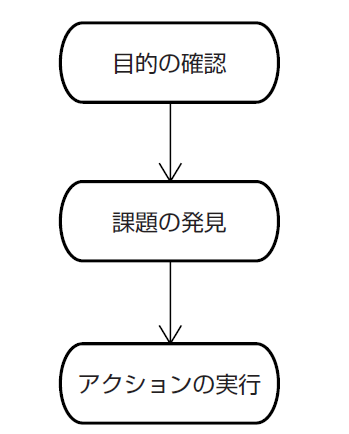
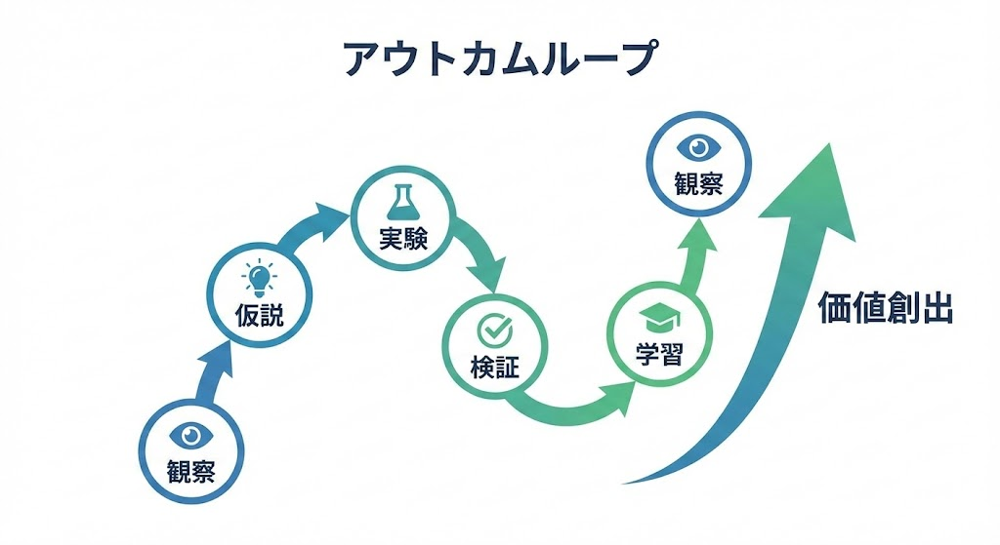

# 第1章：アウトカムループ：観察／仮説／実験／検証／学習の高速サイクル

## 変化する時代に適応するフレームワークへ

「計画通りに機能を作ったのに、なぜお客様は使ってくれないのか？」

皆さんは、こんな経験はありませんか？　私にはあります。何度もあります。要件通りにシステムを納品した。スケジュールも守った。でも、蓋を開けてみたら、お客様はほとんど使ってくれなかった。あのときの衝撃は、今でも忘れられません。

実は、この問いこそが、本章でお伝えする「アウトカムループ」の出発点なのです。

私たちを取り巻く環境は、ものすごいスピードで変わっています。かつてのやり方が通用しない。そんな場面が増えてきました。では、どうすればいいのでしょうか。

二十年前、私は『現場リーダーの技術』という本を書きました。そこでは「目的／課題／アクション」という考え方を紹介しています。目的を定め、課題を見つけ、アクションを起こす。シンプルですが、これが仕事の基本です。計画通りに進めることよりも、目的から逆算して考えること。そして、このステップを繰り返すこと。当時は、この考え方で十分でした。

【図表 1-1: 「目的／課題／アクション」のフロー図】

この考え方は、今でも大切です。目的を見失わないこと。課題を明確にすること。アクションに担当者と期限を定めること。これができなければ、プロジェクトはあっという間に迷走します。

ところが、二十年が経ち、世の中は大きく変わりました。テクノロジーの進化は加速し、市場の変化はかつてないほど速くなった。「一度決めた道筋を変えない」では、もう追いつけないのです。状況に応じて、柔軟に方向転換する。そんな能力が、今まで以上に求められるようになりました。

もちろん、「目的／課題／アクション」は今でも有効です。しかし、それだけでは足りない。お客様に本当の価値を届け、変化に素早く対応するには、新しい視点が必要なのです。

では、現代の**変革リーダー**に求められる、仕事の新しい羅針盤とは何でしょうか？　それが、本書でお伝えしたい「アウトカムループ」という考え方です。観察して、仮説を立てて、実験して、検証して、学ぶ。この5つを高速で回していくのです。シンプルですが、これが強力なのです。

## 本当に大切なのは「つくったもの」より「起きた変化」

ここで「顧客」という言葉について、少し補足させてください。「顧客」とは、商品やサービスを購入するお客様だけではありません。あなたが提供する価値を受け取る人すべてを指します。たとえば、行政なら住民、社内システムなら社員、製造現場なら次工程の作業者、教育現場なら生徒や保護者です。あなたの仕事が誰のためになるのか。その「誰か」が「顧客」なのです。

さて、かつてのプロジェクトでは、「決められた期日までに、決められた機能を開発する」ことが成功の基準でした。いわゆる「機能完了」、つまりアウトプットです。もちろん、これも大切です。けれども、機能がすべて揃っても、顧客が使ってくれなければ意味がありません。顧客の課題が解決されなければ、成功とは言えないのです。

ここで質問です。皆さんは、何を成功の基準にしていますか？

現代のリーダーは、「作ったもの」ではなく「起きた変化」に目を向ける必要があります。「私たちが作ったものによって、顧客の行動がどう変わったか？」「顧客にどんな『うれしさ』が生まれたか？」。この「顧客の行動変化」——アウトカム——にこそ、ゴールを設定すべきなのです。

| 観点 | アウトプット志向 | アウトカム志向 |
| ----- | ----- | ----- |
| フォーカス | 成果物（何を作るか） | 効果（どんな価値・変化を生むか） |
| 成功の定義 | 作ったかどうか | 目的を達成できたかどうか |
| 指標 | スケジュール、納品物の有無 | ユーザー満足度、業務改善、収益など |
| マネジメント手法 | タスク管理、進捗報告 | OKR、KPI、顧客フィードバック |

【図表 1-2: アウトプット志向 vs アウトカム志向の比較図】

アウトカムに焦点を当てると、仕事の進め方も変わります。すべてを事前に計画するのではなく、「こうすればお客様はもっと喜んでくれるのでは？」という「仮説」からスタートする。それを小さく「実験」して、そこから「学習」する。このサイクルが中心になるのです。

## 変化の波に乗る「観察／仮説／実験／検証／学習」のループ

目的は、私たちの「北極星」です。これは変わりません。ただし、その北極星への道のりは常に変化し、予測困難であることを前提にするのです。

では、具体的にどう進めるのでしょうか。

まず「観察」です。お客様の様子、市場の動き、チームの状態など、様々な情報に耳を澄ませ、目を凝らすことから始まります。

次に「仮説」を立てます。「こういう機能があれば、お客様の行動が変わるはずだ」「このサービスを提供すれば、喜んでくれるだろう」。仮説は、まだ証明されていないアイデアです。時には大胆な推測でも構いません。大切なのは、それが「お客様のうれしさ」に繋がる可能性を秘めていること。

仮説ができたら「実験」です。ここで大切なのは、小さく、素早く動くことです。完璧を目指す必要はありません。仮説が正しいかどうかを確かめられる最小限のもので試してみましょう。たとえば、プロトタイプを使ったり、一部のお客様にだけ提供したり、インタビューで反応を探ったりする方法があります。

実験の結果を「検証」します。お客様は使ってくれたか、想定した変化は起きたか、反応はどうか。データを客観的に分析するのです。期待通りでなくても大丈夫です。それも貴重なデータなのですから。

そして「学習」です。仮説は正しかったか、なぜうまくいかなかったのか、新たな気づきは何か。これらを振り返ることで得られる学習こそが、次の行動への原動力になります。

学習から得られた知見を元に、次の「仮説」を立てます。あるいは目的そのものを問い直すこともあるでしょう。「観察→仮説→実験→検証→学習」というサイクルを素早く、何度も回していく。これが「アウトカムループ」なのです。

振り返ると、『現場リーダーの技術』の「目的／課題／アクション」も一種のループでした。しかし、これは成果物の完成を重視する「**アウトプットループ**」と呼べるものです。計画通りに進め、決められた機能を作り上げることに焦点を当てていました。

一方、「アウトカムループ」は顧客の行動変化に焦点を当てます。不確実な環境の中で、学習しながら進化していくのです。より動的で適応的なアプローチと言えるでしょう。

ここで大切なことがあります。両者は対立するものではありません。**状況に応じて使い分ける**のです。要件が明確で環境が安定しているなら**アウトプットループ**。不確実性が高く変化が速いなら**アウトカムループ**。どちらも使いこなせることが、現代のリーダーには求められています。

【図表 1-3: アウトカムループ（観察→仮説→実験→検証→学習のサイクル図）】
<!-- 注: 螺旋状に上昇するサイクル図。5つのステップ「観察」→「仮説」→「実験」→「検証」→「学習」から、さらに「観察」に続く。1周するごとに上へ進む螺旋構造で表現。上部に向かって「価値創出」が高まることを示す。OODAループの図を参考に。シンプルなフラットデザイン -->

| 観点 | アウトプットループ | アウトカムループ |
| ----- | ----- | ----- |
| **フレームワーク** | 目的／課題／アクション | 観察／仮説／実験／検証／学習 |
| **焦点** | アウトプット（成果物の完成） | アウトカム（顧客の行動変化） |
| **環境前提** | 計画可能、予測可能 | 不確実性が高い、変化が速い |
| **開始点** | 目的の確認 | 現状の観察 |
| **進め方** | 目的から逆算して課題を発見し、アクションを実行 | 仮説を立て、小さく実験し、検証しながら学習 |
| **繰り返しの目的** | プロジェクト目標達成 | 継続的な価値創出と環境適応 |
| **成功の指標** | 計画通りの実行、期日内の納品 | 顧客満足度、行動変化、ビジネス成果 |
| **適した場面** | 要件が明確、環境が安定 | 要件が不明確、環境が変動 |
| **関係性** | 要件が明確な場面で効果的 | 不確実性が高い場面で効果的 |

【図表 1-4: アウトプットループとアウトカムループの比較】

## 「機能完成」と「価値創出」のギャップ：私の失敗体験

ここで、私自身の失敗をお話しさせてください。

社内で新しい自社サービスを開発するプロジェクトがありました。私はプロダクトオーナーを務めていました。

当時の私には、長年の受託開発で染み付いた考え方がありました。「お客様の要求を聞いて、仕様に落とし込み、計画通りに開発して、期日までに納品すれば成功」。いわば「受託メンタルモデル」です。

新しいサービス開発でも、この考え方を無意識に適用してしまいました。社内の声を聞いて、「こういうサービスがあれば喜ばれるだろう」と仮説を立てたつもりになった。すぐに開発チームを組成し、計画を立て、ひたすら「機能」を開発しました。

毎週、議事録を書いて進捗を確認。タスク管理ツールでアクションの完了を追いかける。見た目には、順調でした。進捗率は高い。多くの機能が完成に近づいている。チームも一生懸命やってくれている。

ただ、決定的な問題がありました。

私たちが開発している機能やサービスが、市場にいる「お客様」のどんな「行動変化」に繋がるのか？　この最も重要な仮説の検証が、ほとんどできていなかったのです。お客様になるであろう人たちの生の声を聞く。開発中のサービスを使ってもらって反応を見る。そういった「実験」が、ほぼ行われていませんでした。「きっとこれで大丈夫だろう」。自分たちの思い込みで突き進んでしまったのです。

結果はどうだったか。サービスをリリースしたものの、お客様の反応は期待外れでした。ほとんど使ってもらえない。問い合わせも来ない。ビジネスとしては、全く成り立ちませんでした。

私は愕然としました。計画通りに機能を開発した。チームも頑張ってくれた。なのに、なぜ？

必死に考えました。そして気づいたのです。お客様の「うれしさ」を生み出すための「仮説」が曖昧だった。それを検証する「実験」と「学習」のサイクルが、完全に欠けていた。

『現場リーダーの技術』の「目的／課題／アクション」は、計画実行には強力なフレームワークです。しかし、不確実な状況で「お客様のうれしさ」を探し当てるには、それだけでは足りなかった。観察し、仮説を立て、実験し、検証し、学習する。この「アウトカムループ」が必要だったのです。

この失敗は、私にとって痛みを伴う大きな学びでした。そして、これからの時代に**変革リーダー**が身につけるべき「実践技術」とは何か。それを深く考え直すきっかけとなったのです。

---

このアウトカムループは、私がスクラムを実践し、OODAループやリーン・スタートアップなど様々な理論を学び試す中で見出した「最小限の実践フレーム」です。

スクラムには2週間スプリントやロール定義など、形式的な制約があります。リーン・スタートアップはスタートアップ文脈が前提です。しかしアウトカムループは、ソフトウェア開発チームだけでなく行政や教育現場でも、そして予算やリソースに制約がある環境でも適用できる、最小限の思考フレームワークとして設計しています。

## 小さな実験が、行政を変えた

では、このアウトカムループが実際にどう機能するのか。福井県高浜町での事例をご紹介しましょう。

高浜町には、公共施設の空調設備点検という業務がありました。点検員の方々は、町内の施設を巡回し、紙のリストを見ながら点検する。結果を手書きで記録し、事務所に戻ってからExcelに転記して集計する。これを日々繰り返していました。

業務の「目的」は、施設の安全性を確保し、住民に快適な環境を提供すること。しかし、「課題」がありました。この点検業務が非効率なのです。点検員の負担が大きい。集計に時間がかかる。設備異常の早期発見や修繕計画の立案にも遅れが生じる可能性がありました。

ここで私は仮説を立てました。「タブレットで点検結果を直接入力できれば、紙の記録もExcel転記もなくなり、業務効率が大幅に改善されるのでは？」

では、どう検証するか。いきなり高機能なシステムを作る？　いえ、違います。開発にはローコードツールのkintoneを使うことは決まっていましたが、最初から完璧なものを目指さず、最小限の機能だけを実装しました。そして、早い段階で実際の点検員の方々に使ってもらう。これが「実験」です。

【図表 1-5: 高浜町での点検アプリ利用イメージ】

結果はどうだったか。点検現場での記録時間、事務所での転記・集計時間、どちらも大幅に削減されました。これが「検証」です。点検員の方々からも「これは便利だ」「集計が楽になる」という声が上がりました。お客様の「うれしさ」というアウトカムが、確かに得られたのです。

この実験結果を受けて、本格導入と機能拡張を進めました。最終的には、点検業務全体の時間を年間で約45%削減。具体的な成果に繋がったのです。

大切なのは、これが単に「アプリを作った」という話ではないこと。業務の非効率さという課題に対し、仮説を立て、簡易システムで素早く実験し、結果を検証し、学習して本格導入に進んだ。「観察／仮説／実験／検証／学習」のサイクルを回し、アウトカムに焦点を当てたからこその成功なのです。

この考え方は、ソフトウェア開発に限りません。自治体の業務改善、製造ラインの効率化、マーケティング、社内の新しい取り組み。あらゆる現場に応用できます。

## アウトカムループで産学官連携をスムーズに

ソフトウェア開発以外の分野でも、「観察／仮説／実験／検証／学習」のループは大きな成果を生み出します。ここでは、私が実際に関わった産学官連携による「ふくいGirls未来のテックリーダー」プロジェクトをご紹介しましょう。

このプロジェクトは、福井県の理工系分野への大学進学におけるジェンダーギャップの課題に取り組むものでした。福井県の理工系学部への進学率は、理学部が全国45位、工学部に至っては47位（最下位）という状況だったのです。

まず私たちは現状を「観察」するところから始めました。高校の情報の授業内容を調べたり、授業で使用される教科書を確認したりしました。同時に、当時爆発的に話題となっていたChatGPTなどの生成AIに対する若者の関心の高さも観察しました。この観察から、「生成AIをテーマにすれば高校生、特に女子高生の理工系への関心を高められるのではないか」という「仮説」が生まれました。

この仮説を検証するための「実験」として、プロジェクト募集の段階から生成AIの魅力を伝える戦略を立てました。教育に関する県のデータを学習させたAIチャットボットを開発し、その様子をYouTubeにアップ。このデモ動画を学校側に提供して募集のきっかけとしてもらったのです。

実験の「検証」は応募者数という明確な指標で行いました。結果は予想以上に良好で、多数の応募がありました。これにより、「生成AIは若者の関心を引くテーマになる」という仮説が支持されました。同時に、「応募者が多数になると準備に課題が生じる」という新たな「学習」も得られました。

この学習を基に、次のサイクルでは「参加者のリテラシーにばらつきがあるのではないか」という新たな「仮説」を立てました。これを検証するために事前アンケートを実施し、参加者の約7割がプログラミング経験ありと回答しましたが、学校によって情報の授業の進み具合が全く異なることも判明しました。この「検証」結果から、「幅広いスキルレベルに対応できる教材が必要」という「学習」を得て、実際のChromebookを取り寄せてテスト環境を用意し、Google Colaboratoryでの動作確認を行うという次の「実験」につなげました。

プロジェクト開始後もアウトカムループを回し続けました。3回目の講座終了時点でのアンケート結果という「観察」から、「難しかった」という声と「単調だった」という相反する声が混在していることを把握。学校や個人の都合による欠席も多く、参加者間のスキル差が広がっているという現実も見えてきました。

この観察から、「数学という共通言語を活用すれば、プログラミングの理解度が上がるのではないか」という新たな「仮説」を立てました。この仮説を検証するための「実験」として、統計やデータ分析の基礎となる数学の概念から教えるアプローチを採用。生成AIを活用して教材を迅速に作成し、数学が好きな女性スタッフに当日の講義を依頼しました。

実験の「検証」結果は非常に良好で、「数学で学んだことをプログラムで書けて楽しかった」などのポジティブな反応が多数得られました。この経験からの「学習」は、「抽象的なプログラミング概念も、身近な数学と結びつけることで理解が深まる」という知見でした。この学習は、その後のカリキュラム設計にも活かされています。

【図表 1-6: ふくいGirls未来のテックリーダーの様子】

このプロジェクトの成功の背景には、アウトカムループを高速で回すことができた組織文化も影響していました。相互信頼や現場の主導性など、様々な要素がアウトカムループの実践を支えていましたが、組織文化についての詳細は第2章で改めて詳しく掘り下げることにします。

プロジェクトの結果、参加した生徒たちからは次のような声が寄せられました：

「私自身は文系だけど、文系だからといってIT系の仕事を諦めなくてもいいんだなと思った。少し目指してみたいなと思った。」 「とっても楽しくて来てよかったと思いました。プログラミングのことをまた一つ知って将来は絶対医療系に付きたいと思っていたけどエンジニアもとても楽しそうでなによりコードを書くのが楽しいので将来の夢の候補の一つになりました。」 「プログラミングに対する印象がとても良い方向に変わりました。」

この事例で重要なのは、単に「イベントや講座を開催する」というアウトプットに固執せず、「女子高生の理工系に対する関心向上とキャリア選択の変化」というアウトカムに焦点を当て、小さな実験から学びながら改善を重ねたことです。

また、永和システムマネジメントがこのプロジェクトに取り組んだ理由も興味深いものでした。単なる社会貢献だけでなく、将来の採用や広報的価値という経営戦略も含まれていたのです。社会課題の解決と企業の成長戦略を両立させるという視点は、現代の「変革リーダー」にとって重要な視点だと言えるでしょう。

このプロジェクトは今も続いており、より多くの女子高生が参加できるよう、参加しやすいスケジュールにしたり、大学との連携を強化したりと、さらなる改善を加えながら進行中です。「観察／仮説／実験／検証／学習」のループは、このように教育現場や地域課題の解決にも大きな力を発揮するのです。

## アウトカムループの回し方

ここまで、アウトカムループの概念と事例をお伝えしてきました。では、実際にあなたの現場で回すには、具体的に何をすればよいのでしょうか。各ステップの実践方法を解説します。

### 観察：何を見るか、どう見るか

観察とは、現場で「何が起きているか」を先入観なく捉えることです。

**具体的にやること**
- 顧客の業務現場に足を運び、実際の作業を見せてもらう
- 問い合わせやクレームの内容をデータとして眺める
- チームメンバーとの雑談の中で、繰り返し出てくる話題に耳を傾ける
- 競合サービスを自分で使ってみる

**陥りやすい罠**
- 「きっとこうだろう」という思い込みで見てしまう
- 数字だけを見て、その背景にある文脈を無視する
- 自分に都合の良い情報ばかり集めてしまう

**うまくいくコツ**
観察の目的は「答えを見つける」ことではなく、「問いを見つける」ことです。「あれ、おかしいな」「なぜこうなっているんだろう」という違和感を大切にしてください。高浜町の事例では、点検員の方々の作業を実際に見せてもらったことで、紙とExcelの二重作業という課題が見えてきました。

### 仮説：「もし〜なら」の形で書く

仮説とは、観察から得た気づきを「検証可能な予測」に変換することです。

**良い仮説の例**
- 「点検結果をタブレットで直接入力できれば、転記作業がなくなり、1日あたり30分の時間短縮になるはずだ」
- 「生成AIをテーマにすれば、女子高生の参加率が従来より20%上がるだろう」

**悪い仮説の例**
- 「もっと便利なシステムを作れば、みんな喜ぶはずだ」（曖昧すぎて検証できない）
- 「このサービスは絶対に成功する」（仮説ではなく願望）

**仮説を立てるときの問い**
- この仮説が正しければ、顧客のどんな行動が変わるか？
- 何が観察できれば、この仮説が正しいと言えるか？
- 仮説が間違っていた場合、次に何を試すか？

**うまくいくコツ**
仮説は「正しいこと」よりも「検証可能であること」が重要です。大胆な仮説でも構いません。むしろ、小さすぎる仮説は学びも小さくなります。ただし、後述する「実験」で検証できる粒度にすることが大切です。

### 実験：最小限で素早く

実験とは、仮説を検証するための最小限のアクションを実行することです。

**規模感の目安**
- 期間：1〜2週間以内で結果が見える
- コスト：失敗しても許容できる範囲（人日で言えば数日〜1週間程度）
- 対象：全員ではなく、一部の顧客やチームで試す

**「完璧を目指さない」の具体的意味**
- 高浜町では、kintoneで最小限の機能だけ実装し、早期に実ユーザーに触ってもらった
- ふくいGirlsでは、募集段階でAIチャットボットのデモ動画を作り、反応を見た
- 製品開発なら、PowerPointの紙芝居やFigmaのモックアップで十分なこともある

**実験設計のチェックリスト**
- [ ] 何を測定すれば、仮説の正否が判断できるか決めたか？
- [ ] 実験の期間と対象範囲を限定したか？
- [ ] 失敗した場合の撤退基準を決めたか？
- [ ] 実験結果を誰と共有するか決めたか？

**うまくいくコツ**
「もう少し準備してから」「もっとデータを集めてから」と言い続けて、いつまでも実験に踏み切れないケースが多いです。不完全でも、早く試して早く学ぶ。これがアウトカムループの核心です。

### 検証：何をもって成功とするか

検証とは、実験結果を客観的に評価し、仮説の正否を判断することです。

**事前に決めておくべきこと**
- 成功の定義：どんな数値や反応があれば「うまくいった」と言えるか
- 失敗の定義：どんな結果なら「この方向は違う」と判断するか
- 判断の時期：いつの時点で評価するか

**定量と定性のバランス**
- 定量データ：利用率、時間短縮、コスト削減など数値で測れるもの
- 定性データ：顧客の声、チームの感触、予想外の発見など

数値だけを見ると、重要な文脈を見落とすことがあります。高浜町の事例では、時間短縮という定量データだけでなく、点検員の方々から「これは便利だ」という声（定性データ）が得られたことが、本格導入の判断材料になりました。

**うまくいくコツ**
検証で最も重要なのは、「期待通りでなくても、それは失敗ではない」という心構えです。仮説が外れたこと自体が貴重な学びです。「なぜ外れたのか」を考えることで、次の仮説が生まれます。

### 学習：次に活かす問い

学習とは、検証結果から得られた知見を言語化し、次のサイクルにつなげることです。

**振り返りの具体的な問い**
- 仮説は正しかったか？　正しくなかったとしたら、なぜか？
- 予想外の発見は何かあったか？
- 次に試すとしたら、何を変えるか？
- この学びを、他のプロジェクトやチームにも活かせるか？

**チームで共有する方法**
- 週次のチームミーティングで5分間の「今週の学び」コーナーを設ける
- Slackやドキュメントに「実験ログ」として記録する
- 失敗事例も含めて、オープンに共有できる場を作る

**うまくいくコツ**
学習は個人の頭の中に留めず、チームや組織で共有することで価値が何倍にもなります。ただし、「学習を共有する」ためには、第2章で詳しく扱う「心理的安全性」が土台として必要になります。

---

ここまで各ステップの実践方法を解説してきました。大切なのは、このループを「一度回して終わり」ではなく、**継続的に回し続ける**ことです。1周目で完璧な答えは出ません。2周目、3周目と回すうちに、仮説の精度が上がり、顧客への理解が深まっていくのです。

## アウトカムループの源流：私が学んできたフレームワークたち

アウトカムループは、私がこの二十年間で学び、実践してきた様々なフレームワークから影響を受けています。それぞれとの出会いと、そこから得た気づきを振り返ってみます。

**PDCAサイクル**
最初に出会ったのはPDCAサイクルでした。「Plan（計画）→Do（実行）→Check（評価）→Act（改善）」という流れは、製造業の品質管理から広まり、私たちソフトウェア開発の現場でも長く使われてきました。しかし実践の中で、「計画」を起点とするこのサイクルが、不確実性の高い環境では機能しにくいと感じるようになりました。計画を立てる時点で前提が崩れていることが多かったのです。

**OODAループ**
次に学んだのがOODAループです。「Observe（観察）→Orient（情勢判断）→Decide（意思決定）→Act（行動）」という軍事戦略家ジョン・ボイドの考え方は、「計画」ではなく「観察」から始まる点で、私の感じていた違和感に応えてくれました。相手より速く状況を把握し、適応する。この発想は、変化の激しい現代のビジネス環境に通じるものがあります。

**リーンスタートアップ**
エリック・リースの『リーン・スタートアップ』（2011年）との出会いは大きな転機でした。「Build（構築）→Measure（計測）→Learn（学習）」のサイクルは、「学習」を明示的にループの中に組み込んでいます。仮説検証という考え方、MVPで小さく試すというアプローチは、私の実践に直接影響を与えました。

**スクラム**
そして最も長く実践してきたのがスクラムです。スプリントレビューで顧客フィードバックを得て、レトロスペクティブで学びを言語化し、次のスプリントプランニングで仮説を立て直す。気づいたのは、スクラムを正しく実践できているとき、実質的にアウトカムループに近いものが回っているということでした。

**エフェクチュエーション**
経営学者サラス・サラスバシーの「エフェクチュエーション」は、比較的最近学んだ理論です。「今ある資源から始め、許容できる損失の範囲で実験し、協力者を巻き込みながら、結果として目標が形作られていく」という考え方。高浜町でkintoneのプロトタイプを作ったとき、ふくいGirlsの方向転換をしたとき、私たちは無意識にこのアプローチを取っていました。エフェクチュエーションを知ったことで、自分たちの実践を言語化できるようになったのです。

---

これらのフレームワークから学び、実際の現場で試行錯誤する中で、私なりに整理したのがアウトカムループです。新しい理論を発明したわけではありません。先人たちの知恵を、自分の経験を通じて咀嚼し、「顧客の行動変化（アウトカム）」という焦点で再構成したものです。

正直に言えば、私自身はもう、アウトカムループの各ステップを意識して使っているわけではありません。自転車に乗るとき、「次にペダルをこいで、ハンドルをこの角度に変えて」と考えないように、観察→仮説→実験→検証→学習のサイクルは、ほぼ無意識に回っています。本章で言語化したのは、この「体が覚えている」実践知を、読者のみなさんに伝えるためです。

フレームワークの名前やステップの数よりも重要なのは、「計画通りに進める」という固定思考から、「変化を観察し、仮説を立て、実験し、学習するサイクル」という適応的思考への転換です。この思考法の転換こそが、現代の**変革リーダー**に求められる**実践技術**の核心なのです。

## 実践ツール

アウトカムループの各ステップを効果的に実践するための補助手段を紹介します。

### カンバン
タスクの見える化だけでなく、フローの滞りを検知する視点で活用します。「実験」「検証」のステップで、チームの作業状況を可視化し、ボトルネックを早期に発見できます。

### KPT（Keep, Problem, Try）
「学習」ステップを促進する振り返り手法です。うまくいったこと（Keep）、課題（Problem）、次に試すこと（Try）を整理することで、次の仮説立案に繋げます。

### 簡易プロトタイピング
「仮説」「実験」ステップで特に重要です。紙芝居やモックアップなど、非ITの手法も含めて、最小限の労力で仮説を検証できる形にします。最近はFigma AIなど、プロンプトからUIを自動生成するツールも登場しています。

### 顧客インタビュー／観察ガイド
「観察」「検証」ステップの質を高めます。目的を明確にした上で、顧客の声を直接聞き、行動を観察することで、仮説の精度が上がります。

### MVP（最小実行可能プロダクト）計画シート
仮説・目的・検証方法などを整理し、「仮説」「実験」ステップを構造化します。

### 情報共有ツール
Slack、Teams、Mural、Miroなど、学びを共有する視点で選定します。「観察」から「学習」まで全ステップを通じて、チームの知識を蓄積・共有します。

## 明日から実践できる「小さな一歩」

1. **観察タイムを設ける（5分）**
   毎日5分、お客様や現場の様子をただ観察する時間を作ってみましょう。気づいたことをメモするだけでも、新しい発見があるはずです。

2. **仮説ノートをつける（5分）**
   「もしかしたら〇〇すれば、××が改善されるのでは？」という小さな仮説を毎日1つノートに書き留めてみましょう。量が質を生み出します。

3. **週1で小さな実験を行う（15分）**
   チームで週に1つ、小さな改善実験を行う習慣をつくりましょう。完璧を目指さず、素早く試すことが大切です。

4. **KPTで振り返る（15分）**
   週に一度、15分だけチームで「Keep（続けること）、Problem（課題）、Try（試すこと）」を話し合ってみましょう。短時間でも継続することで、学びの文化が根付きます。

5. **アウトカム質問を投げかける（5分）**
   「これによって、誰にどんな変化が起きるだろう？」という問いをプロジェクトで常に問いかけてみましょう。

## 第1章のまとめ

本章では、変化の時代に価値を生み出すための基本フレームワーク「アウトカムループ」についてお伝えしてきました。

### OutputからOutcomeへの転換

2006年の『現場リーダーの技術』では、「目的／課題／アクション」というシンプルなフレームワークを提唱しました。しかし二十年が経ち、「つくったものが価値を生むとは限らない」という現実に直面しました。

機能を作る（Output）ことと、顧客の変化を生む（Outcome）ことは、まったく別物です。この認識の転換が、アウトカムループの出発点となります。

### 5つのステップの実践

アウトカムループは、観察→仮説→実験→検証→学習という5つのステップで構成されます。

高浜町のkintone開発では、現場に足を運び、点検員の動きを観察することから始めました。ふくいGirlsプロジェクトでは、当初の仮説が覆される中で方向転換を行いました。いずれの事例でも、小さく始めて素早くフィードバックを得ることが成功の鍵でした。

### 様々な文脈での応用

アウトカムループは、特定の手法に依存しません。

スクラムを正しく実践しているとき、スプリントレビューが「検証」、レトロスペクティブが「学習」として機能しています。デザイン思考、リーン・スタートアップ、OODAループ——これらの手法も、本質的にはアウトカムループの考え方と共鳴しています。大切なのは手法そのものではなく、「変化から学び、価値を届け続ける」というマインドセットです。

### 土壌づくりへ

ただ、この学習サイクルは、リーダー一人の力では実現できません。

チームメンバー一人ひとりが、安心して「仮説」を口にできること。失敗しても責められず「実験」に取り組めること。気づきをオープンに共有し、「学習」に繋げられること。そんな「土壌」があってこそ、アウトカムループは真に機能するのです。

では、リーダーはどうやってその土壌を育てるのか？　チームが自律的に変化に対応できるようになるには、何が必要なのか？

次章では、チームの学びと自律を支える「心理的安全性」と「権限移譲」について、深く掘り下げていきましょう。
