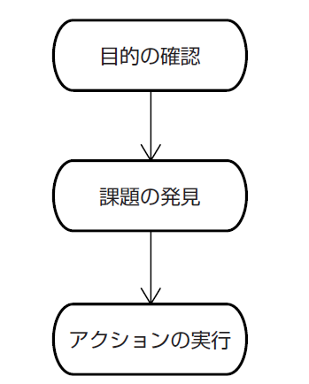
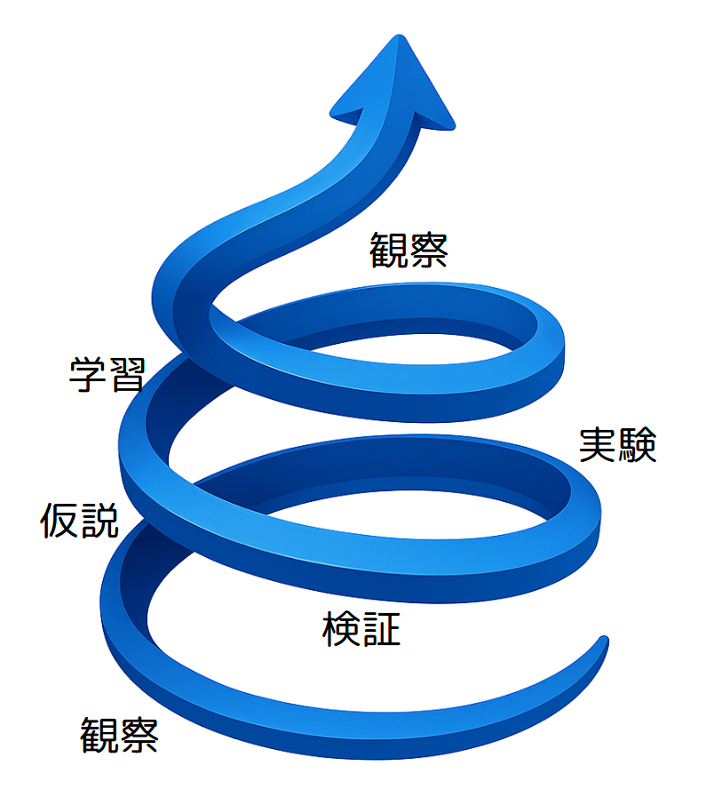

## **第1章：顧客価値∞ループ：観察／仮説／実験／検証／学習の高速サイクル**

### **計画通り、ではうまくいかない時代に**

変化の速さが加速する現代において、従来の「計画通りに進める」というアプローチだけでは、もはや十分ではありません。予測困難な未来に対応するには、新しい思考と実践のフレームワークが必要です。

2006年版の本書では、この仕事の基本を「目的／課題／アクション」という三段論法として説明しました。

【図表 1-1: 2006年版「目的／課題／アクション」のフロー図】

この考え方は、今でも仕事の根幹をなす重要なものです。目的を見失わないこと。課題を明確にすること。アクションに担当者と期限を定めること。これらができなければ、プロジェクトはあっという間に迷走してしまうでしょう。

しかし、あれから約二十年が経ち、私たちの働く環境は劇的に変化しました。テクノロジーの進化は加速し、市場の変化はかつてないほど速くなりました。不確実性が高まる中、一度決めた計画に固執するのではなく、状況の変化に応じて柔軟に方向転換できる能力が求められるようになったのです。

このような時代においては、一度決めた目的や課題、アクションに固執しているだけでは、もはやお客様に本当に価値を届けたり、変化に素早く対応したりすることが難しくなってきています。計画通りに進める能力だけでは不十分なのです。

では、現代の**変革リーダー**に求められる、仕事の新しい羅針盤とは一体何でしょうか？ それが、本書でお伝えしたい「顧客価値∞ループ：観察／仮説／実験／検証／学習の高速サイクル」という考え方です。

### **本当に大切なのは「つくったもの」より「起きた変化」**

まず、「顧客」という言葉について、少し補足しておきましょう。ここでいう「顧客」とは、単に商品やサービスを購入するお客様だけではありません。あなたが提供する価値を受け取る人すべてを指します。行政の場合は住民であり、社内システムの場合は社員であり、製造現場では次工程の作業者かもしれません。教育現場では生徒や保護者が「顧客」となります。あなたの仕事が誰のためになるのか、その「誰か」が「顧客」です。

さて、かつてのプロジェクトでは、「決められた期日までに、決められた機能を開発する」といった「機能完了」（Output）が成功の大きな基準でした。もちろん、これも重要なのですが、機能がすべて揃っても、顧客がそれを使ってくれなかったり、顧客の課題が解決されなかったりすれば、真の意味で成功したとは言えません。

現代、そしてこれからのリーダーは、「私たちが作ったものによって、顧客の行動がどのように変わったか？」「顧客にどのような『うれしさ』が生まれたか？」といった「顧客の行動変化」（Outcome）にこそ、ゴールを設定する必要があります。

| 観点 | Output志向 | Outcome志向 |
| ----- | ----- | ----- |
| フォーカス | 成果物（何を作るか） | 効果（どんな価値・変化を生むか） |
| 成功の定義 | 作ったかどうか | 目的を達成できたかどうか |
| 指標 | スケジュール、納品物の有無 | ユーザー満足度、業務改善、収益など |
| マネジメント手法 | タスク管理、進捗報告 | OKR、KPI、顧客フィードバック |

【図表 1-2: Output志向 vs Outcome志向の比較図】

このOutcomeに焦点を当てるようになると、仕事の進め方も変わってきます。すべてを事前に計画するのではなく、「もしかしたら、こうすればお客様はもっと喜んでくれるのではないか？」という「仮説」からスタートし、それを小さく「実験」して、そこから「学習」するというサイクルが中心になるのです。

### **変化の波に乗る「観察／仮説／実験／検証／学習」のループ**

目的は、引き続き私たちの目指すべき「北極星」です。ただし、その北極星への道のりは常に変化し、予測困難であることを前提とします。

まず、私たちは現在の状況をよく「観察」します。お客様の様子、市場の動き、チームの状態など、様々な情報に耳を澄ませ、目を凝らします。

次に、観察から得られた情報や、目指すべきOutcomeを踏まえて「仮説」を立てます。「この課題を解決するために、このような機能があれば、お客様の〇〇という行動が変わるはずだ」「△△というサービスを提供すれば、お客様は喜んでくれるだろう」といった具合です。仮説は、まだ証明されていないアイデアや見込みであり、時には大胆な推測であっても構いません。重要なのは、それが目的に繋がり、「お客様のうれしさ」を生み出す可能性を秘めていることです。

仮説を立てたら、それを検証するための「実験」を設計し、実行します。ここで大切なのは、小さく、素早く実験することです。完璧なものを作ってから出すのではなく、不完全であっても、仮説が正しいかどうかを確かめられる最小限のもので試してみる。例えば、簡単なプロトタイプを使ったり、一部のお客様にだけ提供してみたり、あるいは調査やインタビューで反応を探ったりします。

実験で得られた結果を「データ検証」します。お客様は実際にその機能を使ってくれたか？想定した行動変化は起きたか？お客様の反応は？といったデータを客観的に分析します。期待通りの結果が得られなくても、それはそれで貴重なデータです。

検証結果から「学習」します。仮説は正しかったのか？なぜうまくいかなかったのか？実験方法に問題はなかったか？新たな気づきは何か？この学習こそが、私たちを次の行動へと繋げる原動力となります。

そして、この学習から得られた知見を元に、次の「仮説」を立てる、あるいは必要であれば目的そのものを問い直すために立ち戻る。このように、「観察→仮説→実験→データ検証→学習」というサイクルを素早く、何度も回すこと。これが、不確実性の高い現代において、顧客価値を発見し続けるための「顧客価値∞ループ」なのです。

【図表 1-3: 顧客価値∞ループ（観察→仮説→実験→データ検証→学習のサイクル図）】 

### **私が体験した「計画」の落とし穴**

私自身、この「観察／仮説／実験／検証／学習」のサイクルを回すことの重要性を、大きな失敗を通じて痛感した経験があります。かつて、社内で新しい自社サービスを開発するプロジェクトで、プロダクトオーナーを務めた時のことです。

当時の私は、長年ソフトウェアを受託開発してきた経験から、「お客様の要求をしっかりと聞き、それを仕様に落とし込み、計画通りに開発し、期日までに納品すれば成功だ」という「受託メンタルモデル」が強く染み付いていました。

新しいサービス開発においても、このモデルを無意識のうちに適用してしまったのです。社内の何人かの声を聞き、「きっと、こういうサービスがあれば喜ばれるだろう」という仮説を立てたつもりになり、すぐに開発チームを組成し、計画を立て、ひたすら「機能」を開発することに注力しました。

毎週のように「議事録」を書いて進捗を確認し、タスク管理ツールで「アクション」の完了を追いかけました。見た目には、プロジェクトは順調に進んでいるように見えました。計画に対する進捗率は高く、多くの機能が完成に近づいていました。チームメンバーも一生懸命開発してくれました。

しかし、ここに決定的な問題がありました。私たちが熱心に開発していた機能やサービスが、実際に市場にいる「お客様」の、どのような「行動変化」（Outcome）に繋がるのか？という、最も重要な「仮説」の検証が、ほとんどできていなかったのです。

お客様になるであろう人たちの生の声を聞いたり、開発中のサービスを実際に使ってもらって反応を見たりといった「実験」が、最小限しか行われていませんでした。「きっとこれで大丈夫だろう」という、自分たちの内側だけで閉じた思い込みで突き進んでしまったのです。

結果として、サービスをリリースしたものの、お客様の反応は期待外れでした。ほとんど使ってもらえず、問い合わせも来ない。ビジネスとしては、全く成り立ちませんでした。プロジェクトは事実上の失敗に終わりました。

この時、私は愕然としました。計画通りに「機能」を開発し、チームも一生懸命やってくれたのに、なぜうまくいかなかったのか？ 必死に考え、あの時のプロジェクトには、お客様の「うれしさ」を生み出すための「仮説」が曖昧で、それを検証する「実験」とそこからの「学習」のサイクルが完全に欠けていたのだと気づいたのです。

旧版で述べていた「目的／課題／アクション」は、計画の実行においては強力なフレームワークです。しかし、不確実な状況で「お客様のうれしさ」というOutcomeを探し当てるためには、観察を行い、仮説を立て、実験し、検証し、学習するという、もう一段階上位の、あるいは常に回し続けるべき「顧客価値∞ループ」が必要だったのです。

この失敗は私にとって、痛みを伴う大きな学びとなりました。同時に、これからの時代に**変革リーダー**が本当に身につけるべき「実践技術」とは何かを、深く考え直すきっかけとなったのです。

### **小さな実験が、行政を変えた（高浜町）**

「観察／仮説／実験／検証／学習」の高速サイクルとOutcomeへの意識が、どのように現実の課題解決に繋がるのか、福井県高浜町での空調設備点検アプリ開発の事例をご紹介しましょう。これは、ソフトウェア開発の事例ではありますが、そのアプローチはあらゆる分野の**変革**に応用可能です。

高浜町では、公共施設の空調設備点検業務において、紙での記録や手作業による集計に多くの時間と手間がかかっていました。点検員の方々は、広大な町内の施設を巡回し、紙のリストを見ながら点検し、結果を手書きで記録し、事務所に戻ってからその内容をExcelに転記して集計するという作業を日々行っていたのです。

この業務の「目的」は、もちろん施設の安全性を確保し、住民の皆様に快適な環境を提供することです。そして、その目的達成を妨げている「課題」の一つが、この点検業務の非効率さでした。点検員の方々の負担が大きいだけでなく、集計に時間がかかるため、設備の異常の早期発見や、長期的な修繕計画の立案にも遅れが生じる可能性がありました。

ここで私たちは、「スマートフォンやタブレットで点検結果を直接入力できるようにすれば、紙での記録やExcelへの転記作業がなくなり、業務効率が大幅に改善されるのではないか？」という「仮説」を立てました。

この仮説を検証するために、いきなり高機能なシステム開発を目指すのではなく、まずはローコード開発ツールのkintoneを使って、点検項目をアプリ上で入力できる簡易的なシステムを「実験」として短期間で作ってみました。操作が簡単なタブレットを用意し、実際の点検員の方々にこのアプリを使って点検を行ってもらいました。

【写真 1-2: 高浜町での点検アプリ利用イメージ】

実験の結果、点検現場での記録にかかる時間、事務所での転記・集計作業にかかる時間が大幅に削減されることが「データ検証」によって明らかになりました。点検員の方々からも「これは便利だ」「集計が楽になる」という「お客様（業務担当者）の声」というOutcomeが得られました。

この成功的な実験結果を受けて、アプリの本格導入と機能拡張を進めることになりました。最終的には、このアプリ導入を含む業務改善によって、点検業務全体にかかる時間を年間で約45%削減するという具体的な成果（Outcome）に繋がったのです。

この事例は、単にアプリという「機能」（Output）を開発したという話ではありません。業務の「非効率さ」という課題に対し、「アプリで入力できれば効率が上がるだろう」という「仮説」を立て、簡易的なシステムで素早く「実験」し、業務時間削減という「結果」（データ検証）と点検員の方々の「うれしさ」（Outcome）を確認し、そこから「学習」して本格導入に進んだ。まさに、「観察／仮説／実験／検証／学習」のサイクルを回し、Outcomeに焦点を当てたからこそ生まれた成功だと言えます。

この考え方は、ソフトウェア開発だけでなく、自治体での業務改善、製造ラインの効率化、マーケティング活動、あるいは社内での新しい取り組みなど、あらゆる現場に応用できるのです。

### **顧客価値∞ループで行政課題に挑む：理工系女子高生増加プロジェクト**

ソフトウェア開発以外の分野でも、「観察／仮説／実験／検証／学習」のループは大きな成果を生み出します。ここでは、私が福井県CDO補佐官として実際に関わった「ふくいGirls未来のテックリーダー」プロジェクトをご紹介しましょう。

このプロジェクトは、福井県の理工系分野への大学進学におけるジェンダーギャップの課題に取り組むものでした。福井県の理工系学部への進学率は、理学部が全国45位、工学部に至っては47位（最下位）という状況だったのです。

まず私たちは現状を「観察」するところから始めました。高校の情報の授業内容を調べたり、授業で使用される教科書を確認したりしました。同時に、当時爆発的に話題となっていたChatGPTなどの生成AIに対する若者の関心の高さも観察しました。この観察から、「生成AIをテーマにすれば高校生、特に女子高生の理工系への関心を高められるのではないか」という「仮説」が生まれました。

この仮説を検証するための「実験」として、プロジェクト募集の段階から生成AIの魅力を伝える戦略を立てました。教育に関する県のデータを学習させたAIチャットボットを開発し、その様子をYouTubeにアップ。このデモ動画を学校側に提供して募集のきっかけとしてもらったのです。

実験の「検証」は応募者数という明確な指標で行いました。結果は予想以上に良好で、多数の応募がありました。これにより、「生成AIは若者の関心を引くテーマになる」という仮説が支持されました。同時に、「応募者が多数になると準備に課題が生じる」という新たな「学習」も得られました。

この学習を基に、次のサイクルでは「参加者のリテラシーにばらつきがあるのではないか」という新たな「仮説」を立てました。これを検証するために事前アンケートを実施し、参加者の約7割がプログラミング経験ありと回答しましたが、学校によって情報の授業の進み具合が全く異なることも判明しました。この「検証」結果から、「幅広いスキルレベルに対応できる教材が必要」という「学習」を得て、実際のChromebookを取り寄せてテスト環境を用意し、Google Colaboratoryでの動作確認を行うという次の「実験」につなげました。

プロジェクト開始後も顧客価値∞ループを回し続けました。3回目の講座終了時点でのアンケート結果という「観察」から、「難しかった」という声と「単調だった」という相反する声が混在していることを把握。学校や個人の都合による欠席も多く、参加者間のスキル差が広がっているという現実も見えてきました。

この観察から、「数学という共通言語を活用すれば、プログラミングの理解度が上がるのではないか」という新たな「仮説」を立てました。この仮説を検証するための「実験」として、統計やデータ分析の基礎となる数学の概念から教えるアプローチを採用。生成AIを活用して教材を迅速に作成し、数学が好きな女性スタッフに当日の講義を依頼しました。

実験の「検証」結果は非常に良好で、「数学で学んだことをプログラムで書けて楽しかった」などのポジティブな反応が多数得られました。この経験からの「学習」は、「抽象的なプログラミング概念も、身近な数学と結びつけることで理解が深まる」という知見でした。この学習は、その後のカリキュラム設計にも活かされています。

このプロジェクトの成功の鍵となったのは、顧客価値∞ループを高速で回せる組織文化でした。特に以下の4つの文化的特性が重要だったと感じています：

1. **相互信頼**：初対面のメンバーが多い中、タイトなスケジュールがかえって結束力を強化しました。  
2. **皮膚感覚**：Scrum/アジャイル経験を通じて直観的かつ自発的に問題を解決する能力を磨いてきたメンバーが多くいました。  
3. **リーダーシップ契約**：志願してくれた社員にメンターとしてのミッションを任せ、現場の主導性を高めました。  
4. **焦点と方向性**：プロジェクトが永和システムマネジメントのビジョンや戦略、課題と整合していることを最初から説明し、ぶれない軸を持っていました。

プロジェクトの結果、参加した生徒たちからは次のような声が寄せられました：

「私自身は文系だけど、文系だからといってIT系の仕事を諦めなくてもいいんだなと思った。少し目指してみたいなと思った。」 「とっても楽しくて来てよかったと思いました。プログラミングのことをまた一つ知って将来は絶対医療系に付きたいと思っていたけどエンジニアもとても楽しそうでなによりコードを書くのが楽しいので将来の夢の候補の一つになりました。」 「プログラミングに対する印象がとても良い方向に変わりました。」

この事例で重要なのは、単に「イベントや講座を開催する」というOutputに固執せず、「女子高生の理工系に対する関心向上とキャリア選択の変化」というOutcomeに焦点を当て、小さな実験から学びながら改善を重ねたことです。

また、永和システムマネジメントがこのプロジェクトに取り組んだ理由も興味深いものでした。単なる社会貢献だけでなく、将来の採用や広報的価値という経営戦略も含まれていたのです。社会課題の解決と企業の成長戦略を両立させるという視点は、現代の「変革リーダー」にとって重要な視点だと言えるでしょう。

このプロジェクトは今も続いており、より多くの女子高生が参加できるよう、参加しやすいスケジュールにしたり、大学との連携を強化したりと、さらなる改善を加えながら進行中です。「観察／仮説／実験／検証／学習」のループは、このように教育現場や地域課題の解決にも大きな力を発揮するのです。

### **顧客価値∞ループと既存フレームワーク：比較と独自性**

「顧客価値∞（こきゃくかち インフィニティ）ループ」の考え方は、様々な分野で長く活用されてきた実践的フレームワークの系譜に連なるものです。それらとの関係性を理解することで、このループの特徴と使い方がより明確になるでしょう。

**科学的手法との関連**  
 「観察→仮説→実験→検証」という科学的手法は、17世紀から続く問題解決の基本アプローチです。顧客価値∞ループはこれに「学習」のステップを明示的に加え、ビジネス文脈に適用しています。科学的手法が「真理の追究」を目的とするのに対し、顧客価値∞ループは「顧客価値の創出」を目指す点が大きな違いです。

**PDCAサイクルとの違い**  
 マネジメントの世界で広く知られる「Plan（計画）→Do（実行）→Check（評価）→Act（改善）」のPDCAサイクルと比較すると、顧客価値∞ループは「計画」ではなく「観察」から始まります。これは事前の綿密な計画よりも、現状理解と顧客洞察を出発点とする点で、不確実性の高い環境により適応的なアプローチと言えるでしょう。

**OODAループとの共通点**  
 軍事戦略家ジョン・ボイドによって提唱されたOODAループ（Observe/観察→Orient/情勢判断→Decide/意思決定→Act/行動）は、特に複雑で変化の激しい状況での意思決定に効果を発揮します。顧客価値∞ループとOODAループは、どちらも「観察」から始まり、環境変化への適応を重視する点で共通しています。両者を対比すると、観察は共通であり、情勢判断は仮説に、意思決定と行動は実験に、次のサイクルの観察は検証に、次のサイクルの情勢判断は学習に相当します。OODAが「意思決定の速さ」に焦点を当てるのに対し、顧客価値∞ループは「顧客価値の継続的創出」を重視する点が特徴的です。また、OODAループでは熟達した個人やチームの「直観」的判断力が重視される一方、顧客価値∞ループでは明示的な仮説検証と学習のプロセスがより強調されています。どちらも「計画通りに進める」という古い思考モデルから脱却し、「変化に適応しながら学び続ける」という新しいパラダイムへの転換を促している点が重要です。

**リーンスタートアップとの共鳴**  
 エリック・リースが2011年に提唱した「Build（構築）→Measure（計測）→Learn（学習）」のサイクルは、顧客価値∞ループと非常に親和性が高いです。両者とも「学習」を明示的に組み込み、小さな実験を通じて顧客理解を深めていく点で共通しています。顧客価値∞ループは、観察とデータ検証のステップをより明確に分離し、「仮説」の重要性を強調しているのが特徴です。

**アジャイル開発との関連**  
 ソフトウェア開発の世界で広まったアジャイル手法は、短いイテレーションでのフィードバックと改善を重視します。顧客価値∞ループはこの考え方を、技術開発だけでなく顧客価値創造全般に応用し、観察と学習のプロセスをより体系化しています。

---

顧客価値∞ループの独自性は、これら既存フレームワークのエッセンスを取り入れながらも、「顧客の行動変化（Outcome）」に明確な焦点を当て、各ステップを実践的かつ具体的なアクションに落とし込んでいる点にあります。そして何より、私自身の成功と失敗の経験を通じて、このループがなぜ現代のビジネス環境で有効なのかを実例で示せることに価値があると考えています。

フレームワークの名前やステップの数よりも重要なのは、「計画通りに進める」という固定思考から、「変化を観察し、仮説を立て、実験し、学習するサイクル」という適応的思考への転換です。この思考法の転換こそが、現代の**変革リーダー**に求められる**実践技術**の核心なのです。

### **第1章の終わりに：学習するチームの土壌へ**

「顧客価値∞ループ」を高速で回し、変化から素早く学び、顧客に価値を届け続ける。これは、現代の**変革リーダー**にとって不可欠な**実践技術**です。そして、この学習サイクルは、リーダー一人の力だけで実現できるものではありません。

チームメンバー一人ひとりが、安心して「仮説」を口にし、たとえ失敗しても責められることなく「実験」に取り組み、そこから得られた気づきをオープンに共有し、「学習」に繋げていく。そんな、チーム全体が安全に学び、進化していける「土壌」があってこそ、この高速なサイクルは真に機能するのです。

では、リーダーはそのためにどのような「土壌」を育て、チームが自律的に変化に対応できるようになるには何が必要なのでしょうか。次の章では、チームの学びと自律を支える「心理的安全性」と「権限移譲」について、さらに深く掘り下げていきましょう。

---

### **第1章 付録：**

**ツール：**

* カンバン（タスクの見える化だけでなく、フローの滞りを検知する視点で）  
* DRN議事録（決定、リスク、メモなど、目的・ネクストアクションに焦点を当てる、学びの促進を意識した共有方法）  
* KPT（Keep, Problem, Try：チームの学習を促進する振り返り）  
* 簡易プロトタイピングツール（紙芝居、モックアップ作成など非IT含む）  
* 顧客インタビュー／観察ガイド  
* 最小実行可能プロダクト（MVP）計画シート  
* 情報共有ツール（Slack, Teams, Mural, Miroなど、学びを共有する視点で）

**明日から実践できる「小さな一歩」：**

1. **5分間観察タイム**: 毎日5分、お客様や現場の様子をただ観察する時間を作ってみましょう。気づいたことをメモするだけでも、新しい発見があるはずです。

2. **仮説ノート**: 「もしかしたら〇〇すれば、××が改善されるのでは？」という小さな仮説を毎日1つノートに書き留めてみましょう。量が質を生み出します。

3. **週1小さな実験**: チームで週に1つ、小さな改善実験を行う習慣をつくりましょう。完璧を目指さず、素早く試すことが大切です。

4. **15分KPT**: 週に一度、15分だけチームで「Keep（続けること）、Problem（課題）、Try（試すこと）」を話し合ってみましょう。短時間でも継続することで、学びの文化が根付きます。

5. **Outcome質問**: 「これによって、誰にどんな変化が起きるだろう？」という問いをプロジェクトで常に問いかけてみましょう。