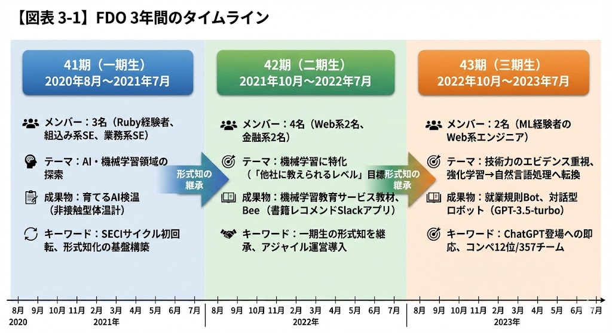
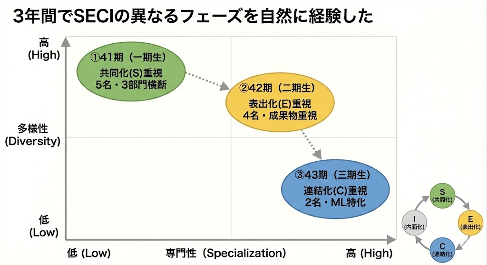
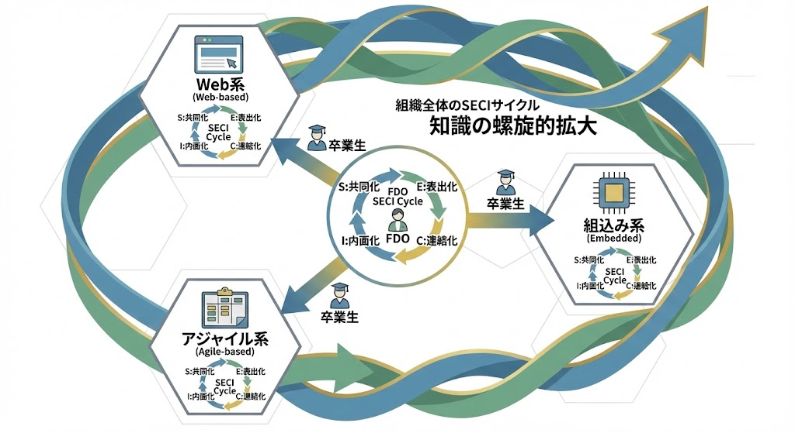

# 第3章：組織学習の実験場：SECIモデルが生んだ「育てて返す」モデル

## 知識を組織に循環させる挑戦

第1章では「アウトカムループ」を、第2章では「心理的安全性」と「権限移譲」をお伝えしました。これらは組織が学習し、変化に適応するための基盤です。しかし、個人が学んだ知識をどうやって組織全体に広げるか。この古典的な課題に対して、私たちは3年間の実験を通じて、一つの答えを見出しました。

2020年8月、私たちは「FDO（Future Design Office）」という部門横断プロジェクトを立ち上げました。機械学習という新しい技術領域で、次世代のエースを育成し、組織に技術を根付かせる。この野心的な目標に向けて、私たちは野中郁次郎教授が提唱する「SECIモデル」を学習フレームワークとして採用しました。

単なる資格取得者数を増やすようなリニアな成長ではなく、暗黙知と形式知を螺旋的に拡大していく質的な学習。FDOは、このSECIモデルを意図的に実践する「組織学習の実験場」として設計されたのです。

そして3年後、私たちは当初の目標とは異なる、しかしより価値のある発見をしました。それが「育てて返す」モデルです。本章では、SECIモデルの意図的な実践から予想外の発見に至るまでの3年間の旅をお伝えします。

## SECIモデルを活用した組織学習の設計

### なぜSECIモデルを選んだのか

FDO設立時、私たちは明確な課題に直面していました。機械学習という広大な領域を、限られた期間でどう学ぶか。個人が学んだ知識を、どうやって組織全体に広げるか。

この問いに対する答えが、野中郁次郎教授のSECIモデルでした。SECIモデルは、知識創造を4つの変換プロセスとして捉えます：

**共同化（Socialization）**：暗黙知を暗黙知として共有する
- 実務を通じて先行者と共に学び、言葉にならない「コツ」や「勘」を体感する
- ペアプログラミングやモブプログラミングで、思考プロセスを共有する

**表出化（Externalization）**：暗黙知を形式知に変換する
- 体験したことを言語化し、対話を通じて概念として整理する
- 「なぜそうしたのか」「何が難しかったのか」を振り返りで共有する

**連結化（Combination）**：形式知同士を組み合わせる
- 学んだ知識を組み合わせ、プロダクトやドキュメントとして体系化する
- GitHubやWikiで知識を蓄積し、組織の財産として整理する

**内面化（Internalization）**：形式知を暗黙知として実践する
- ドキュメントを読んで学び、自分の現場で応用する
- 他者の経験を自分の文脈に「翻訳」して使いこなす

このサイクルを回すことで、個人の経験が組織の知識へと螺旋的に拡大していく。FDOは、このSECIモデルを学習プロセスの骨格として採用しました。

### FDOの3つのミッション

FDOには明確な3つのミッションがありました：

1. **新しい領域での技術力の根拠作り**：開発実績を築く
2. **技術転換の促進**：次世代のエースを育成する
3. **認知度の向上**：「機械学習をやっている永和さん」として知られる

注目すべきは、2つ目のミッションです。「エースを育成する」。当時の私たちは、機械学習の専門家集団を社内に作ることを想定していました。FDOで育ったエースたちが、機械学習プロジェクトを牽引する。そんなイメージでした。

しかし3年後、私たちが発見したのは、まったく異なる価値でした。

### 組織設計：X-as-a-Service型コラボレーション

FDOは、事業部から最大1年間メンバーを受け入れ、プロダクト開発を通じて新しい技術を獲得させる部門横断プロジェクトとして設計されました。重要なのは、メンバーは期間終了後、必ず元の事業部に戻るという点です。

SaaS（Software as a Service）のように、必要な時に必要なサービスを提供するクラウド型のビジネスモデルがあります。この考え方を組織能力に応用したのが「X-as-a-Service型」です。プロダクトオーナー（PO）として私が意識していたのは、FDOを「メンバーを成長させて事業部に返すサービス」として見立てることでした。固定的な専門部署ではなく、期間限定で人材を受け入れ、スキルを付与して返す。この「X-as-a-Service型」の設計が、後に重要な意味を持つことになります。

## 1年目：SECIサイクルを完成させる

### 一期生（2020年8月-2021年7月）：多様性からのスタート

一期生は3名でスタートしました。Ruby経験者、組込み系SE、業務系SE。バックグラウンドがバラバラで、当初は共通言語を見つけるのに苦労しました。しかし、この多様性こそが、創発的な学びの源泉となりました。

機械学習をテーマに選んだ理由は、その広大さと不確実性です。すべてをマスターすることは不可能。だからこそ、チームで学び、SECIサイクルを回すことが重要でした。

### 第1四半期：共同化（Socialization）

最初の四半期は、実際の案件を通じて「暗黙知」を体感することに焦点を当てました。

技術アドバイザーとペアプログラミングを行い、データの前処理や特徴量設計の「勘所」を学ぶ。コードを書く手が止まったとき、なぜ止まったのか。モデルの精度が上がらないとき、どこを疑うのか。こうした言葉にならない「感覚」を、実務を通じて共有しました。

機械学習プロジェクトは、データ収集→前処理→学習→評価のサイクルを繰り返します。この「精度を確認し、繰り返す」という性質は、スクラムと非常に親和性が高いのです。スクラムとは、1〜2週間の短いサイクル（スプリント）で計画・実行・振り返りを繰り返すチーム運営の手法です。チームには、プロダクトの価値と優先順位に責任を持つプロダクトオーナー（PO）、開発を担うメンバー、そしてプロセス改善を支援するスクラムマスターという役割があります。FDOでは1週間スプリントを基本とし、毎日の短い進捗確認（デイリースクラム）や振り返り（レトロスペクティブ）を活用しました。

「このスプリントでは〇〇を学ぼう」。POと開発メンバーの間で、失敗しても学びがあれば良いという合意を形成しました。やりたいことはプロダクトバックログ（優先順位付けされたやりたいことリスト）として管理し、スプリントごとに何を学ぶかを選択します。この心理的安全性が、挑戦的な学習を支えました。

### 第2四半期：表出化（Externalization）

第2四半期は、体験したことを言語化し、概念として整理する段階です。

機械学習コンペティションに挑戦しました。チームで対話しながら、「なぜこのアプローチを選んだのか」「何が難しかったのか」を言葉にしていく。週次の振り返りでは、「前処理8割」という言葉の真の意味を体感したこと、予測率の目標設定の危険性、統計知識の重要性など、多くの気づきが共有されました。

重要だったのは、単に知識を獲得するだけでなく、「なぜそれが重要か」を自分たちの言葉で説明できるようになることでした。これがSECIモデルの「表出化」です。

### 第3四半期：連結化（Combination）

第3四半期は、これまで得た知識を組み合わせ、プロダクトという形で体系化する段階です。

一期生の集大成として開発したのが「育てるAI検温」でした。市販の検温器からインスピレーションを得て、自分たちで開発したプロダクトです。コンセプトは、社員に活動を広く知ってもらい、社員と一緒にデータモデルを「育てる」こと。

POとしての私のこだわりは、活動コンセプトを表現できるストーリーとスペックの策定でした。UIの工夫、本社1階エントランスでの実証実験。社員に活動を知ってもらうためのタスクを、プロダクトバックログに組み込みました。

プロダクト開発を通じて、学んだ知識がGitHubリポジトリやドキュメントとして蓄積されていきました。これが次期メンバーへの財産となります。

### 第4四半期：内面化（Internalization）

第4四半期は、形式知を実践を通じて自分の暗黙知として体得する段階です。

一期生は「育てるAI検温レシピ」というドキュメントを作成しました。しかし、このプロセスで重要だったのは、ドキュメントを「作る」こと自体ではありません。技術的な詳細を言語化し、レビューで質問に答え、修正を繰り返す。その過程で「なぜこうしたのか」「別のやり方ではなぜダメなのか」を何度も問い直すことになりました。

社内勉強会での発表、ブログ記事の執筆、外部カンファレンス（RSGT2022）での事例共有。人に説明するたびに理解が深まり、質問に答えるたびに自分の言葉で語れるようになる。こうして知識は、マニュアルを読めばできる「形式知」から、自然と手が動く「暗黙知」へと変換されていきました。これがSECIモデルの「内面化」です。

そして一期生は、それぞれの事業部に戻っていきました。

## 2年目・3年目：深化と方向転換

### 二期生（2021年10月-2022年7月）：形式知からの学習

二期生は4名でスタートしました。ここで重要な変化がありました。二期生は、一期生が残した形式知（ドキュメント）からスタートできたのです。

ゼロから暗黙知を体感する必要はない。一期生の経験が言語化されているため、理論から学び、より早く実践に移れる。これはSECIモデルの「内面化」から「共同化」へのサイクルが、世代を超えて機能している証拠でした。

二期生では、POの関わり方も変化しました。一期生では深く関与していましたが、二期生では運営をチームに任せ、POとしてレビューやゴール設定に集中する。チームの成熟度に合わせて、権限移譲のレベルを調整しました。

しかし、新たな課題も浮上しました。「スキル先行者がフォロワーに回り、個々の技術獲得ペースがダウンする」。チームワークを重視するあまり、できる人ができない人に合わせる。全員で同じペースで進もうとする。結果として、個人の成長速度が落ちてしまったのです。

二期生は、非接触型体温計Ver2や書籍推薦アプリ「Bee」を開発し、実用的な成果を上げました。しかし、チームワークと個人成長のバランスという、新たなジレンマが見えてきました。

### 三期生（2022年10月-2023年7月）：戦略的方向転換

三期生はわずか2名、しかもWeb系のみ。部門横断という当初の理念からは遠ざかり、多様性は失われました。しかし皮肉にも、技術的には最も深化した期となりました。

最も印象的だったのは、強化学習への挑戦とその後の方向転換です。

「AlphaGoのような、自己対戦で学習するAIを作りたい」という高い目標を掲げました。しかし、強化学習の理論は複雑で、実装はさらに困難でした。2ヶ月間、メンバーは必死に取り組みましたが、まともに動くモデルすら作れませんでした。

「このままでは1年かけても成果が出ない」

第2四半期の終わりに、重要な決断を下しました。強化学習から自然言語処理へと方向転換する。一見「失敗」に見えますが、これは戦略的な判断でした。限られたリソースを最大限活かすための柔軟性こそが、学習する組織の本質です。

実際、自然言語処理への転換は大成功でした。ちょうどChatGPTが登場したタイミングで、就業規則Botや対話型ロボットといった実用的な成果物を生み出すことができました。ブルーカーボン・ダイナミクスコンペでは357チーム中12位という成績を収めました。

三期生の経験から学んだのは、うまくいかないと判断したら、素早く方向を変える勇気です。SECIモデルの「学習」は、固執することではなく、適応することなのだと実感しました。

【図表 3-1: FDO3年間のSECI実践の変遷】
（*注: 2×2マトリクス図。縦軸「多様性」（低→高）、横軸「専門性」（低→高）。3つの楕円で各期を配置：①41期（一期生）は左上「多様性高・専門性低」領域に緑色楕円、ラベル「共同化(S)重視」「5名・3部門横断」。②42期（二期生）は中央やや右上に黄色楕円、ラベル「表出化(E)重視」「4名・成果物重視」。③43期（三期生）は右下「多様性低・専門性高」領域に青色楕円、ラベル「連結化(C)重視」「2名・ML特化」。各楕円を点線矢印で時系列につなぐ。右下に小さくSECIサイクルの円環図を配置し、S→E→C→Iの流れを示す。全体のメッセージ：「3年間でSECIの異なるフェーズを自然に経験した」*）

## 予想外の発見：「育てて返す」価値

### 振り返りから見えた真実

2023年春、FDOの3年間を振り返る中で、予想外の事実に気づきました。

卒業生たちが、それぞれの部署に戻り、FDOでの経験を活かしていたのです。

元の部署に戻ったメンバーに話を聞くと、「FDOでの学び方が、今の仕事に役立っている」「新しい技術への取り組み方が変わった」という声が返ってきました。具体的な成果の大小はさまざまでしたが、共通していたのは「学習する姿勢」と「新しい技術への心理的障壁が下がった」という点でした。

私たちは「機械学習のエース集団」を作ろうとして、その点では期待通りの成果を上げられませんでした。FDOは解散しましたし、機械学習の専門部署も残りませんでした。

しかし、気づけば「人を育てて、組織に返す」という、より価値のあるモデルを生み出していたのです。エースを集めて囲い込むのではなく、各部署で学習する姿勢を持った人材を増やす。この方が、組織全体の適応力を高めることに気づいたのです。

### なぜ気づけたのか：目標そのものを問い直す

この発見ができたのは、「目標そのもの」を問い直したからでした。

通常、目標が達成できないとき、私たちは「どうすればうまくいくか」を考えます。しかしFDOでは「そもそも、なぜ機械学習のエース集団が必要なのか？」「本当に専門部署が正しいアプローチなのか？」と、前提自体を問い直しました。

これはクリス・アージリスが「ダブルループ学習」と呼んだものです。方法を改善するのではなく、目的を問い直す。FDOの存在意義を根本から考え直した結果、「人を育てて返す」という新たな価値を発見できたのです。

### 知識が組織に浸透する仕組み

従来の専門部署では、知識がその部署内に閉じてしまいます。しかし「人を育てて返す」モデルでは、知識が自然に組織全体に浸透します。

FDOで学んだメンバーが元の部署に戻ると、その知識は各部署の文脈に合わせて「翻訳」されます。業務系では業務改善の文脈で、サービス系では顧客体験向上の文脈で。同じ技術が、それぞれの部署に最適な形で伝わるのです。

興味深いことに、FDOは組織全体でSECIサイクルを実現していました：

- **共同化**：FDO内でのペアプログラミング、暗黙知の共有
- **表出化**：週次振り返りでの経験の言語化
- **連結化**：GitHubでの知識の蓄積・体系化
- **内面化**：卒業生が各部署で実践し、それぞれの文脈で応用

当初は「チーム内のSECIサイクル」を想定していました。しかし実際には、「組織全体のSECIサイクル」が回っていたのです。FDOという「場」が、個人の暗黙知を組織の形式知へと変換し、それが再び各部署で暗黙知として実践される。この大きなサイクルが、3年間で確立されたのです。

【図表 3-2: 知識が組織に浸透する仕組み - SECIモデルの組織的実践】
（*注: 二重螺旋構造の概念図。中央に「FDO」を表す小さな円環（SECIサイクル：S共同化→E表出化→C連結化→I内面化）を配置。この小さな円環の周囲に、放射状に4つの部署アイコン（「業務系」「サービス系」「組込み系」「品質保証」など）を配置。FDOから各部署へ「卒業生」を示す人型アイコンと矢印が伸びる。各部署でも小さなSECIサイクルが回っている様子を示す。全体を包む大きな螺旋矢印で「組織全体のSECIサイクル」を表現。螺旋は上昇するように描き、「知識の螺旋的拡大」を視覚化。色使い：FDO中央は暖色系（オレンジ）、各部署は寒色系（青・緑）、螺旋矢印はグラデーション。*）

## 「育てて返す」モデルの誕生

### 新しい組織モデルの発見

FDOの真の価値は、期間限定の「育てて返す」モデルにありました。

従来の研修は「教えて終わり」。専門部署は「知識を囲い込む」。しかしFDOは違いました。1年間という期間限定で各部門から人材を受け入れ、最新技術を習得させ、元の部署に返す。卒業生は各部署で技術伝道師となり、知識を実務に応用する。

このモデルの革新性は3つあります：

1. **知識が部署を越えて循環する**：専門部署に閉じ込めず、組織全体に拡散
2. **各部署の文脈に合わせて技術が「翻訳」される**：画一的な適用ではなく、最適化された活用
3. **組織全体の技術レベルが底上げされる**：一部のエースではなく、全体の能力向上

FDOは単なる教育機関ではなく、組織の知識循環を促進する「サービス」だったのです。

興味深いことに、このモデルは後に知ることになったマシュー・スケルトンとマニュエル・パイスの『チームトポロジー』で提唱される「イネーブリングチーム」の概念と合致していました。期間限定で他チームを支援し、自律性を育てる。まさに私たちが実践していたことだったのです。

### FDOの経験から得た3つの示唆

3年間の活動を通じて、私たちは以下の学びを得ました：

**1. 多様性のあるメンバー構成を維持すること**

年々多様性が下がっていったという反省から。意図的に多様性を保つ仕組みが必要です。部門横断的なメンバー構成は維持コストが高いですが、それ以上の価値を生み出します。

多様性は、SECIモデルの「共同化」を豊かにします。異なる背景を持つメンバーが集まることで、同じ経験から異なる気づきが生まれる。この多様な暗黙知が、より豊かな形式知へと変換されるのです。

**2. メンバーの複数年固定とリーダーの選任**

組織的な知識の蓄積には、ある程度の継続性が必要です。毎年総入れ替えでは、知識が希薄化してしまいます。コアメンバーを残しつつ、新しい血を入れるバランスが重要です。

これは、SECIモデルの「内面化」から次の「共同化」への橋渡しを担う役割です。前期の経験を暗黙知として持つメンバーが、新メンバーと共に活動することで、知識の継承がスムーズになります。

**3. ニーズドリブンで事業開発とワンセット**

技術のための技術ではなく、明確なニーズに基づいた活動を。事業価値と直結させることで、学習の方向性が定まり、成果も見えやすくなります。

これは、SECIモデル全体の方向性を定めるものです。何のために学ぶのか。どんな価値を生み出すのか。この「北極星」があることで、4つの知識変換プロセスが意味を持ちます。

## X-as-a-Serviceへの展開

### アジプラの設立（2023年7月）

FDOの成功体験は、2023年7月の「アジプラ（アジリティプラットフォーム）」設立につながりました。

アジプラは、マーケティング、広報、人材育成、採用といった機能を「サービス」として全社に提供する組織です。FDOで発見した「期間限定で支援し、能力を育てて返す」モデルを、他の領域に展開したのです。

例えば、新規事業を立ち上げたいがマーケティングノウハウがない事業部があったとします。「Marketing-as-a-Service」として伴走支援を実施し、アジプラ担当者が週2日その事業部で活動しながら、市場調査からプロモーション戦略まで共に実行する。支援が終わる頃には、事業部内にマーケティングの基礎知識が根付いている——そんな形を想定しています。

ここでもSECIモデルが機能しています。アジプラ担当者と事業部メンバーが共同で作業する（共同化）、ノウハウを言語化する（表出化）、マーケティング計画として体系化する（連結化）、事業部メンバーが独自に実践できるようになる（内面化）。

### なぜX-as-a-Serviceが必要なのか

従来の組織では、専門部署を作ると以下の問題が起きがちです：

- **知識のサイロ化**：専門知識が部署内に閉じ込められ、他部署に伝わらない
- **依存構造の固定化**：他部署は専門部署に「お願い」する立場になり、自律性が育たない
- **柔軟性の喪失**：組織構造が硬直化し、変化への対応が遅れる

X-as-a-Serviceモデルは、これらの課題に対する一つの解を提示します：

**期間限定**：必要な時に、必要な期間だけ支援を提供する。支援が終われば、受け手は自走できるようになっている

**伴走型支援**：「教えて終わり」ではなく、一緒に実践する。現場の文脈に合わせて、知識を「翻訳」しながら伝える

**知識の定着**：支援終了後も、獲得した知識とスキルは組織に残る。依存ではなく、自律を育てる

このモデルの本質は、固定的な組織構造から、必要に応じて形を変える流動的な組織への転換にあります。

【図表 3-3: 従来型組織とX-as-a-Service型組織の比較】
（*注: 左右対比のビフォーアフター図。【左側：従来型組織】ピラミッド型の組織図。上から「経営層」→「専門部署」→「各事業部門」。専門部署は壁で囲まれ「知識の囲い込み」を示す。各部門と専門部署の間は細い点線（連携弱い）。各部門から専門部署への一方向矢印で「依頼・依存」を表現。色調はグレー系で硬直的な印象。ラベル：「サイロ化」「依存構造」「知識が閉じる」。【右側：X-as-a-Service型組織】ネットワーク図。中央に「サービス提供チーム」の円、周囲に各部門の円がメッシュ状につながる。太い双方向矢印で「伴走型支援」「人材の循環」を示す。知識の流れを示す曲線矢印が組織全体を循環。色調は明るい青・緑系で流動的な印象。ラベル：「期間限定」「伴走型支援」「知識が循環」。中央下に比較表：「依存→自律」「囲い込み→共有」「教える→育てて返す」*）

## 実践ツール

### SECIサイクル設計シート

学習プロジェクトを立ち上げる際に、SECIモデルを意図的に設計するためのシートです。

```
【SECIサイクル設計シート】

プロジェクト名：
期間：
学習テーマ：

【共同化（Socialization）】暗黙知→暗黙知
暗黙知をどう共有するか？
□ 実務を通じた体験学習（一緒にやってみる）
□ ペアプログラミング/モブプログラミング
□ 観察と模倣（見て学ぶ）
□ 具体的な活動：

【表出化（Externalization）】暗黙知→形式知
経験をどう言語化・概念化するか？
□ 対話を通じた気づきの言語化
□ メタファーやアナロジーを使った説明
□ 「なぜそうしたか」の振り返り
□ 社内勉強会・外部発信での言語化
□ 具体的な活動：

【連結化（Combination）】形式知→形式知
形式知をどう組み合わせ体系化するか？
□ 複数の知識を統合したドキュメント作成
□ ナレッジベースの構築・整理
□ 異なる分野の知識を組み合わせた新しい体系
□ 具体的な活動：

【内面化（Internalization）】形式知→暗黙知
形式知をどう身体知にするか？
□ ドキュメントを読んで自分で実践
□ 他者の経験を自分の文脈で応用
□ 繰り返しの実践による習熟
□ 具体的な活動：

【螺旋的拡大の設計】
• 1回転目の到達点（個人レベル）：
• 2回転目の到達点（チームレベル）：
• 3回転目の到達点（組織レベル）：
• 形式知として残すもの：
```

### 知識循環診断チェックリスト

組織の知識循環状態を診断するためのチェックリストです。

```
【知識循環診断チェックリスト】

以下の項目を5段階評価（1：全くない～5：十分にある）

■ 共同化（暗黙知→暗黙知）
□ 実務を通じた学習機会がある
□ ベテランと若手が一緒に作業する場がある
□ 言葉にしにくい「コツ」を体験から学べる

■ 表出化（暗黙知→形式知）
□ 経験を言葉にする対話の場がある
□ 「なぜそうしたか」を問い合う文化がある
□ メタファーや図解で概念を伝え合っている

■ 連結化（形式知→形式知）
□ 異なる知識を組み合わせた体系化が行われている
□ ナレッジベースが整理・統合されている
□ 部門を超えた知識の結合が起きている

■ 内面化（形式知→暗黙知）
□ ドキュメントを読んで実践する機会がある
□ 他者の知見を自分の業務で試している
□ 繰り返しの実践で身体知になっている

■ 螺旋的拡大
□ 個人→チーム→組織へと知識が広がっている
□ 1回転ごとに知識の質・範囲が深化している
□ 学習プロジェクトから元部署への還流がある

【評価】
合計60点以上：知識循環が良好
合計40-59点：改善の余地あり
合計40点未満：知識が閉塞している
```

## 明日から実践できる「小さな一歩」

1. **チームでSECIサイクルを1回転させる実験（2週間）**
   小さなテーマ（新しいツールの習得、業務改善案の実践など）を選び、意識的にSECIサイクルを回してみてください：
   - Week 1前半：ペア作業で暗黙知を共有（共同化）
   - Week 1後半：振り返りで言語化（表出化）
   - Week 2前半：ドキュメント化（連結化）
   - Week 2後半：他メンバーが実践（内面化）

2. **「育てて返す」機会を探す（30分）**
   自組織で、以下の問いに答えてみてください：
   - 組織全体に広げたいスキルは何か？
   - そのスキルを持つ人、または学べる場はあるか？
   - 期間限定で誰かを「預かる」ことは可能か？
   - 元部署に戻った後、どう実践してもらうか？

3. **部門横断学習セッションを企画（1時間）**
   異なる部署のメンバー3-5名で、1時間の学習セッションを開催してみてください。テーマは「お互いの仕事のやり方を学ぶ」。それぞれが15分ずつ、自分の仕事の「コツ」を共有します。これがSECIの「共同化」の第一歩です。

## 第3章のまとめ

本章では、FDO（Future Design Office）の3年間を通じて発見した「育てて返す」モデルについてお伝えしてきました。

### SECIモデルの意図的実践

FDOは、野中郁次郎教授のSECIモデルを学習フレームワークとして意図的に採用しました。共同化→表出化→連結化→内面化という知識創造サイクルを、チーム学習のプロセスに組み込んだのです。

一期生は、このSECIサイクルを1年かけて完成させ、「育てるAI検温」というプロダクトと「育てるAI検温レシピ」というドキュメントを生み出しました。二期生は、一期生の形式知からスタートし、さらに深化させました。三期生は、強化学習から自然言語処理への戦略的転換を通じて、学習する組織の柔軟性を体現しました。

### 予想外の発見

当初の目標は「機械学習のエース集団を作る」ことでした。しかし3年後、私たちが発見したのは、より価値のある「人を育てて返す」モデルでした。

専門部署に知識を閉じ込めるのではなく、期間限定で人材を受け入れ、スキルを付与して元の部署に返す。この「育てて返す」モデルは、知識を組織全体に循環させ、各部署の文脈に合わせて最適化される仕組みを生み出しました。

興味深いことに、チーム内で設計したSECIサイクルは、組織全体のSECIサイクルとしても機能していました。FDOという「場」が、個人の暗黙知を組織の形式知へと変換し、それが再び各部署で暗黙知として実践される。この大きなサイクルが、意図せず実現されていたのです。

### 知識循環による組織レジリエンス

FDOの経験は、組織のレジリエンス（変化に対する適応力）を高める重要な示唆を与えてくれます。

固定的な専門部署ではなく、流動的な「育てて返す」モデル。知識を特定の場所に閉じ込めるのではなく、組織全体に循環させる。SECIサイクルを意図的に回すことで、組織は継続的に学習し、進化し続けることができます。

2023年7月に設立されたアジプラ（アジリティプラットフォーム）は、FDOの発見を他の領域に展開したものです。「育てて返す」モデルを起点に、マーケティングやコミュニケーションなど他領域にも同じ考え方を展開しました。

本章では、人間同士の知識創造（SECIモデル）と、その組織的な実践（「育てて返す」モデル）についてお伝えしました。次章では、このSECIモデルがAI時代にどう進化するかを探ります。AIはSECIの4つの象限のうち、どの部分を加速し、どの部分は人間に残されるのか。故野中郁次郎教授が晩年に示唆したAI時代の知識創造と、永和システムマネジメントの「フロネシス・プログラム」を通じて、AI×人間の新しい知識創造の形をお伝えします。
