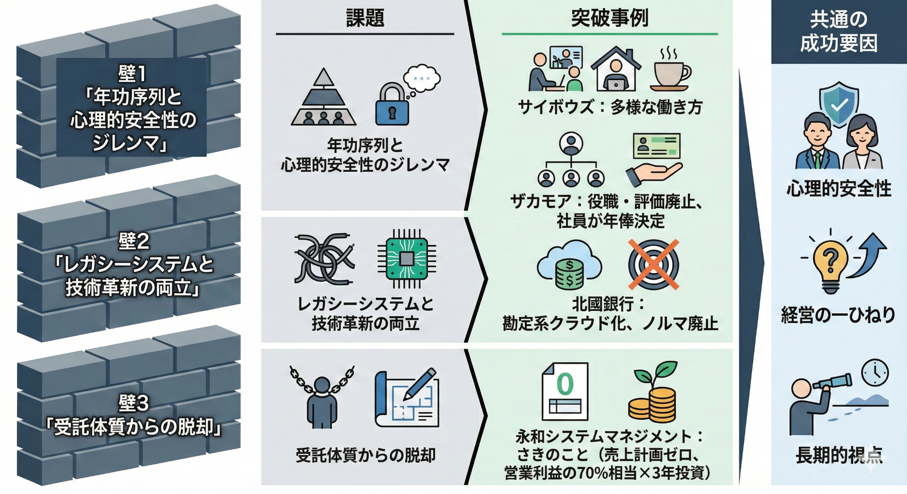
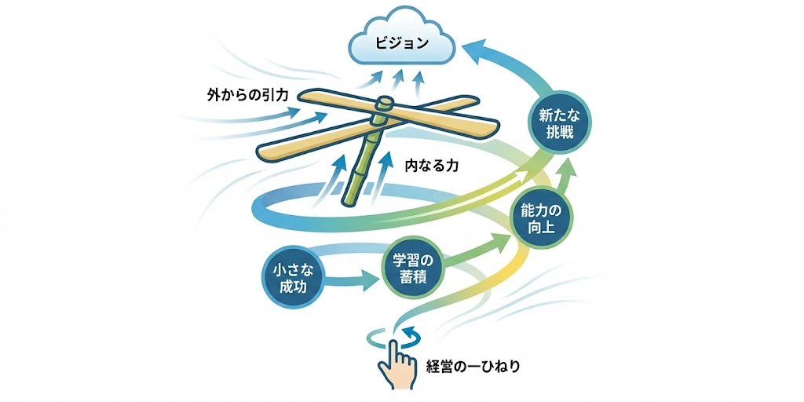
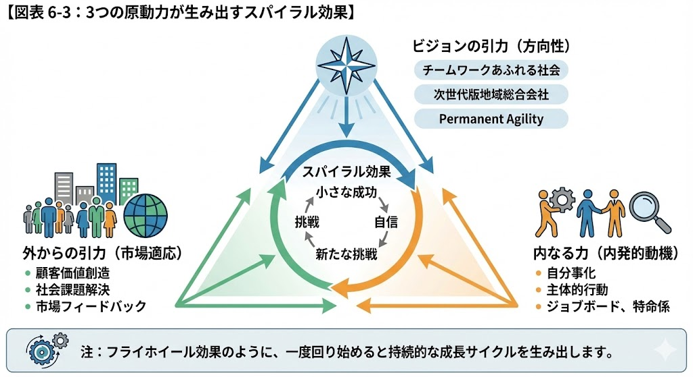
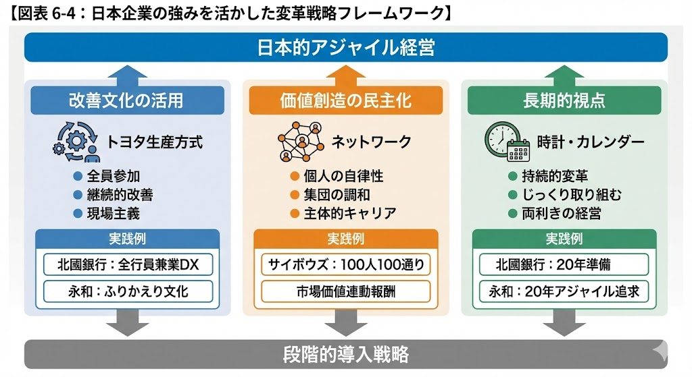

# 第6章：日本企業におけるアジャイル経営への道 - 竹とんぼが示す変革の原動力

## 2025年、変革の岐路に立つ日本企業

2024年1月26日、アジャイル経営カンファレンスで私は一つの問いを投げかけました。

「アジャイル開発の手法を経営に適用するだけで、本当に組織は変わるのか？」

皆さんは、この問いにどう答えますか？　私たちは4つの日本企業の実践から、一つの答えを見出しました。サイボウズの離職率28%からの復活、北國銀行の地銀初となる勘定系クラウド化、私たち永和システムマネジメントが掲げる「Permanent Agility」への挑戦、そして福井県のザカモアが示した究極の権限移譲。これらの事例から浮かび上がったのは、表面的な手法の導入ではなく、組織の深層に流れる「原動力」の存在でした。

第5章まで、私たちは変革のための理論と実践を探求してきました。アウトカムループによる仮説検証、心理的安全性と権限移譲、知識創造のサイクル、AIの組織能力化、そして価値の本質を見極めるOKR。しかし、これらを日本の伝統的な組織にどう実装するか。形式主義に陥らず、本質的な変革を実現するにはどうすべきか。

本章では、「竹とんぼ型スパイラルアップモデル」という独自の理論を通じて、日本企業が持つ構造的な課題を乗り越え、むしろ日本的な強みを活かした変革の道筋を示します。

## 日本企業が直面する3つの壁

### 壁その1：年功序列と心理的安全性のジレンマ

2005年、サイボウズは深刻な危機に直面していました。離職率28%。IT企業としては決して珍しくない数字かもしれませんが、青野慶久社長にとってそれは組織の根本的な問題を示すシグナルでした。

青野社長は退職者一人一人の声に耳を傾け、その理由を分析しました。浮かび上がってきたのは、「100人いれば100通りの退職理由がある」という事実でした。キャリアパスへの不満、ワークライフバランスの欠如、成長機会の不足、評価への疑問。それぞれが異なる理由で組織を去っていました。

この分析から見えてきたのは、画一的な人事制度では個々の価値観やライフスタイルの多様性に対応できないという構造的な問題でした。従来の日本企業が持つ年功序列による硬直的な評価システムは、確かに組織の安定をもたらしましたが、同時に個人の創造性と自律性を抑圧していました。

青野社長は段階的な改革を進めました。まず、働き方の選択肢を増やすことから始めました。在宅勤務、時短勤務、副業許可。これらの制度を一つずつ導入し、その効果を検証しながら、最終的に「100人100通りのマッチング」という考え方に到達したのです。これは単なる制度変更ではなく、個人と組織の関係性を根本から見直すパラダイムシフトでした。これは単なる「働き方改革」ではありません。個人の希望とチームの目標を動的に交渉し、調整し続けるプロセスです。市場価値連動型の報酬制度では、社員自らが「転職したらいくらで評価されるか」を基準に給与交渉を行います。

この変革を支えたのが「公明正大」という文化でした。プライバシーとインサイダー情報を除く、あらゆる情報を社内に公開する。「アホはいいけど嘘はダメ」というモットーが示すように、失敗は許容されるが、隠蔽は許されない。これこそ、第2章で述べた心理的安全性の実践そのものです。

さらに極端な事例として、福井県のEC企業である株式会社ザカモアの変革があります。売上4〜5億円に対して赤字1300万円という危機に直面した2020年、西村拓朗代表は自らが組織の「ボトルネック」であると判断しました。そして、トップダウン経営の完全廃止、部長・課長といった役職の廃止、評価制度の廃止、社員自身が年俸を決める報酬制度への移行という大胆な改革を実行。さらに、代表自身が3年間会社を離れるという究極の権限移譲に踏み切ったのです。

「さん」付けをやめて英語のニックネームで呼び合う制度、毎日全員で同じ昼食を共にする時間、業績を示す「ドリームライン」の掲示。これらは、フラットな関係性と徹底した透明性を実現する仕組みです。当初、社員は戸惑いながらも、3人で集まって相談し、自分たちに何ができるかを話し合うようになりました。トップの指示を待つのではなく、自ら考えて動く文化が生まれたのです。

### 壁その2：レガシーシステムと技術革新の両立

北國銀行の事例は、さらに困難な挑戦を示しています。銀行という最も保守的な業界で、勘定系システムをパブリッククラウドに移行する。これは単なる技術的な決断ではありませんでした。

杖村修司頭取が掲げた「次世代版地域総合会社」というビジョン。これを実現するために、北國銀行は2010年代から本格的なデジタル化の準備を進めてきました。継続的な業務効率化により投資原資を確保し、システム子会社「デジタルバリュー」を設立して開発を内製化。外部委託から脱却し、自らの手でシステムを作り上げる能力を獲得したのです。

しかし、技術だけでは変革は成功しません。北國銀行が導入した「非減点主義」と「キャリアレビュー」制度。これは第2章で述べた「失敗から学ぶ組織」の実装です。従来の銀行文化では考えられない、挑戦を奨励し、失敗を学習の機会と捉える文化。法人向けインターネットバンキングの新機能を、従来の開発期間の半分以下である3ヶ月でリリースできたのは、この文化変革があったからこそです。従来は6〜12ヶ月かかっていた新機能開発が、アジャイル開発の導入により大幅に短縮されました。

### 壁その3：受託体質からの脱却

私たち永和システムマネジメントは、さらに根深い課題に直面していました。25年間の受託開発で培われた「受託メンタルモデル」。これは目の前の顧客を満足させることには長けていましたが、まだ見ぬ市場の顧客を想像することは苦手でした。

第5章で述べたHIKKOSHIクラウドの失敗。2000万円の投資で3.5万円の売上という結果は、この受託体質の限界を示していました。しかし、その失敗から私たちは学びました。「Permanent Agility」というビジョンを掲げ、アジャイルを単なる開発手法ではなく、組織のアイデンティティそのものとして再定義したのです。

そして2023年7月、私たちは「さきのこと」という革新的な事業を立ち上げました。これは単なる新規事業ではありません。**売上計画ゼロ、投資回収前提なし**という、従来のビジネス常識を覆す戦略的決断でした。

「さきのこと」の基本方針は以下の通りです：

- **社会課題への純粋なフォーカス**：民間や行政で予算がつきにくい、かつ社会で必要とされていることをテーマとする
- **自己組織化チーム**：メンバー自身が興味あるテーマを企画し、賛同者を募る
- **フラットな組織構造**：序列を最小限にし、複数企画を同時進行、チームメンバーは固定しない
- **心理的安全性の制度化**：「失敗を恐れない」「心理的安全性を高く保つ」を行動規範に明記

実際に取り組んでいるテーマは多岐にわたります。自治体の広報誌や回覧板のデジタル化を実現するサービス、高齢者がスマートフォンの着信に気が付かない問題を解決するアプリ、運動不足の解消を支援するアプリ、など、いずれもビジネス的には採算が取りにくいが、社会的に必要とされる課題です。

最も驚くべきは、**営業利益の70%相当×3年間の投資**を決断したことです。予想営業利益から必要営業利益を差し引いた余剰を、未来への投資として充当するという大胆な戦略でした。

「さきのこと」の運営体制も革新的です。メンバー全員が「特命係」に移行し、360度評価を導入。「ベースキャンプ」（3ヶ月に1回）、「テント場」（月次）というアジャイル的な会議体を設置し、継続的な検証と方向修正を行っています。


【図表 6-1: 日本企業が直面する3つの壁と突破事例】
<!-- 注: 3つの壁を縦に並べた構造図。各壁に対して「課題」と「突破事例」を対比表示。壁1「年功序列と心理的安全性のジレンマ」→突破「サイボウズ：100人100通りのマッチング」「ザカモア：役職・評価廃止、社員が年俸決定」。壁2「レガシーシステムと技術革新の両立」→突破「北國銀行：勘定系クラウド化、非減点主義」。壁3「受託体質からの脱却」→突破「永和システムマネジメント：さきのこと（売上計画ゼロ、営業利益の70%相当×3年投資）」。右側に共通の成功要因として「心理的安全性」「経営の一ひねり」「長期的視点」を配置 -->

## 竹とんぼ型スパイラルアップモデル

### 経営の役割は「最初の一ひねり」

これらの変革事例を分析する中で、各社に共通するパターンを発見しました。強い初期推進力、その後の自律的な展開、そして螺旋を描きながらの成長。このパターンを表現する最適なメタファーを探していた時、私は日本人なら誰もが知っている玩具を思い出しました。「竹とんぼ」です。

なぜ竹とんぼなのか。西洋的な「ロケット型」の変革モデルでは、継続的な燃料供給が必要です。一方、「竹とんぼ型」は最初の推進力を与えた後は、空気力学的な原理で自然に上昇を続けます。これは、トップダウンの継続的介入ではなく、組織の自律的な力を信じる日本的アプローチと合致します。

竹とんぼを飛ばすには、最初に強い「ひねり」を与える必要があります。しかし、一度回転が始まれば、あとは自然の力に任せる。過度に介入すれば、かえって飛行を妨げてしまいます。

経営の役割もこれと同じです。明確なビジョンを示し、変革のきっかけとなる強い「一ひねり」を与える。しかし、その後は組織の自律的な動きを「見守る」ことに徹する。これは第2章で述べた「権限移譲」の具体的な実践です。

【図表 6-2: 竹とんぼ型スパイラルアップモデル概念図】
<!-- 注: 中央に竹とんぼのイラストを配置し、螺旋を描きながら上昇する様子を視覚化。竹とんぼの目指す先がビジョンで、「外からの引力」「内なる力」はそれぞれの羽。最下部に「経営の一ひねり」として手のアイコンを配置し、初期推進力を与える場面を表現。螺旋軌道に沿って「小さな成功」→「学習の蓄積」→「能力の向上」→「新たな挑戦」のサイクルを記載。 -->

サイボウズの青野社長が離職率28%という危機を変革の起点としたこと、北國銀行の杖村頭取が2010年代から本格的なデジタル化の準備を始めたこと、永和システムマネジメントが「さきのこと」に営業利益の70%相当×3年の投資を決断したこと。そしてザカモアの西村代表が自ら3年間会社を離れることで、組織に強制的な自律化を促したこと。これらはすべて、経営による「最初の一ひねり」でした。

### 3つの原動力が生み出すスパイラル

竹とんぼが上昇を続けるには、3つの力が必要です。

**1. 突き抜けたビジョンの引力（方向性）**

単なる売上目標や効率化では、人は動きません。「チームワークあふれる社会を創る」（サイボウズ）、「次世代版地域総合会社」（北國銀行）、「Permanent Agility」（永和システムマネジメント）。これらのビジョンは、組織が向かうべき方向を明確に示す「北極星」となったのです。

**2. 外（社会・顧客）からの引力（市場適応）**

内向きの改革は必ず行き詰まります。社会課題の解決、顧客価値の創造、市場からのフィードバック。これらの「外からの引力」が、組織を正しい方向へ導くのです。北國銀行がFinTech（金融とITを融合した新しいサービス）の急速な進化に対応できたのも、この外部志向があったからでした。

**3. 内（会社・社員）に流れる変革を志向する力（内発的動機）**

最も重要なのが、この内なる力です。社員一人ひとりが「自分事」として変革を捉え、主体的に行動する。サイボウズの「ジョブボード」や「大人の体験入部」、永和システムマネジメントの「特命係」。これらは、社員の内発的動機を引き出す仕組みなのです。

この3つの力が相互に作用することで、組織は螺旋を描きながら上昇していきます。小さな成功が次の挑戦を生み、学習が蓄積され、能力が向上する。

これはジム・コリンズが『ビジョナリー・カンパニー2』で述べた「フライホイール効果」の日本的な表現と言えるでしょう。フライホイール（弾み車）は、最初に回し始める時には大きな力が必要ですが、一度回転が始まると、その慣性によって少ない力でも加速を続けます。ビジネスにおいても、最初の成功は困難ですが、小さな改善と成功の積み重ねが、やがて大きな推進力となって組織を前進させるのです。

竹とんぼモデルとフライホイール効果には重要な共通点があります。どちらも初期の強い推進力を必要とし、その後は蓄積されたエネルギーによって自律的に加速していきます。しかし、竹とんぼが螺旋を描きながら上昇するという点で、より立体的で日本的な変革のイメージを提供しています。

【図表 6-3: 3つの原動力が生み出すスパイラル効果】
<!-- 注: 三角形の頂点に3つの原動力を配置した図。上頂点「ビジョンの引力（方向性）」には北極星アイコンと各社ビジョン（チームワークあふれる社会、次世代版地域総合会社、Permanent Agility）を記載。左下「外からの引力（市場適応）」には顧客・社会アイコンと「顧客価値創造」「社会課題解決」「市場フィードバック」を記載。右下「内なる力（内発的動機）」には社員アイコンと「自分事化」「主体的行動」「ジョブボード、特命係」を記載。三角形の中央に「スパイラル効果」として螺旋矢印を配置し、「小さな成功→自信→新たな挑戦」のサイクルを表現。下部にフライホイール効果との比較注釈 -->

実際、これらの企業でもこの効果は明確に現れています。サイボウズでは、最初の制度改革（在宅勤務導入）の成功が、次の改革（副業許可）への自信となり、最終的に「100人100通りのマッチング」という大胆な変革へとつながりました。北國銀行では、小さなDXプロジェクトの成功体験が組織全体の自信となり、勘定系クラウド化という前例のない挑戦を可能にしました。永和システムマネジメントでは、「さきのこと」の立ち上げが組織全体のマインドセットを変え、受託体質から価値創造企業への転換を加速させています。

## 4社の変革事例比較分析

次の表は、サイボウズ、北國銀行、永和システムマネジメント、そしてザカモアの変革を比較したものです。

| 項目 | サイボウズ | 北國銀行 | 永和システムマネジメント | ザカモア |
|------|------------|----------|------------------------|----------|
| **主要課題** | 離職率28%、画一的人事制度 | レガシーシステム、保守的文化 | 受託体質、自社サービス開発の困難 | トップダウン経営の失敗、赤字1300万円 |
| **核心施策** | 100人100通りのマッチング | 勘定系クラウド化、非減点主義 | さきのこと、Agile Studio | 完全権限移譲、役職・評価廃止 |
| **成功指標** | 離職率5%未満、社員満足度90%以上 | 新機能開発期間50%短縮、イノベーション提案3倍 | さきのこと事業確立、ESMファン増加 | V字回復、経営理念を社員主導で変更 |
| **推進体制** | 経営主導の段階的改革 | 全行員参加型DX | 専門チーム＋X-as-a-Service | 代表3年間不在による強制的自律化 |

## 日本企業の強みを活かした変革戦略

### 「改善」文化とアジャイルの融合

日本企業には世界に誇る「改善」の文化があります。トヨタ生産方式に代表される継続的改善の思想は、実はアジャイルの本質と深く共鳴します。

北國銀行のDXプロジェクトが興味深いのは、専門部署に任せるのではなく、全行員が兼業で取り組む体制を取ったことです。これは日本的な「全員参加」の思想とアジャイルの「全員が当事者」という原則の見事な融合です。

永和システムマネジメントのアジプラも同様です。専門知識を一部の専門家に閉じ込めるのではなく、全社にサービスとして提供する。マーケティング、広報、人材育成、採用支援といった形で、組織全体にアジャイルのマインドセットを浸透させていく。これは第3章で述べたSECIモデルと「育てて返す」モデルの実践であり、知識を部署に閉じ込めず、組織全体に循環させていくプロセスです。

### 価値創造の民主化

アジャイル経営の本質は、「価値創造の民主化」にあります。これまで一部のエリート層や経営陣が独占していた価値創造を、全社員に開放する。

サイボウズの事例が示すのは、まさにこの民主化の成功です。100人100通りのマッチングは、単なる人事制度ではありません。社員一人ひとりが自らのキャリアと組織の価値創造の主役となる仕組みです。市場価値連動型報酬によって、社員は自らの価値を客観的に認識し、その向上に主体的に取り組みます。

この「民主化」は、日本企業が持つ集団主義の強みと矛盾しません。むしろ、個人の自律性と集団の調和を両立させる、新しい組織モデルの可能性を示しています。

### 長期的視点での持続的変革

日本企業の強みの一つは、長期的な視点を持てることです。四半期決算に振り回されることなく、じっくりと変革に取り組める。

北國銀行が20年かけて準備した変革、永和システムマネジメントが20年以上アジャイルを追求し続けたこと。これらは日本企業ならではの強みを活かした戦略です。

重要なのは、この長期的視点を「遅さ」の言い訳にしないことです。第5章で述べたOKRの四半期ごとの見直しのように、長期ビジョンを持ちながら、短期的な学習サイクルを回す。この「両利きの経営」こそが、日本企業に求められる変革アプローチです。

【図表 6-4: 日本企業の強みを活かした変革戦略フレームワーク】
<!-- 注: 3つの強みを柱として配置した構造図。左柱「改善文化の活用」：トヨタ生産方式アイコン、「全員参加」「継続的改善」「現場主義」のキーワード、実践例として北國銀行の全行員兼業DXと永和のふりかえり文化を記載。中央柱「価値創造の民主化」：ネットワークアイコン、「個人の自律性」「集団の調和」「主体的キャリア」のキーワード、実践例としてサイボウズの100人100通りと市場価値連動報酬を記載。右柱「長期的視点」：時計・カレンダーアイコン、「持続的変革」「じっくり取り組む」「両利きの経営」のキーワード、実践例として北國銀行20年準備と永和20年以上アジャイル追求を記載。3本柱の上に「日本的アジャイル経営」のゴールを配置し、下部に「段階的導入戦略」への矢印 -->

## 実践への第一歩：段階的導入戦略

### ステップ1：現状認識と「解凍」

変革の第一歩は、現状を正確に認識することです。しかし、多くの日本企業では「問題はない」という建前が、真の課題を覆い隠しています。

サイボウズの離職率28%は、誰も無視できない明確な問題でした。この「危機」が変革の触媒となりました。しかし、すべての企業が明確な危機に直面しているわけではありません。

その場合は、小さな「実験」から始めることです。永和システムマネジメントの「さきのこと」のように、売上計画を立てない、社会課題解決に特化したチームを作る。

「さきのこと」が実証したのは、**売上なしで始める勇気**です。営業利益の70%相当×3年という大胆な投資により、メンバーは売上プレッシャーから解放され、純粋に社会課題と向き合える。少子高齢化、過疎地域問題、インフラ劣化など、ビジネス的には採算が取りにくいが社会的に必要とされる課題にアジリティをもたらす。失敗しても組織全体への影響が限定的な「安全な実験場」で、新しいアプローチを試すのです。

### ステップ2：心理的安全性の島を作る

組織全体を一度に変えることは不可能です。まず、心理的安全性の高い「島」を作ることから始めましょう。

永和システムマネジメントの「さきのこと」は、まさにこの「島」として機能しています。メンバーは「特命係」として、既存の評価システムから独立し、「失敗を恐れない」ことを行動規範に設定されています。ステップ1で述べた「売上なしで始める勇気」により、メンバーは売上プレッシャーから解放され、純粋に社会課題に向き合える。真に必要とされるソリューションを探索できる環境こそが、心理的安全性の高い「島」なのです。

この小さな成功体験が、組織全体のマインドセットを「受託」から「創造」へと変え、次の挑戦への自信を生み出します。

重要なのは、この「島」を既存組織から完全に切り離さないことです。北國銀行のデジタルバリューのように、独立性を保ちながらも、既存組織との連携を維持する。これにより、「島」での学びが組織全体に伝播していきます。

### ステップ3：成功の可視化と横展開

小さな成功を積み重ねたら、それを可視化し、組織全体に共有することが重要です。

永和システムマネジメントのAgile Studioは、まさにこの役割を果たしています。2018年の開設、2020年の本格始動以来、国内外から多くの企業の見学を受け入れ、実際のアジャイル開発の現場を公開してきました。スタジオツアーという形で、成功事例を体感してもらう。これは単なる知識の共有ではなく、第4章で述べた「場」の共有による暗黙知の伝達です。

### ステップ4：制度とカルチャーの同期

最後に、組織の制度と文化を同期させる必要があります。

北國銀行の「非減点主義」とクラウド移行の関係が示すように、技術的な変革と文化的な変革は不可分です。新しい働き方を導入しても、評価制度が旧態依然としていれば、変革は失敗します。

サイボウズの市場価値連動型報酬、北國銀行のキャリアレビュー制度、永和システムマネジメントの特命係。これらはすべて、新しい価値観を制度として具現化したものです。

## 形式主義を超えて本質へ

### 「型」から入って「心」を変える

日本には「守破離」という素晴らしい学習の概念があります。まず型を守り、それを破り、最後に離れて独自の道を行く。

アジャイル経営も同じです。最初はスクラムのフレームワークやOKRの型を忠実に実践する。しかし、それは出発点に過ぎません。重要なのは、その実践を通じて組織の「心」、つまりマインドセットを変えることです。

私がHIKKOSHIクラウドで失敗したのは、アジャイル開発の「型」は実践していたものの、「心」が変わっていなかったからです。顧客価値よりも自己の成功を優先する「受託脳」のままでした。

### 「失敗」を「実験」と呼び変える勇気

日本企業の多くが変革に踏み出せない理由の一つは、「失敗」への恐怖です。しかし、北國銀行の「非減点主義」が示すように、失敗を罰するのではなく、挑戦を奨励する文化への転換が不可欠です。

ザカモアでは、この文化が具体的な行動として表れています。社員が意思決定した広告施策で300万円の損失が出た際、西村代表は叱責しませんでした。この経験を通じて、社員は「任せてもらえている」と実感し、より責任感を持って挑戦するようになりました。失敗から学び、次に活かすサイクルが、組織のアジリティを高めたのです。また、2012年から掲げていた経営理念「感動をつくる！」に対し、社員から「"感動"がよくわからない」という率直な声が上がりました。これを受け、トップダウンではなく社員間の議論を経て、理念を「いい顔、いい人、いい会社」へと変更。組織自らが存在意義を問い直し、進化していく姿勢を示しました。

ここで重要なのは、言葉の力です。「失敗」を「実験」や「学習機会」と呼び変える。「問題」を「改善機会」と捉え直す。この言語の転換が、組織のマインドセットを変える第一歩となります。

### 日本から世界へ：JACKが示す新しい可能性

2025年、私たちは新たな挑戦を始めました。「Japan Agile Collaboration Kernel (JACK)」の発足です。永和システムマネジメント、KDDI、レッドジャーニー、クリエーションライン、グロース・アーキテクチャ＆チームズ。日本のアジャイル変革をリードする5社が協力して、業界横断的な変革プラットフォームを作りました。

これは、個別企業の成功事例を超えて、日本全体のアジャイル変革を加速させる試みです。JACKは2025年に発足したばかりですが、すでに複数の企業から問い合わせが寄せられ、業界横断的な知識共有の場として機能し始めています。

JACKが示すのは、競争と協調の新しいバランスです。各社が独自の強みを持ちながら、共通の目的のために協力する。これは日本的な「和」の精神とアジャイルの「協働」の原則の融合と言えるでしょう。

## 実践ツール

### 竹とんぼ診断シート

本章で紹介した「竹とんぼ型スパイラルアップモデル」の3つの原動力を診断・設計するためのテンプレートです。自組織の現状を可視化し、次のアクションを明確にするために活用してください。

```
【竹とんぼ診断シート】

■ 組織名：________________　■ 記入日：____年__月__日

━━━━━━━━━━━━━━━━━━━━━━━━━━━━━━━
■ 3つの原動力の現状診断（各項目5点満点で評価）
━━━━━━━━━━━━━━━━━━━━━━━━━━━━━━━

【1. ビジョンの引力（方向性）】
□ ビジョンが明文化され、共有されている　　　　　　____/5
□ ビジョンを聞いて社員がワクワクする　　　　　　　____/5
□ 日々の判断基準としてビジョンが機能している　　　____/5
　　　　　　　　　　　　　　　　　　　小計：____/15

現在のビジョン：
_________________________________________________

【2. 外からの引力（市場適応）】
□ 顧客との対話が定期的に行われている　　　　　　　____/5
□ 市場の変化を素早くキャッチできている　　　　　　____/5
□ 社会課題への貢献を意識している　　　　　　　　　____/5
　　　　　　　　　　　　　　　　　　　小計：____/15

主な顧客接点：
_________________________________________________

【3. 内なる力（内発的動機）】
□ 社員が「自分事」として変革を捉えている　　　　　____/5
□ 失敗を恐れず挑戦できる風土がある　　　　　　　　____/5
□ 自発的な改善提案が出てくる　　　　　　　　　　　____/5
　　　　　　　　　　　　　　　　　　　小計：____/15

内発的動機を引き出す仕組み：
_________________________________________________

━━━━━━━━━━━━━━━━━━━━━━━━━━━━━━━
■ バランス診断
━━━━━━━━━━━━━━━━━━━━━━━━━━━━━━━

　　　　　　　ビジョン（　　/15）
　　　　　　　　　▲
　　　　　　　　／ ＼
　　　　　　　／　　 ＼
　　　　　　▲ーーーーー▲
　外からの引力　　　　　内なる力
　（　　/15）　　　　　 （　　/15）

最も弱い原動力：□ビジョン　□外部志向　□内発的動機

━━━━━━━━━━━━━━━━━━━━━━━━━━━━━━━
■ 経営の「一ひねり」設計
━━━━━━━━━━━━━━━━━━━━━━━━━━━━━━━

最も弱い原動力を強化するための「一ひねり」：
_________________________________________________
_________________________________________________

具体的なアクション（最初の30日）：
_________________________________________________

成功の指標（3ヶ月後）：
_________________________________________________
```

**活用のポイント**

1. **四半期ごとに診断を繰り返す**
   - 変革は一度で完了しない。定期的に診断し、バランスの変化を追跡する

2. **チームで議論しながら採点する**
   - 一人で採点するより、複数の視点で議論することで気づきが増える

3. **最も弱い原動力に集中する**
   - 3つすべてを同時に改善しようとせず、ボトルネックに注力する

このテンプレートは、組織の規模や業種に合わせて適宜カスタマイズしてお使いください。

## 明日から実践できる「小さな一歩」

### 1. 自組織の「竹とんぼ」を描いてみる（30分）

まず、あなたの組織の現状を「竹とんぼ」のメタファーで描いてみましょう。

- ビジョンの引力：組織が向かっている方向は明確ですか？
- 外からの引力：顧客や社会のニーズに応えていますか？
- 内なる力：社員は変革に向けて動機づけられていますか？

この3つの力のバランスを視覚化することで、組織の課題が見えてきます。

### 2. 3つの原動力のうち最も弱い部分を特定（20分）

竹とんぼが上手く飛ばない理由は、3つの力のいずれかが弱いからです。

- ビジョンが不明確なら、まず「なぜ変革するのか」を言語化する
- 外部志向が弱いなら、顧客との対話を増やす
- 内発的動機が弱いなら、小さな成功体験を作る

最も弱い部分を特定し、そこから改善を始めましょう。

### 3. 「非減点主義」で試せる小さな実験を設計（30分）

失敗しても大きな影響がない、小さな実験を一つ設計してください。

例えば：
- 週次の振り返り会を始める
- 情報共有の場を作る
- 部門横断の勉強会を開催する

重要なのは、この実験の成否で評価しないことを明確にすることです。学びを得ることが目的であると宣言しましょう。

### 4. 透明性を高める情報共有の第一歩を決める（15分）

サイボウズの「公明正大」は一朝一夕には実現できません。しかし、小さな一歩から始めることはできます。

- 会議の議事録を公開する
- プロジェクトの進捗を可視化する
- 成功も失敗も含めて共有する場を作る

どれか一つ、明日から実践できることを決めて、実行に移しましょう。

## 第6章のまとめ

### 日本企業の変革は可能である

サイボウズ、北國銀行、永和システムマネジメント、そしてザカモアの事例が示すのは、日本企業の変革は十分可能であるということです。年功序列、レガシーシステム、受託体質、トップダウン経営といった構造的な課題は確かに存在します。しかし、それらは乗り越えられない壁ではないのです。

重要なのは、表面的な手法の導入ではなく、組織の深層に流れる「原動力」を理解し、それを活性化させることなのです。

### 竹とんぼが教える変革の本質

竹とんぼ型スパイラルアップモデルは、日本的な変革アプローチの本質を表現しています。

経営は「最初の一ひねり」を与え、あとは見守ります。3つの原動力（ビジョン、外部志向、内発的動機）が相互に作用し、組織を螺旋状に上昇させるのです。これは、西洋的なトップダウンでも、単純なボトムアップでもない、日本独自の変革モデルです。

### 実践への示唆

変革は一夜にして成りません。しかし、明日から始められることは必ずあります。

心理的安全性の島を作り、小さな実験を重ね、成功を可視化し、制度と文化を同期させる。この段階的なアプローチこそが、日本企業に適した変革の道筋なのです。

形式主義に陥ることなく、本質を追求する。「改善」の文化を活かし、価値創造を民主化し、長期的視点で持続的に変革を進める。これらは日本企業が持つ強みを活かした戦略です。

では、このような変革を組織全体にスケールさせ、持続可能なものにするにはどうすればよいでしょうか？　次章では、小さな成功を大きなうねりに変え、変革を組織のDNAに刻み込む方法論を、さらに深く掘り下げていきます。

2025年、日本企業は変革の岐路に立っています。しかし、それは危機ではなく機会なのです。日本的な強みを活かしたアジャイル経営の実現——その可能性は、すでに私たちの手の中にあります。
